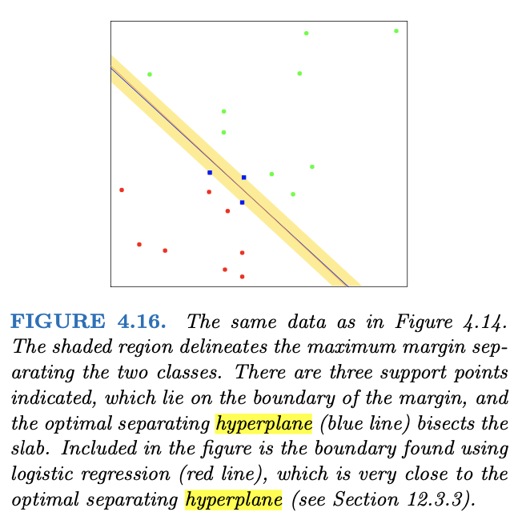

# NAIL029 Machine Learning Exam Review

## General

-   Class website
    -   <http://ktiml.mff.cuni.cz/~marta/SU.html>
-   Moodle
    -   <https://dl1.cuni.cz/course/view.php?id=5765#section-2>
-   Alternative learning
    -   <https://ufal.mff.cuni.cz/courses/npfl129/2122-winter>
-   General Notes
    -   Marginal Likelihood not going to be on the exam
    -   Scikit Learn and Gaussian Distribution slides will be on exam
-   Textbook
    -   <https://hastie.su.domains/ElemStatLearn/printings/ESLII_print12_toc.pdf>
-   Note
    -   This chapter not part of the exam
    -   
        13. Inductive Logic Programming **(not part of the exam)**

## Outline

1.  Introduction, linear regression, k-NN, expected prediction error, Curse of dimensionality,
    -   Section 2 in ESLII\
2.  Linear regression, Ridge, Lasso regression, Undirected Graphical Models (first part),
    -   Section 17.1-17.3,17.4.4 in ESLII - later editions, like the internet one.
    -   Further sources: S. Hojsgaard, D. Edwards, S. Lauritzen: Graphical Models with R, Springer 2012,
3.  Undirected Graphical Models (second part),
    -   Gaussian Processes, C. E. Rasmussen & C. K. I. Williams,
    -   Gaussian, Processes for Machine Learning, the MIT Press, 2006
    -   Peter I. Frazier: A Tutorial on Bayesian Optimization, 2018\
4.  Splines (Basis Expansion and Regularization),
    -   Sections 5 and 6 ESLII\
5.  Linear Models for Classification,
    -   Section 4 ESLII\
6.  Model Assessment and Selection,
    -   Sections 7 ESLII\
7.  Decision Trees and Related Methods (MARS),
    -   Sections 9 ESLII\
8.  Model Inference and Averaging,
    -   Sections 8,10,15,16 ESLII
9.  Clustering,
    -   Selected parts of Chapter 14 ESLII, mean shift clustering and Silhouette from Scikitlearn
10. Bayesian Learning, Other use of the EM algorithm
11. Association rules, Frequent itemsets (Apriori algorithm)
12. Support Vector Machines (+ Independent Component Analysis)

## Exam Questions

-   linear regression
-   k-NN nearest neighbors (instance based learning)
-   undirected graphical models
-   Gaussian processes and Bayesian optimization
-   logistic regression, LDA- linear discriminant analysis
-   optimal separating hyperplane, SVM, kernel functions
-   decision trees with prunning, entropy, information gain
-   model assessment (overfitting, test/validation data, crossvalitdation, one-leave-out, bootstrap)
-   RSS = square error loss, crossentropy, 0-1 error loss
-   Bayes optimal prediction, maximum aposteriory hypothesis, maximum likelihood hypothesis
-   model averaging (bagging, stacking, boosting, random forest)
-   k-means clustering
-   EM algorithm
-   Apriory algorithm, association rules (market basket analysis)

## Review

Probabilities in Gaussian Distributions: probabilities are the area under a fixed distribution $P( \ data \ | \ distribution \ )$ Likelihoods are the y axis values for fixed data points with distributions that can be moved $L(\ distribution \ |\ data \ )$

### Linear Regression

Machine learning is about making predictions and classifications. The original data is called training data. Use testing data to evaluate machine learning methods. Dont be fooled by how well a machine learning method fits the data. Fitting the training data well but making poor predictions is the **Bias-Variance Tradeoff**.

**Bias** is the inability for a machine learning method to capture the true relationship. If a line for example cant fit the data well it has a large amount of bias. **Variance** is the difference in fits between data sets. In other words variance is the average of the sum of the squares. I.e. vastly different sums of squares means larger variance means bad. **Overfitting** when a line fits the training set really well but doesnt fit the testing set.

> Low bias and low variability is what we are looking for, for the optimally fit line.

**Linear Regression** First thing you do is use least squares to fit a line to the data. Then calculate R\^2. Then calculate a p-value for R\^2. Basically we use the sum of squared residuals and rotate the line and then compare all the results, the rotation with the minimal sum of squared residuals is the line of best fit.

-   Sum of squares around the mean: $(data - mean^2)$
-   Variation around the mean: $\frac{(data - mean^2)}{n}$
-   Variance formula (formal): $S^2 = \frac{\sum(x_i - \overline{x})^2}{n-1}$
-   Where n is the sample size

$R^2$ tells us how much of the variation in the y axis (say mouse size) can be explained by taking the x axis (say mouse weight) into account. If $R^2$ is a say 0.60 then there is a 60% reduction in variance when we take the x axis (mouse weight) into account. Basically we can say that the x axis (mouse weight) explains 60% of the y axis (mouse size). If R\^2 is 1 then the curve fits the data exactly. If R\^2 = 0 then the x axis (mouse weight) doesn't explain anything about the y axis (mouse size). R\^2 quantifies the relationship in the data, larger is better.

$R^2 = \frac{Var(mean)-Var(fit)}{Var(mean) }$

**F value** is the reduction of variance when we take the x axis into account divided by the variation in the x axis not explained by weight. Part of the numerator is the same as in R\^2 so it is the $Var(mean) - Var(fit)$. Part of the denominator is $Var(fit)$ .

$F = \frac{SS(mean) - SS(fit) / (p_{fit} - p_{mean})}{SS(fit) / (n-p_{fit}) }$

**p-value** helps us determine if the R\^2 value is statistically significant. The p value is the number of extreme values divided by all the values. This helps us determine how reliable the R\^2 value is and it is calculated with the F value. We plot F values on a histogram. The p value will be smaller when there are more samples relative to the number of parameters in the fit equation. p-value helps determine how reliable the data is, we want this value to be small.

In the stat quest video we compute the sum of the squared residuals repeatedly (rotate the line after each time) then plot these values. Then choose the point / line with the smallest value for sum of the squared residuals. Method for fitting a line is called least squares.

### k-NN nearest neighbors (instance based learning)

A super simple way to classify data. If the k in k-nearest neighbors is one then we just use the single closest neighbor to identify the item we are trying to classify. If k is equal to 11 then we look at the 11 nearest items and see what the resulting poll yields to classify the new item.

Some general info on k-NN's:

-   Non parametric classification method
-   Supervised machine learning algorithm
-   It is a lazy learning algorithm, it predicts directly based on training data
-   Can be continuously updated with new training data

Steps for getting started with k-NN:

1.  Start with a data set with known categories
2.  Add a new item with an unknown category to the PCA plot, figure out which item or item group it is most similar to
3.  We classify the new item by looking at the nearest annotated cell

Finding an optimal k value: if k is to small than an item can easily be classified with an outlier which could be incorrect. If k is too large then the item could be classified into the wrong group and the most applicable group could be outvoted.

Whats a PCA plot?

-   Principal component analysis (PCA) is a technique that transforms high-dimensions data into lower-dimensions while retaining as much information as possible. PC1 is principal axis one and it is the axis that spans the most variation, PC2 is the axis that spans the second most variation.
-   Looking for the variables with the most variation
-   Scree plot...

### Undirected graphical models

For some domains being forced to choose a direction for the edges as required by a directed graphical model is rather akward, i.e. image analysis, spatial statistics. Also called **Markov Graphs**.

Separators: if A, B, and C are subgraphs then C is said to separate A and B if every path between A and B intersects a node C. Separators break the graph into conditionally independent pieces.

For an UGM the Markov Blanket is just the nearest neighbors.

Global Markov Property: segments parts of the graphs from each other

Local Markov Property: segments one node from the rest

Pairwise Markov Property: Given all nodes except two with no path to the two. The two cant be connected.

Converting Bayes Nets to MRFs (Markov random fields) - We lose marginal independence when we convert a Bayes Net to an MRF - Bayesian networks are not MRFs and vice versa but they can be converted Potential Functions Markov Random Fields. A clique is a maximal complete subgraph. and is part of a MRFs. Marginal distribution removes appropriate dimensions from the mean and covariance matrix. Basically remove dimensions that you arent interested in. Conditioning: Conditional distribution...

Represents linear regression with respect to any of the variables. Use a graph to describe relations between the variables. Each variable is one node. Represents the full probability distribution. Sometimes called generative model. We have to know the inputs. UGM has info of probability of the features. Missing edges represent conditional independence of variables. Multivariate Gaussian Distribution (3-D!)

### Gaussian Process and Bayesian Optimization

Based on a given input consider all functions and add a probability to each of them. Uses kernel functions to build up the line of best fit.

Def: A Gaussian process is a set of random variables where any finite subset follows multivariate Gaussian distribution.

-   Kernel Functions
    -   RBF Covariance Function
    -   Constant Covariance Function
    -   Squared Exponentional Covariance Function
    -   ExpSineSquared Kernel Function
    -   Rational Quadratic Kernel Function

### Logisitic Regression

Predicts whether something is true or false instead of something continuous. Instead of fitting a line it fits an S shaped logistic function from 0 to 1. Usually used for classification. Can accommodate continuous and discrete measurements. Uses maximum likelihood to find the best fit curve, shift and recalculate, the curve with the max value for the likelihood is selected. Logistical Regression uses Maximum Likelihood instead of R\^2. Pick a probability and scale by weight and calculate the likelihood of observing a data point. Multiply all the likelihoods together and choose the line with the max likelihood value as the line of best fit for the data.

### Linear Discriminant Analysis (LDA)

LDA is like PCA but it focuses on maximizing the separability among known categories. Uses information from both variables to create an axis (line) then it projects the points onto the line taking it from 2-d to 1-d. How does LDA create this new axis? It uses two criteria. After the data is projected onto the new axis we want to 1) maximize the distance between the two means and 2) minimize scatter (i.e. we want the data to be clustered). Again we want to maximize the distance between the two means and minimize the scatter.

Difference of the two means squared divided by the sum of the scatter:

$\frac{(\mu_1 - \mu_2)^2}{s_1^2 + s_2^2} = \frac{d^2}{s_1^2 + s_2^2}$

Ideally the numerator is large and denominator is small.

LDA in the 3-d case:

There are two cases: 1) three axes 2) three categories and 2 axes.

Create a new axis that maximizes the means while minimizing the scatter. Find a point that is central to all the data. Then measure each categories center of mass point to the central point and again we want to maximize mean and minimize scatter to this point. Next it creates two axes to separate the data.

-   Both rank the axes in the order of importance like PCA
-   LDA and PCA both try to reduce the dimensions
-   PC1 accounts for the most variation in the **data**
-   LD1 accounts for the most variation in the **categories**

### Optimal Separating Hyperplane, SVM, Kernel Functions

Optimal Separating Hyperplane

<https://cw.fel.cvut.cz/old/_media/courses/ae3m33ui/lectures/svm-slides.pdf>

For SVMs, we start with data in a low dimension, move the data to a higher dimension, find a support vector classifier that separates the higher dimensional data into groups. SVMs use kernel functions to systematically find support vector classifiers in higher dimensions. When d = 2 the polynomial kernel computes the 2-d between each pair of observations, those relationships are used to find a support vector classifier. The polynomial kernel systematically increases dimensions by setting the degree of the polynomial and the relationships between each pair of observations are used to find a support vector classifier.

We can find a good value of d with cross validation. Kernel functions only calculate the relationships between very pair of points as if they were in higher dimensions, they dont actually do the transformations. This trick is called the kernel trick, it reduces the amount of computation required for SVMs by avoiding the math that transforms the data from low to high dimensions and it makes calculating relationships in the infinite dimensions used by the RBF possible. When we have 2 categories but not obvious linear classifier, SVMs work by moving the data into a relatively high dimensional space and finds a relatively high support vector classifier that can classify the observations.

The polynomial kernel $(a \times b + r)^d$ computes relationships between pairs of observations.$r$ and $d$ are computed using cross validation.

Radial Basis Function Kernel (RBF) $e^{-\gamma (a-b)^2}$ finds support vector classifiers in infinite dimensions. Gamma is determined from cross validation. It behaves like a weighted nearest neighbor model. The closest observations have a lot of influence on how we classify the new observation.

Support Vector Classifier comes from the fact that observations on the edge and within the soft margin are called support vectors. Can handle overlapping data and mis-classifications.

The main idea for Support Vector Machines is to start with data in a relatively low dimension then put it into a higher dimension. Find a support vector classifier that separates the data into two groups. SVMs use kernel functions to systematically find Support Vector Classifiers in higher dimensions.

### Decision Trees with Prunning, Entropy, Information Gain

A decision tree makes a statement then depending on whether the statement is true or false it makes a decision. When a decision tree classifies things into categories its called a classification tree. When a decision tree predicts numerical values its called a regression tree.

Gini impurity is similar to Entropy and Information gain but is simplier to implement and understand. It is the weighted average of the Gini Imputites of the leaves. It is calculated for each leaf by taking 1 minus the square of the probability of yes's minus the square of the probability of no's.

To avoid overfitting we try to remove unnecessary nodes. Postprunning is where we build a tree, prune afterwards; it is the usual way that pruning is done. Preprunning is when the pruning is done during the construction. This seems nice but we could prune two attributes combined by XOR since both has information gain (close to) zero.

**Postprunning**

-   subtree replacement

-   select a tree and replace it by a leaf;

-   it increases the training error

-   it may decrease the error on validation data

-   step by step, we try to prune each subtree:

-   we prune if we do not increase validation error.

-   subtree raising

    -   remove an inner node. Used in C4.5. The data samples must be re-send to the remaining branch, it is time consuming.

    -   Usually checked only for the most frequent branch in the tree.

**Entropy**

The entropy is the excepted value of the surprise. Such as the expected surprise every time we flip the coin is an example. The equation for entropy is the sum of a specific value for the surprise times the probability of observing that specific value for surprise. Entropy is the sum of the surprise times the probability of the surprise.

Entropy also helps us measure the purity of the split. And it helps us determine node ordering. Entropy measures the impurity of S. If it isnt homogeneous then the entropy value would be one.

$E(Surprise) = \sum xP(X=x)$

$Entropy = \sum \log(\frac{1}{p(x)})p(x)$

But in text books we will see this:

$Entropy = -\sum p(x)\log(p(x))$

### Model Assessment

Overfitting

When a line fits the training set really well but doesnt fit the testing set.

Test/validation Data

Train, Validate, Test method. Split the data up into three groups if you have a lot of data. Use 1/2 of the data to train the model. Use 1/4 of the data to validate the model. Use 1/2 of the data to test the model. If validation isnt needed then use 2/3 to train and 1/3 to test.

Cross Validation

Cant use the data for both training and testing. Cross validation breaks up the data into k chunks. It then trains on one chunk of the data and tests on the other chunks and records its performance. This process then repeats for all other chunks of data and the best performing algorithm is selected.

-   One-leave-out (cross validation)
    -   Use all but one data sample for learning then cross validate like above
    -   Best possible classifier learned
    -   Can be computationally expensive

Bootstrapping

-   Randomly selecting data and allowing duplicates is called **sampling with replacement**
-   For bootstrapping if you have n data points then select n data points using *sampling with replacement* and use this new data set, this is called the **bootstrapped data set**
-   Now calculate the mean of the bootstrapped data set
-   Repeat this calculation of the mean and add it to the histogram a bunch of times (could also do this for median or standard deviation or any other statistic), maybe thousands of time
-   The great thing about bootstrapping is that we can apply it to any statistic to create a histogram of what might happen if we repeated the experiment a bunch of times and we can use it to calculate standard errors and confidence intervals without having to worry about if there is a nice formula

### RSS = Square Error Loss, Crossentropy, 0-1 error loss

Loss function. It's a method of evaluating how well specific algorithm models the given data. If it models the data poorly it would be a very large number.

Residual square error, trying to predict values of y given the value of x. Also called the error sum of squares. When we compute the RSS we want it to be as small as possible. A smaller value would mean that the data points are sticking closer to the function that we created. RSS is the sum of the square distances from the y points to the y points of the line.

**HELP** Cross Entropy as a loss function for classification. When optimizing classification models, cross-entropy is commonly employed as a loss function. The logistic regression technique and artificial neural network can be utilized for classification problems. We are frequently concerned with lowering the model's cross-entropy throughout the entire training dataset. This can be done by taking the average cross-entropy of all training sets.

0-1 Loss. The simplest loss function is the zero-one loss. It literally counts how many mistakes an hypothesis function h makes on the training set. For every single example it suffers a loss of 1 if it is misdirected, and 0 otherwise.

### Bayes optimal prediction, maximum aposteriory hypothesis, maximum likelihood hypothesis

-   bayes optimal prediction (same as bayes learning?)
    -   Bayesian optimization is a sequential design strategy for global optimization of black-box functions that does not assume any functional forms. It is usually employed to optimize expensive-to-evaluate functions
    -   Is the weigthed average of predictions of all hypotheses
    -   If our model is correct, no prediction has smaller expected error then Bayesian optimal prediction.
    -   We always assume independently identically distributed data
-   maximum aposteriory hypothesis
    -   to make predictions based on a single most probable hypothesis---that is, an hi that maximizes P (h_i \| d)
    -   Although our example doesn't show it, finding MAP hypotheses is often much easier than Bayesian learning, because it requires solving an optimization problem instead of a large summation (or integration) problem
    -   Bayesian and MAP learning methods use the prior to penalize complexity
-   maximum likelihood hypothesis
    -   Goal is to find an optimal way to fit a distribution to the data

### Model averaging (bagging, stacking, boosting, random forest)

Hierarchy:

-   Model Averaging / Ensemble Learning
    -   Bagging
    -   Stacking
    -   Boosting
    -   Random Forest

Model averaging, also called **ensemble learning** is use multiple learning algorithms to obtain better predictive performance than could be obtained from any of the constituent learning algorithms alone. It consists of only a concrete finite set of alternative models, but typically allows for much more flexible structure to exist among those alternatives.

**Bagging** is a machine learning ensemble meta-algorithm designed to improve the stability and accuracy of machine learning algorithms used in statistical classification and regression. It also reduces variance and helps to avoid overfitting. Although it is usually applied to decision tree methods, it can be used with any type of method. Bagging is a special case of the model averaging approach.

**Stacking** involves training a learning algorithm to combine the predictions of several other learning algorithms. First, all of the other algorithms are trained using the available data, then a combiner algorithm is trained to make a final prediction using all the predictions of the other algorithms as additional inputs. If an arbitrary combiner algorithm is used, then stacking can theoretically represent any of the ensemble techniques described in this article, although, in practice, a logistic regression model is often used as the combiner.

**Boosting** involves incrementally building an ensemble by training each new model instance to emphasize the training instances that previous models mis-classified. In some cases, boosting has been shown to yield better accuracy than bagging, but it also tends to be more likely to over-fit the training data. By far, the most common implementation of boosting is **Adaboost**, although some newer algorithms are reported to achieve better results.[citation needed]

In Boosting, an equal weight (uniform probability distribution) is given to the sample training data (say D1) at the very starting round. This data (D1) is then given to a base learner (say L1). The mis-classified instances by L1 are assigned a weight higher than the correctly classified instances, but keeping in mind that the total probability distribution will be equal to 1. This boosted data (say D2) is then given to second base learner (say L2) and so on. The results are then combined in the form of voting.

**Random Forests** or random decision forests is an ensemble learning method for classification, regression and other tasks that operates by constructing a multitude of decision trees at training time. For classification tasks, the output of the random forest is the class selected by most trees. Random forests are frequently used as "blackbox" models in businesses, as they generate reasonable predictions across a wide range of data while requiring little configuration.

### k-means clustering

K-means clustering is a method used for clustering analysis, especially in data mining and statistics. It aims to partition a set of observations into a number of clusters (k), resulting in the partitioning of the data into Voronoi cells. It can be considered a method of finding out which group a certain object really belongs to.

It is used mainly in statistics and can be applied to almost any branch of study. For example, in marketing, it can be used to group different demographics of people into simple groups that make it easier for marketers to target. Astronomers use it to sift through huge amounts of astronomical data; since they cannot analyze each object one by one, they need a way to statistically find points of interest for observation and investigation.

The algorithm:

1.  K points are placed into the object data space representing the initial group of centroids.
2.  Each object or data point is assigned into the closest k.
3.  After all objects are assigned, the positions of the k centroids are recalculated.
4.  Steps 2 and 3 are repeated until the positions of the centroids no longer move.

When we plot the reduction in variance as we increase the number of k points we get an elbow plot and we can determine the best value for k. K-means clustering is different than hierarchical clustering because it puts the data into as many clusters as you tell it to. For a 2-d plot with k-means use pick the value of k and evaluate the euclidean distances to the nearest cluster. Then after we have assigned all the points we calculate the center of each cluster and then recluster. If the data is a heat map we can use the data and compute the euclidean distances just like above.

### EM algorithm

Expectation Maximization Algorithm starts by placing the Gaussians randomly and then for each point it tries to figure out which gaussian it came from. The EM algorithm wants to discover the parameters of the probability distributions (mean and covarianace). It computes the probability that it come from one gauss or the other.

Once it has computed the assignments, then it restimates the mean and variance. Keep iterating this until it converges. Mixture models are a probabilistic way of doing soft clustering (where a data point has some probability of being in one group or the other, where hard clustering is it must be assigned to one group).

### Apriory algorithm, association rules (market basket analysis)

Apriori algorithm is an algorithm for frequent item set mining and association rule learning over relational databases. It proceeds by identifying the frequent individual items in the database and extending them to larger and larger item sets as long as those item sets appear sufficiently often in the database. Apriori is designed to operate on databases containing transactions (for example, collections of items bought by customers).

Apriori uses breadth-first search and a Hash tree structure to count candidate item sets efficiently. It generates candidate item sets of length k from item sets of length k-1. Then it prunes the candidates which have an infrequent sub pattern. According to the downward closure lemma, the candidate set contains all frequent k-length item sets. After that, it scans the transaction database to determine frequent item sets among the candidates. Apriori finds all rules with high support. Frequently, it finds many of rules. Apriori algorithm is important for market basket analysis.

Market basket analysis explains which products or goods are often bought together. You need a list of past purchases to see which products were bought together.

Support -\> How much the historical data supports the defined rules and confidence mean

Confidence -\> How confident are we about the defined rule

Lift -\> Confidence support
