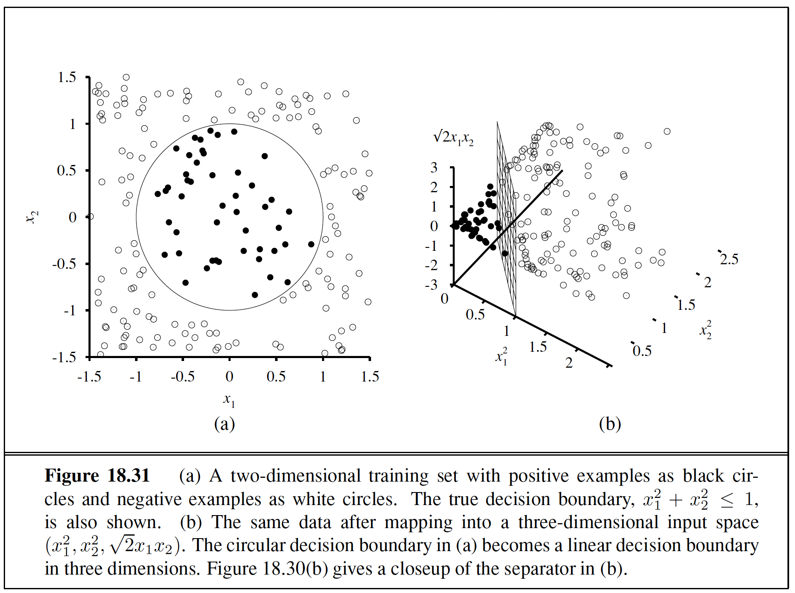

# NAIL070 Artificial Intelligence II Outline

-   Some Resources
    -   <https://www.cse.wustl.edu/~garnett/cse511a/>

## 1. Introduction to uncertainty reasoning. Probability theory.

-   (Chapter 13)
-   Lecture 12: <https://www.youtube.com/watch?v=cFtXkaLog5A>
-   Probability <https://www.youtube.com/watch?v=sMNbLXsvRig&list=PLsOUugYMBBJENfZ3XAToMsg44W7LeUVhF&index=12>

### Summary

-   Uncertainty arises because of both laziness and ignorance. It is inescapable in complex, non deterministic, or partially observable environments.
-   Probabilities express the agent's inability to reach a definite decision regarding the truth of a sentence. Probabilities summarize the agent's beliefs relative to the evidence.
-   Decision theory combines the agent's beliefs and desires, defining the best action as the one that maximizes expected utility.
-   Basic probability statements include prior probabilities and conditional probabilities over simple and complex propositions.
-   The axioms of probability constrain the possible assignments of probabilities to propositions. An agent that violates the axioms must behave irrationally in some cases.
-   The full joint probability distribution specifies the probability of each complete assignment of values to random variables. It is usually too large to create or use in its explicit form, but when it is available it can be used to answer queries simply by adding up entries for the possible worlds corresponding to the query propositions.
-   Absolute independence between subsets of random variables allows the full joint distribution to be factored into smaller joint distributions, greatly reducing its complexity. Absolute independence seldom occurs in practice.
-   Bayes' rule allows unknown probabilities to be computed from known conditional probabilities, usually in the causal direction. Applying Bayes' rule with many pieces of evidence runs into the same scaling problems as does the full joint distribution.
-   Conditional independence brought about by direct causal relationships in the domain might allow the full joint distribution to be factored into smaller, conditional distributions. The naive Bayes model assumes the conditional independence of all effect variables, given a single cause variable, and grows linearly with the number of effects.
-   A wumpus-world agent can calculate probabilities for unobserved aspects of the world, thereby improving on the decisions of a purely logical agent. Conditional independence makes these calculations tractable.

### Basic Probability Notation

-   **Utility theory** says that every state has a degree of usefulness, or utility, to an agent and that the agent will prefer states with higher utility.
-   A logical agent believes each sentence to be true or false or has no opinion, whereas a probabilistic agent may have a numerical degree of belief between 0 (for sentences that are certainly false) and 1 (certainly true). **Probability** provides a way of summarizing the uncertainty that comes from our lazi- ness and ignorance, thereby solving the qualification problem.
-   The fundamental idea of decision theory is that an agent is rational if and only if it chooses the action that yields the highest expected utility, averaged over all the possible outcomes of the action. This is called the principle of **maximum expected utility** (MEU).
-   Probabilities such as P (Total = 11) and P (doubles ) are called **unconditional or prior probabilities** (and sometimes just "priors" for short); they refer to degrees of belief in propositions in the absence of any other information. Most of the time, however, we have some information, usually called **evidence**, that has already been revealed. For example, the first die may already be showing a 5 and we are waiting with bated breath for the other one to stop spinning.
-   **Product Rule** $P(a\land b) = P(a|b)P(b)$
-   **Conditional probability** Rewritten this is the product rule $P(a|b) = \frac{P(a \land b)}{P(b)}$
-   **Independence** $P(a|b) = P(a)$ and vice versa or also $P(a \land b) = P(a)P(b)$
-   For **continuous variables**, it is not possible to write out the entire distribution as a vector, because there are infinitely many values. Instead, we can define the probability that a random variable takes on some value x as a parameterized function of x.
-   We need notation for distributions on multiple variables. Commas are used for this. For example, P(Weather,Cavity) denotes the probabilities of all combinations of the values of Weather and Cavity. This is a 4×2 table of probabilities called the joint probability distribution of Weather and Cavity. We can also mix variables with and without values; P(sunny,Cavity) would be a two-element vector giving the probabilities of a sunny day with a cavity and a sunny day with no cavity.
-   **Inclusion Exclusion Principle** $P(a \lor b) = P(a) + P(b) - P(a \land b)$ This rule is easily remembered by noting that the cases where a holds, together with the cases where b holds, certainly cover all the cases where $a \lor b$ holds; but summing the two sets of cases counts their intersection twice, so we need to subtract $P (a \land b)$.
-   **Bayes Rule** $P(b|a) = \frac{P(a|b)P(b)}{P(a)}$
-   **Conditional Independence** That means that conditional independence assertions can allow probabilistic systems to scale up; moreover, they are much more com- monly available than absolute independence assertions. Conceptually, Cavity separates Toothache and Catch because it is a direct cause of both of them.

## 2. Bayesian networks: construction, semantics, inference (exact and approximate).

-   (Chapter 14.1-14.5)\
-   **Shit gets bad in 14.4 Approximate and Exact Inference in Bayes Nets**
-   Lecture 16: <https://www.youtube.com/watch?v=gMQZq2O8yDA>
-   Lecture 17: <https://www.youtube.com/watch?v=9OajWBYRhRU>
-   Bayes Nets <https://www.youtube.com/watch?v=T4l6ltMMcec&list=PLsOUugYMBBJENfZ3XAToMsg44W7LeUVhF&index=13>
-   Bayes Nets Independence <https://www.youtube.com/watch?v=FUnOdyZZAaE&list=PLsOUugYMBBJENfZ3XAToMsg44W7LeUVhF&index=14>
-   Bayes Nets Inference <https://www.youtube.com/watch?v=A1hYXGAUdmU&list=PLsOUugYMBBJENfZ3XAToMsg44W7LeUVhF&index=15>
-   Bayes Nets Sampling <https://www.youtube.com/watch?v=kGngCS-1kjU&list=PLsOUugYMBBJENfZ3XAToMsg44W7LeUVhF&index=16>
-   Naive Bayes
-   Section 14.5 described two approximation algorithms: likelihood weighting (Figure 14.15) and Markov chain Monte Carlo (MCMC, Figure 14.16)

### Summary

-   This chapter has described Bayesian networks, a well-developed representation for uncertain knowledge. Bayesian networks play a role roughly analogous to that of propositional logic for definite knowledge.
    -   A Bayesian network is a directed acyclic graph whose nodes correspond to random variables; each node has a conditional distribution for the node, given its parents.
    -   Bayesian networks provide a concise way to represent conditional independence relationships in the domain.
    -   A Bayesian network specifies a full joint distribution; each joint entry is defined as the product of the corresponding entries in the local conditional distributions. A Bayesian network is often exponentially smaller than an explicitly enumerated joint distribution.
    -   Many conditional distributions can be represented compactly by canonical families of distributions. Hybrid Bayesian networks, which include both discrete and continuous variables, use a variety of canonical distributions.
    -   Inference in Bayesian networks means computing the probability distribution of a set of query variables, given a set of evidence variables.
    -   Exact inference algorithms, such as variable elimination, evaluate sums of products of conditional probabilities as efficiently as possible.
    -   In polytrees (singly connected networks), exact inference takes time linear in the size of the network. In the general case, the problem is intractable.
    -   Stochastic approximation techniques such as likelihood weighting and Markov chain Monte Carlo can give reasonable estimates of the true posterior probabilities in a network and can cope with much larger networks than can exact algorithms.
    -   Probability theory can be combined with representational ideas from first-order logic to produce very powerful systems for reasoning under uncertainty. Relational probability models (RPMs) include representational restrictions that guarantee a well-defined probability distribution that can be expressed as an equivalent Bayesian network. Open- universe probability models handle existence and identity uncertainty, defining probabilty distributions over the infinite space of first-order possible worlds.
    -   Various alternative systems for reasoning under uncertainty have been suggested. Generally speaking, truth-functional systems are not well suited for such reasoning.

### Bayesian Networks

-   **Bayesian Network** can represent essentially any full joint probability distribution and in many cases can do so very concisely. It is a Directed Acyclic Graph (DAG). The parents of node Xi should contain all those nodes in X1 , . . . , Xi-1 that directly influence Xi. Another important property of Bayesian networks is that they contain no redundant probability values. If there is no redundancy, then there is no chance for inconsistency. Bayes nets are a locally structured system, each sub-component interacts directly with only a bounded number of other components, regardless of the total number of components. If we stick to a causal model, we end up having to specify fewer numbers, and the numbers will often be easier to come up with. A network with both discrete and continuous variables is called a **hybrid Bayesian network**. Leads to inference by enumeration leads to variable elimination algorithm.
    -   Each node corresponds to a random variable, which may be discrete or continuous.
    -   A set of directed links or arrows connects pairs of nodes. If there is an arrow from node X to node Y , X is said to be a parent of Y. The graph has no directed cycles (and hence is a directed acyclic graph, or DAG.
    -   Each node Xi has a conditional probability distribution P(Xi\|Parents(Xi))that quantifies the effect of the parents on the node.
-   **Chain Rule** $P(x_1,...,x_n) = P(x_n |x_{n-1},...,x_1)P(x_{n-1} |x_{n-2},...,x_1) \cdot \cdot \cdot P(x_2 |x_1)P(x_1)$ or
    -   $P(X_i |X_{i-1},...,X_1) = P(X_i |Parents(X_i))$ says the Bayesian network is a correct representation of the domain only if each node is conditionally independent of its other predecessors in the node ordering, given its parents.
-   If we stick to a causal model, we end up having to specify fewer numbers, and the numbers will often be easier to come up with.
-   **Markov Blanket** Another important independence property is implied by the topological semantics: a node is conditionally independent of all other nodes in the network, given its parents, children, and children's parents
-   **Noisy OR** The noisy-OR model allows for uncertainty about the ability of each parent to cause the child to be true---the causal relationship between parent and child may be inhibited, and so a patient could have a cold, but not exhibit a fever. The model makes two assumptions.
-   **Continuous Variables** i.e. Discreteization, in bayes nets, One possible way to handle continuous variables
-   Discretization is sometimes an adequate solution, but often results in a considerable loss of accuracy and very large CPTs. The most common solution is to define standard families of probability density functions (see Appendix A) that are specified by a finite number of parameters. For example, a Gaussian (or normal) distribution $N(\mu,\sigma^2)(x)$ has the mean $\mu$ and the variance $\sigma^2$ as parameters. Yet another solution---sometimes called a nonparametric representation---is to define the conditional distribution implicitly with a collection of instances, each containing specific values of the parent and child variables.

### Exact Inferences in Bayes Nets

-   The complexity of **exact inference**
    -   The complexity of exact inference in Bayesian networks depends strongly on the structure of the network. The burglary network of Figure 14.2 belongs to the family of networks in which there is at most one undirected path between any two nodes in the network. These are called **singly connected networks** or **polytrees**, and they have a particularly nice property: The time and space complexity of exact inference in polytrees is linear in the size of the network.
-   **Inference by enumeration**
    -   Therefore, a query can be answered using a Bayesian network by computing sums of products of conditional probabilities from the network.
    -   Unfortunately, its time complexity for a network with n Boolean variables is always $O(2^n)$
-   **Variable Elimination Algorithm** The enumeration algorithm can be improved substantially by eliminating repeated calculations. The idea is simple: do the calculation once and save the results for later use. We eventually find that every variable that is not an ancestor of a query variable or evidence variable is irrelevant to the query. A variable elimination algorithm can therefore remove all these variables before evaluating the query.
    -   The burglary network of Figure 14.2 belongs to the family of networks in which there is at most one undirected path between any two nodes in the network. These are called singly connected networks or polytrees, and they have a particularly nice property: The time and space complexity of exact inference in polytrees is linear in the size of the network. Here, the size is defined as the number of CPT entries; if the number of parents of each node is bounded by a constant, then the complexity will also be linear in the number of nodes. For multiply connected networks, such as that of Figure 14.12(a), variable elimination can have exponential time and space complexity in the worst case, even when the number of parents per node is bounded.

    -   Variable elimination works by evaluating expressions in right-to-left order (that is, bottom up). Intermediate results are stored, and summations over each variable are done only for those portions of the expression that depend on the variable.
-   **Clustering Algorithms**
    -   Using clustering algorithms (also known as join tree algorithms), the time can be reduced to O(n). For this reason, these algorithms are widely used in commercial Bayesian network tools.
    -   The basic idea of clustering is to join individual nodes of the network to form cluster nodes in such a way that the resulting network is a polytree.
    -   The variable elimination algorithm is simple and efficient for answering individual queries. If we want to compute posterior probabilities for all the variables in a network, however, it can be less efficient. For example, in a polytree network, one would need to issue O(n) queries costing O(n) each, for a total of O(n\^2) time.
    -   For example, the multiply connected network shown in Figure 14.12(a) can be converted into a polytree by combining the Sprinkler and Rain node into a cluster node called Sprinkler+Rain, as shown in Figure 14.12(b). The two Boolean nodes are replaced by a "meganode" that takes on four possible values: tt, tf , ft, and ff
    -   The meganode has only one parent, the Boolean variable Cloudy, so there are two conditioning cases. Although this example doesn't show it, the process of clustering often produces meganodes that share some variables.
    -   Once the network is in polytree form, a special-purpose inference algorithm is required, because ordinary inference methods cannot handle meganodes that share variables with each other.
    -   With careful bookkeeping, this algorithm is able to compute posterior probabilities for all the nonevidence nodes in the network in time linear in the size of the clustered network. However, the NP-hardness of the problem has not disappeared: if a network requires exponential time and space with variable elimination, then the CPTs in the clustered network will necessarily be exponentially large.

### Approximate Inference In Bayesian Networks

#### Direct sampling methods

-   **Approximate Inference** This section describes randomized sampling algorithms, also called Monte Carlo algorithms, that provide approximate answers whose accuracy depends on the number of samples generated.
    -   This section describes randomized sampling algorithms, also called Monte Carlo algorithms, that provide approximate answers whose accuracy depends on the number of samples generated. We describe two families of algorithms: direct sampling and Markov chain sampling.
    -   *The primitive element in any sampling algorithm is the generation of samples from a known probability distribution.*
    -   Given a source of random numbers uniformly distributed in the range [0,1], it is a simple matter to sample any distribution on a single variable, whether discrete or continuous.
    -   The simplest kind of random sampling process for Bayesian networks generates events from a network that has no evidence associated with it. The idea is to sample each variable in turn, in topological order. The probability distribution from which the value is sampled is conditioned on the values already assigned to the variable's parents.
    -   **Rejection Sampling**
        -   Is a general method for producing samples from a hard-to-sample distribution given an easy-to-sample distribution.

        -   First, it generates samples from the prior distribution specified by the network. Then, it rejects all those that do not match the evidence. Finally, the estimate Pˆ(X = x \| e) is obtained by counting how often X = x occurs in the remaining samples.

            -   Rejection sampling produces a consistent estimate of the true probability.
            -   But there are many samples that need to be discarded
    -   **Likelihood weighting**
        -   Avoids the inefficiency of rejection sampling by generating only events that are consistent with the evidence e. It is a particular instance of the general statistical technique of importance sampling, tailored for inference in Bayesian networks.

        -   How it works: it fixes the values for the evidence varibles E and samples only the non evidence variables. This guarantees that each event generated is consistent with the evidence. Not all events are equal, however. Before tallying the counts in the distribution for the query variable, each event is weighted by the likelihood that the event accords to the evidence, as measured by the product of the conditional probabilities for each evidence variable, given its parents. Intuitively, events in which the actual evidence appears unlikely should be given less weight.

        -   In our discussion of likelihood weighting in Chapter 14, we pointed out that the algorithm's accuracy suffers if the evidence variables are "downstream" from the variables being sampled, because in that case the samples are generated without any influence from the evidence.

#### Inference by Markov chain simulation

-   **Markov chain Monte Carlo** algorithms work quite differently from rejection sampling and likelihood weighting. Instead of generating each sample from scratch, MCMC algorithms generate each sample by making a random change to the preceding sample. It is therefore helpful to think of an MCMC algorithm as being in a particular current state specifying a value for every variable and generating a next state by making random changes to the current state. Gibbs sampling is a specific form that is well suited for bayes nets.
    -   **Gibbs Sampling**: The algorithm therefore wanders randomly around the state space---the space of possible complete assignments---flipping one variable at a time, but keeping the evidence variables fixed.
    -   The sampling process settles into a "dynamic equilibrium" in which the long-run fraction of time spent in each state is exactly proportional to its posterior probability. This remarkable property follows from the specific transition probability with which the process moves from one state to another, as defined by the conditional distribution given the Markov blanket of the variable being sampled.
    -   The Gibbs sampling algorithm for Bayesian networks starts with an arbitrary state (with the evidence variables fixed at their observed values) and generates a next state by randomly sampling a value for one of the non evidence variables Xi.
    -   The sampling for Xi is done conditioned on the current values of the variables in the Markov blanket of Xi.
    -   Gibbs sampling returns consistent estimates for posterior probabilities.
    -   This remarkable property follows from the specific transition probability with which the process moves from one state to another, as defined by the conditional distribution given the Markov blanket of the variable being sampled.

## 3. Probabilistic reasoning over time

-   Markov models, inference in temporal models (filtering, prediction, smoothing, most likely explanation).
-   (Chapter 15.1-15.3)
-   Markov Models, HMM / Particle Filters (respectively)
-   Lecture 13: <https://www.youtube.com/watch?v=Nxkapm7QlNw>
-   Lecture 18: <https://www.youtube.com/watch?v=OdQoRGRPmj8> same as \^ + HMM
-   Lecture 15: <https://www.youtube.com/watch?v=KBg97801U40> HMM applications + Particle filters 
-   HMM <https://www.youtube.com/watch?v=eCZLhZu_U1I&list=PLsOUugYMBBJENfZ3XAToMsg44W7LeUVhF&index=18>
-   HMM PF <https://www.youtube.com/watch?v=pNam9hbwg4g&list=PLsOUugYMBBJENfZ3XAToMsg44W7LeUVhF&index=19>
-   Intro
    -   An agent maintains a belief state that represents which states of the world are currently possible. From the belief state and a transition model, the agent can predict how the world might evolve in the next time step. From the percepts observed and a sensor model, the agent can update the belief state.
    -   The transition and sensor models may be uncertain: the transition model describes the probability distribution of the variables at time t, given the state of the world at past times, while the sensor model describes the probability of each percept at time t, given the current state of the world. Section 15.2 defines the basic inference tasks and describes the gen- eral structure of inference algorithms for temporal models.
    -   Then we describe three specific kinds of models: hidden Markov models, Kalman filters, and dynamic Bayesian networks (which include hidden Markov models and Kalman filters as special cases).

### Summary

-   This chapter has addressed the general problem of representing and reasoning about probabilistic temporal processes. The main points are as follows:
    -   The changing state of the world is handled by using a set of random variables to represent the state at each point in time.
    -   Representations can be designed to satisfy the Markov property, so that the future is independent of the past given the present. Combined with the assumption that the process is stationary---that is, the dynamics do not change over time---this greatly simplifies the representation.
    -   A temporal probability model can be thought of as containing a transition model describing the state evolution and a sensor model describing the observation process.
    -   The principal inference tasks in temporal models are filtering, prediction, smoothing, and computing the most likely explanation. Each of these can be achieved using simple, recursive algorithms whose run time is linear in the length of the sequence.
    -   Three families of temporal models were studied in more depth: hidden Markov models, Kalman filters, and dynamic Bayesian networks (which include the other two as special cases).
    -   Unless special assumptions are made, as in Kalman filters, exact inference with many state variables is intractable. In practice, the particle filtering algorithm seems to be an effective approximation algorithm.
    -   When trying to keep track of many objects, uncertainty arises as to which observations belong to which objects---the data association problem. The number of association hypotheses is typically intractably large, but MCMC and particle filtering algorithms for data association work well in practice.

### Time and Uncertainty

-   We will use $X_t$ to denote the set of state variables at time $t$, which are assumed to be un-observable, and $E_t$ to denote the set of observable evidence variables. The observation at time $t$ is $E_t = e_t$ for some set of values $e_t$.
-   Security guard under ground bunker umbrella example
-   **Markov assumption** Or Markov Chains, the current state depends on only a finite fixed number of previous states. Hence, in a first-order Markov process, the transition model is the conditional distribution $P(X_t | X_{t-1})$. The transition model for a second-order Markov process is the conditional distribution $P(X_t | X_{t-2}, X_{t-1})$.

-   **Stationary process** that is, a process of change that is governed by laws that do not themselves change over time. (Don't confuse stationary with static: in a static process, the state itself does not change.) In the umbrella world, then, the conditional probability of rain, P(Rt \| Rt-1), is the same for all t, and we only have to specify one conditional probability table.

### Inference in Temporal Models

-   Example Security guard stationed underground cant see outside but can see umbrella
-   Filter, prediction, Smoothing, Most likely explanation, Learning,
-   **Prediction**
    -   Can be seen simply as filtering without the addition of new evidence. Predicting a future state with the information up to the current state.

    -   This is done using recursion
-   **Smoothing**
    -   This is the task of computing the posterior distribution over a past state, given all evidence up to the present. That is, we wish to compute $P(X_k | e_{1:t})$ for some k such that 0 \<= k \< t.

    -   In the umbrella example, it might mean computing the probability that it rained last Wednesday, given all the observations of the umbrella carrier made up to today. Smoothing provides a better estimate of the state than was available at the time, because it incorporates more evidence.

    -   This is done with the **forward backward algorithm**
-   **Filtering**
    -   This is the task of computing the belief state---the posterior distribution over the most recent state---given all evidence to date. Filtering is also called state estimation. In our example, we wish to compute $P(X_t | e_{1:t})$. In the umbrella example, this would mean computing the probability of rain today, given all the observations of the umbrella carrier made so far.
    -   This is done using recursion
    -   Filtering is what a rational agent does to keep track of the current state so that rational decisions can be made. Note that learning requires smoothing, rather than filtering, because smoothing provides better estimates of the states of the process.
    -   Learning with filtering can fail to converge correctly.
    -   The time and space requirements for updating must be constant if an agent with limited memory is to keep track of the current state distribution over an unbounded sequence of observations.
-   **Most likely explanation**
    -   Given a sequence of observations, we might wish to find the sequence of states that is most likely to have generated those observations, to do this we use this algorithm...
    -   **Viterbi Algorithm**
        -   Its an algorithm for computing the most likely sequence and its similar to filtering
        -   It runs forward along the sequence, computing the m message at each time step
        -   At the end, it will have the probability for the most likely sequence reaching each of the final states.
        -   One can thus easily select the most likely sequence overall (the states outlined in bold).
        -   In order to identify the actual sequence, as opposed to just computing its probability, the algorithm will also need to record, for each state, the best state that leads to it; these are indicated by the bold arrows

### Hidden Markov Models

-   **Simplified Matrix Model**
    -   With a single, discrete state variable $X_t$, we can give concrete form to the representations of the transition model, the sensor model, and the forward and backward messages
    -   Besides providing an elegant description of the filtering and smoothing algorithms for HMMs, the matrix formulation reveals opportunities for improved algorithms
-   **Hidden Markov Model**
    -   We can use the inference methods we described above on HMMs
    -   HMMs are not equivalent to DBNs, rather they are a special case of DBNs in which the entire state of the world is represented by a single hidden state variable.
    -   Inference tasks solved by means of matrix multiplication
    -   It is a temporal probabilistic model in which the state of the process is described by a *single discrete random variable*. The possible values of the variable are the possible states of the world.
    -   The umbrella example described in the preceding section is therefore an HMM, since it has just one state variable: Rain
    -   What happens if you have a model with two or more state variables? You can still fit it into the HMM framework by combining the variables into a single "mega-variable" whose values are all possible tuples of values of the individual state variables.
    -   Used for robot localization except when in a continuous space the number of variables is infinite so not great in practice
-   **Forward Backward Algorithm**
    -   If we want to smooth the whole sequence, one obvious method is simply to run the whole smoothing process once for each time step to be smoothed. This results in a time complexity of $O(t^2)$. A better approach uses a simple application of dynamic programming to reduce the complexity to O(t).
    -   A clue appears in the preceding analysis of the umbrella example, where we were able to reuse the results of the forward-filtering phase. The key to the linear-time algorithm is to record the results of forward filtering over the whole sequence. Then we run the backward recursion from t down to 1, computing the smoothed estimate at each step k from the computed backward message bk+1:t and the stored forward message f1:k.
    -   Drawbacks:
        -   The first is that its space complexity can be too high when the state space is large and the sequences are long.
        -   The second drawback of the basic algorithm is that it needs to be modified to work in an online setting where smoothed estimates must be computed for earlier time slices as new observations are continuously added to the end of the sequence
-   **Fixed Time Lag Smoothing**
    -   Requires computing the smoothed estimate P(Xt-d \| e1:t) for fixed d. That is, smoothing is done for the time slice d steps behind the current time t; as t increases, the smoothing has to keep up.
    -   Obviously, we can run the forward--backward algorithm over the d-step "window" as each new observation is added, but this seems inefficient. In Section 15.3, we will see that fixed-lag smoothing can, in some cases, be done in constant time per update, independent of the lag d.
-   **Localization**

## 4. Kalman filters and Dynamic Bayesian networks

-   (Chapter 15.4-15.6)
-   **Dynamic Bayes Nets are a specific form of a hidden markov model**
-   This chapter has addressed the general problem of representing and reasoning about probabilistic temporal processes. The main points are as follows:
    -   The changing state of the world is handled by using a set of random variables to represent the state at each point in time.
    -   Representations can be designed to satisfy the Markov property, so that the future is independent of the past given the present. Combined with the assumption that the process is stationary---that is, the dynamics do not change over time---this greatly simplifies the representation.
    -   A temporal probability model can be thought of as containing a transition model describing the state evolution and a sensor model describing the observation process.
    -   The principal inference tasks in temporal models are filtering, prediction, smoothing, and computing the most likely explanation. Each of these can be achieved using simple, recursive algorithms whose run time is linear in the length of the sequence.
    -   Three families of temporal models were studied in more depth: hidden Markov models, Kalman filters, and dynamic Bayesian networks (which include the other two as special cases).
    -   Unless special assumptions are made, as in Kalman filters, exact inference with many state variables is intractable. In practice, the particle filtering algorithm seems to be an effective approximation algorithm.
    -   When trying to keep track of many objects, uncertainty arises as to which observations belong to which objects---the data association problem. The number of association hypotheses is typically intractably large, but MCMC and particle filtering algorithms for data association work well in practice.

### Kalman Filters

-   Bird flying between trees example
-   The Kalman filter and its elaborations are used in a vast array of applications. The "classical" application is in radar tracking of aircraft and missiles.
-   The extended Kalman filter (EKF) attempts to overcome nonlinearities in the system being modeled. A system is nonlinear if the transition model cannot be described as a matrix multiplication of the state vector
-   What does it mean for a system to be "unsmooth" or "poorly behaved"? Technically, it means that there is significant non linearity in system response within the region that is "close"
-   A reasonable model of the bird, on the other hand, would predict evasive action to one side or the other, as shown in Figure 15.12(b). Such a model is highly nonlinear, because the bird's decision varies sharply depending on its precise location relative to the trunk. To handle examples like these, we clearly need a more expressive language for representing the behavior of the system being modeled.

### Dynamic Bayesian Nets

-   Battery on robot example
-   A dynamic Bayesian network, or DBN, is a Bayesian network that represents a temporal probability model of the kind described in Section 15.1. We have already seen examples of DBNs: the umbrella network in Figure 15.2 and the Kalman filter network in Figure 15.9.

-   It should be clear that every hidden Markov model can be represented as a DBN with a single state variable and a single evidence variable. It is also the case that every discrete- variable DBN can be represented as an HMM; as explained in Section 15.3, we can combine all the state variables in the DBN into a single state variable whose values are all possible tuples of values of the individual state variables.
-   Now, if every HMM is a DBN and every DBN can be translated into an HMM, what's the difference? The difference is that, by decomposing the state of a complex system into its constituent variables, the can take advantage of sparseness in the temporal probability model
-   Suppose, for example, that a DBN has 20 Boolean state variables, each of which has three parents in the preceding slice. Then the DBN transition model has 20 × 2\^3 = 160 probabilities, whereas the corresponding HMM has $2^{20}$ states and therefore $2^{40}$, or roughly a trillion, probabilities in the transition matrix.

> The relationship between DBNs and HMMs is roughly analogous to the relationship between ordinary Bayesian networks and full tabulated joint distributions.

-   We have already explained that every Kalman filter model can be represented in a DBN with continuous variables and linear Gaussian conditional distributions (Figure 15.9). It should be clear from the discussion at the end of the preceding section that not every DBN can be represented by a Kalman filter model.
-   In a Kalman filter, the current state distribution is always a single multivariate Gaussian distribution---that is, a single "bump" in a particular location. DBNs, on the other hand, can model arbitrary distributions.
-   Constructing DBNS:
    -   To construct a DBN, one must specify three kinds of information:
        -   the prior distribution over the state variables, P(X0);
        -   the transition model P(Xt+1 \| Xt); and
        -   the sensor model P(Et \| Xt)
    -   To specify the transition and sensor models, one must also specify the topology of the connections between successive slices and between the state and evidence variables.
-   Battery on robot example
    -   For the system to handle sensor failure properly, the sensor model must include the possibility of failure. The simplest kind of failure model for a sensor allows a certain probability that the sensor will return some completely incorrect value, regardless of the true state of the world.
    -   The upper curve in Figure 15.14(b) shows that the transient failure model can handle transient failures without a catastrophic change in beliefs.
    -   we need a persistent failure model that describes how the sensor behaves under normal conditions and after failure. To do this, we need to augment the state of the system with an additional variable, say, BMBroken, that describes the status of the battery meter.

### Exact Inference in Dynamic Bayes Nets

-   Given a sequence of observations, one can construct the full Bayesian network representation of a DBN by replicating slices until the network is large enough to accommodate the observations
-   This technique, mentioned in Chapter 14 in the context of relational probability models, is called unrolling.
-   Once the DBN is **unrolled**, one can use **any of the inference algorithms**; inference by enumeration, variable elimination, clustering methods, and so on
-   A naive application of unrolling would not be particularly efficient.
-   If we want to perform filtering or smoothing with a long sequence of observations e1:t, the unrolled network would require O(t) space and would thus grow without bound as more observations were added.
-   Moreover, if we simply run the inference algorithm anew each time an observation is added, the inference time per update will also increase as O(t).
-   Summing out variables is exactly what the variable elimination (Figure 14.11) algorithm does, and it turns out that running variable elimination with the variables in temporal order exactly mimics the operation of the recursive filtering update in Equation (15.5).
-   The modified algorithm keeps at most two slices in memory at any one time: starting with slice 0, we add slice 1, then sum out slice 0, then add slice 2, then sum out slice 1, and so on. In this way, we can achieve constant space and time per filtering update.
-   Bad news:
    -   It turns out that the "constant" for the per-update time and space complexity is, in almost all cases, exponential in the number of state variables. What happens is that, as the variable elimination proceeds, the factors grow to include all the state variables (or, more precisely, all those state variables that have parents in the previous time slice). The maximum factor size is O(dn+k) and the total update cost per step is O(ndn+k), where d is the domain size of the variables and k is the maximum number of parents of any state variable.
    -   Of course, this is much less than the cost of HMM updating, which is O(d2n), but it is still infeasible for large numbers of variables. What it means is that even though we can use DBNs to represent very complex temporal processes with many sparsely connected variables, we cannot reason efficiently and exactly about those processes.

### Approximate Inference in Dynamic Bayes Nets

-   Section 14.5 described two approximation algorithms: likelihood weighting (Figure 14.15) and Markov chain Monte Carlo (MCMC, Figure 14.16). Of the two, the former is most easily adapted to the DBN context. We will see, however, that several improvements are required over the standard likelihood weighting algorithm before a practical method emerges.

-   Likelihood weighting in DBN

    -   Technique

        -   The problem is that the standard algorithm runs each sample in turn, all the way through the network. Instead, we can simply run all N samples together through the DBN, one slice at a time.
        -   The modified algorithm fits the general pattern of filtering algorithms, with the set of N samples as the forward message. The first key innovation, then, is to use the samples themselves as an approximate representation of the current state distribution.
        -   This meets the requirement of a "constant" time per update, although the constant depends on the number of samples required to maintain an accurate approximation.
        -   There is also no need to unroll the DBN, because we need to have in memory only the current slice and the next slice.
        -   The second key innovation is to focus the set of samples on the high-probability regions of the state space. This can be done by throwing away samples that have very low weight, according to the observations, while replicating those that have high weight.

-   Particle Filtering in DBN

    -   Particle filtering works as follows: First, a population of N initial-state samples is created by sampling from the prior distribution P(X0). Then the update cycle is repeated for each time step:

        1.  Each sample is propagated forward by sampling the next state value xt+1 given the current value xt for the sample, based on the transition model P(Xt+1 \| xt).
        2.  Each sample is weighted by the likelihood it assigns to the new evidence,P(et+1\|xt+1).
        3.  The population is resampled to generate a new population of N samples. Each new sample is selected from the current population; the probability that a particular sample is selected is proportional to its weight. The new samples are unweighted.

    -   Particle filtering is consistent, therefore, but is it efficient? In practice, it seems that the answer is yes: particle filtering seems to maintain a good approximation to the true posterior using a constant number of samples.

> DBNs with particle theory seem to be the best algorithms to use in real life applications

### Keeping Track of Many Objects

-   In this section, we see what happens when two or more objects generate the observations. What makes this case different from plain old state estimation is that there is now the possibility of uncertainty about which object generated which observation.
-   For filtering in HMMs and DBNs, we were able to sum out the state variables from 1 to t - 1 by a simple dynamic programming trick; for Kalman filters, we took advantage of special properties of Gaussians. For data association, we are less fortunate. There is no (known) efficient exact algorithm, for the same reason that there is none for the switching Kalman filter
-   For choosing the "best" assignment, it is common to use the so-called **nearest-neighbor filter**, which repeatedly chooses the closest pairing of predicted position and observation and adds that pairing to the assignment
-   When there is more uncertainty as to the correct assignment, a better approach is to choose the assignment that maximizes the joint probability of the current observations given the predicted positions. This can be done very efficiently using the Hungarian algorithm
-   A **particle filtering** algorithm (see page 598) for data association works by maintaining a large collection of possible current assignments
-   An **MCMC** algorithm explores the space of assignment histories---for example, Figure 15.19(b--c) might be states in the MCMC state space---and can change its mind about previous assignment decisions. Current MCMC data association methods can handle many hundreds of objects in real time while giving a good approximation to the true posterior distributions.
-   Often, the reported observations include false alarms (also known as clutter), which are not caused by real objects. Detection failures can occur, meaning that no observation is reported for a real object. Finally, new objects arrive and old ones disappear. These phenomena, which create even more possible worlds to worry about

## 5. Utility theory, preferences, value of information.

-   (Chapter 16.1-16.4, 16.6) + (16.5, 16.7 ... moved fom lecture 6)
-   Uncertainty and Utilities <https://www.youtube.com/watch?v=n3A29GEzC6g&list=PLsOUugYMBBJENfZ3XAToMsg44W7LeUVhF&index=7>

### Summary (ch 16)

-   This chapter shows how to combine utility theory with probability to enable an agent to select actions that will maximize its expected performance.
    -   Probability theory describes what an agent should believe on the basis of evidence, utility theory describes what an agent wants, and **decision theory** puts the two together to describe what an agent should do.
    -   We can use decision theory to build a system that makes decisions by considering all possible actions and choosing the one that leads to the best expected outcome. Such a system is known as a rational agent.
    -   Utility theory shows that an agent whose preferences between lotteries are consistent with a set of simple axioms can be described as possessing a utility function; furthermore, the agent selects actions as if maximizing its expected utility.
    -   Multiattribute utility theory deals with utilities that depend on several distinct attributes of states. Stochastic dominance is a particularly useful technique for making unambiguous decisions, even without precise utility values for attributes.
    -   **Decision networks** provide a simple formalism for expressing and solving decision problems. They are a natural extension of Bayesian networks, containing decision and utility nodes in addition to chance nodes.
    -   Sometimes, solving a problem involves finding more information before making a decision. The value of information is defined as the expected improvement in utility compared with making a decision without the information.
    -   **Expert systems** that incorporate utility information have additional capabilities compared with pure inference systems. In addition to being able to make decisions, they can use the value of information to decide which questions to ask, if any; they can recommend contingency plans; and they can calculate the sensitivity of their decisions to small changes in probability and utility assessments.

### Combining Beliefs and Desires Under Uncertainty

-   In this chapter we deal with non deterministic partially observable environments. Since the agent may not know the current state, we omit it and define RESULT(a) as a random variable whose values are the possible outcome states. The probability of outcome s', given evidence observations e, is written $P(RESULT(a)=s' |a,e)$
-   The agent's preferences are captured by a **utility function**, U (s), which assigns a single number to express the desirability of a state. The **expected utility** of an action given the evidence, $EU (a|e)$, is just the average utility value of the outcomes, weighted by the probability that the outcome occurs $EU(a|e) = \sum_{s} P(Result(a)=s|a,e) U(s)$
-   The principle of **maximum expected utility** (MEU) says that a rational agent should choose the action that maximizes the agent's expected utility $action = argmax EU (a|e)$
-   If an agent acts so as to maximize a utility function that correctly reflects the performance measure, then the agent will achieve the highest possible performance score (averaged over all the possible environments).

### The Basics of Utility Theory

-   These constraints are known as the axioms of utility theory. Each axiom can be motivated by showing that an agent that violates it will exhibit patently irrational behavior in some situations.
-   Six constraints for any reasonable preference agent to obey
    -   Short Explanation: TOMS-CD
        -   Transitivity: If A \> B and B \> C then agent prefers A

        -   Orderability: The agent must make a decision even if A and B are equal

        -   Monotonicity: if agent likes an outcome then if that's in a lottery the agent prefers it

        -   Substitutability: Swapping out one similar lottery for another has no effect on preference

        -   Continuity: Will accept a P(B) in between A and B

        -   Decomposabiity: compound lotteries can be reduced via laws of probability
    -   Long Explanation...
        -   Orderability: Given any two lotteries, a rational agent must either prefer one to the other or else rate the two as equally preferable. That is, the agent cannot avoid deciding. As we said on page 490, refusing to bet is like refusing to allow time to pass. - Exactly one of $(A \succ B),(B \succ A)$, or $(A\sim B)$ holds.

        -   Transitivity: Given any three lotteries, if an agent prefers A to B and prefers B to C, then the agent must prefer A to C.

            -   $(A \succ B) \land (B \succ C) => (A \succ C)$

        -   Continuity: If some lottery B is between A and C in preference, then there is some probability p for which the rational agent will be indifferent between getting B for sure and the lottery that yields A with probability p and C with probability 1 - p.

            -   $A\prec B \prec C \Rightarrow \exists p [p,A; 1-p,C]\sim B$

        -   Substitutability: If an agent is indifferent between two lotteries A and B, then the agent is indifferent between two more complex lotteries that are the same except that B is substituted for A in one of them. This holds regardless of the probabilities and the other outcome(s) in the lotteries. This also holds if we substitute $\succ$ for $\sim$ in this axiom.

            -   $A \sim B \Rightarrow [p,A; 1-p,C]\sim [p,B;1-p,C]$

        -   Monotonicity: Suppose two lotteries have the same two possible outcomes, A and B. If an agent prefers A to B, then the agent must prefer the lottery that has a higher probability for A (and vice versa).

            -   $A \prec B \Rightarrow (p>q \Leftrightarrow [p,A; 1-p,B] \succ [q,A; 1-q,B])$

        -   Decomposability: Compound lotteries can be reduced to simpler ones using the laws of probability. This has been called the "no fun in gambling" rule because it says that two consecutive lotteries can be compressed into a single equivalent lottery, as shown in Figure 16.1(b).

            -   $[p,A; 1-p,[q,B; 1-q,C]]\sim [p,A; (1-p)q,B; (1-p)(1-q),C]$
-   The axioms of utility theory are axioms about preferences but we can derive the following consequences form them
    -   Existence of Utility Function: If an agent's preferences obey the axioms of utility, then there exists a function U such that U(A) \> U(B) if and only if A is preferred to B, and U(A) = U(B) if and only if the agent is indifferent between A and B.
    -   $U(A)>U(B) \Leftrightarrow A \prec B U(A)=U(B) \Leftrightarrow A\sim B$
    -   Expected Utility of a Lottery: The utility of a lottery is the sum of the probability of each outcome times the utility of that outcome.
    -   $U([p_1,S_1;...;p_n,S_n]) = \sum p_iU(S_i)$
    -   Notice that the axioms of utility theory are really axioms about preferences---they say nothing about a utility function.
-   It is easy to see, in fact, that an agent's behavior would not change if its utility function U(S) were transformed according to $U'(S) = aU(S) + b$ this is a **value function** or **ordinal utility function**
    -   It is important to remember that the existence of a utility function that describes an agent's preference behavior does not necessarily mean that the agent is explicitly maximizing that utility function in its own deliberations.

### Utility Functions

-   Utility assessment and utility scales
    -   If we want to build a decision-theoretic system that helps the agent make decisions or acts on his or her behalf, we must first work out what the agent's utility function is. This process, often called preference elicitation, involves presenting choices to the agent and using the observed preferences to pin down the underlying utility function.
    -   Agents with curves of this shape are risk-averse: they prefer a sure thing with a payoff that is less than the expected monetary value of a gamble. On the other hand, in the "desperate" region at large negative wealth in Figure 16.2(b), the behavior is risk-seeking.
    -   Notice that for small changes in wealth relative to the current wealth, almost any curve will be approximately linear. An agent that has a linear curve is said to be risk-neutral
    -   **certainty effect**, people are strongly attracted to gains that are certain.
    -   the exact wording of a decision problem can have a big impact on the agent's choices; this is called the **framing effect**

### Multi-attribute Utility Functions

-   Airport site cost example
-   Problems like these, in which outcomes are characterized by two or more attributes, are handled by **multi-attribute utility theory**
-   Site example: generates less noise pollution, and is safer than site S2. One would not hesitate to reject S2. We then say that there is **strict dominance** of S1 over S2. In general, if an option is of lower value on all attributes than some other option, it need not be considered further.
-   The **cumulative distribution** measures the probability that the cost is less than or equal to any given amount---that is, it integrates the original distribution.
-   $\star$ If A1 stochastically dominates A2, then for any monotonically nondecreasing utility function U(x), the expected utility of A1 is at least as high as the expected utility of A2. Hence, if an action is stochastically dominated by another action on all attributes, then it can be discarded.
-   Preference structure and multiattribute utility
    -   **preference independence** Two attributes X and X are preferentially independent of a third attribute 12 X3 if the preference between outcomes ⟨x1, x2, x3⟩ and ⟨x'1, x'2, x3⟩ does not depend on the particular value x3 for attribute X3.
    -   We say that the set of attributes {Noise , Cost , Deaths } exhibits mutual preferential independence (MPI). MPI says that, whereas each attribute may be important, it does not affect the way in which one trades off the other attributes against each other.
    -   If attributes $X_1 ,..., X_n$ are mutually preferentially independent, then the agent's preference behavior can be described as maximizing the function $V (x1, ... , xn) = \sum_{i} V_i(x_i)$ where each $V_i$ is a value function referring only to the attribute $X_i$
    -   A value function of this type is called an additive value function. Additive functions are an extremely natural way to describe an agent's preferences and are valid in many real-world situations.
    -   The basic notion of **utility independence** extends preference independence to cover lotteries: a set of attributes X is utility independent of a set of attributes Y if preferences between lotteries on the attributes in X are independent of the particular values of the attributes in Y.
    -   A set of attributes is **mutually utility independent** (MUI) if each of its subsets is utility-independent of the remaining attributes.
    -   MUI implies that the agent's behavior can be described using a multiplicative utility function (Keeney, 1974). The general form of a multiplicative utility function is best seen by looking at the case for three attributes.

### Decision Networks

-   General mechanism for making rational decisions. The notation is often called an influence diagram, but we will use the more descriptive term **decision network**. Decision networks combine Bayesian networks with additional node types for actions and utilities
-   In its most general form, a decision network represents information about the agent's current state, its possible actions, the state that will result from the agent's action, and the utility of that state.

-   **Chance nodes** (ovals) represent random variables, just as they do in Bayesian networks. The agent could be uncertain about the construction cost, the level of air traffic and the potential for litigation, and the Deaths, Noise, and total Cost variables, each of which also depends on the site chosen. Each chance node has associated with it a conditional distribution that is indexed by the state of the parent nodes. In decision networks, the parent nodes can include decision nodes as well as chance nodes. Note that each of the current-state chance nodes could be part of a large Bayesian network for assessing construction costs, air traffic levels, or litigation potentials.

-   **Decision nodes** (rectangles) represent points where the decision maker has a choice of actions. In this case, the AirportSite action can take on a different value for each site under consideration. The choice influences the cost, safety, and noise that will result. In this chapter, we assume that we are dealing with a single decision node. Chapter 17 deals with cases in which more than one decision must be made.

-   **Utility nodes** (diamonds) represent the agent's utility function. The utility node has as parents all variables describing the outcome that directly affect utility. Associated with the utility node is a description of the agent's utility as a function of the parent attributes. The description could be just a tabulation of the function, or it might be a parameterized additive or linear function of the attribute values.

-   A simplified form is also used in many cases. The notation remains identical, but the chance nodes describing the outcome state are omitted. Instead, the utility node is connected directly to the current-state nodes and the decision node. In this case, rather than representing a utility function on outcome states, the utility node represents the expected utility associated with each action, as defined in Equation (16.1) on page 611; that is, the node is associated with an action-utility function (also known as a Q-function in reinforcement learning, as described in Chapter 21). Figure 16.7 shows the action-utility representation of the airport siting problem.

-   Notice that, because the Noise, Deaths, and Cost chance nodes in Figure 16.6 refer to future states, they can never have their values set as evidence variables. Thus, the simplified version that omits these nodes can be used whenever the more general form can be used. Although the simplified form contains fewer nodes, the omission of an explicit description of the outcome of the siting decision means that it is less flexible with respect to changes in circumstances.

### Evaluating Decision Networks

-   Actions are selected by evaluating the decision network for each possible setting of the decision node. Once the decision node is set, it behaves exactly like a chance node that has been set as an evidence variable. The algorithm for evaluating decision networks is the following:

1.  Set the evidence variables for the current state.
2.  For each possible value of the decision node:
    1.  Set the decision node to that value.

    2.  Calculate the posterior probabilities for the parent nodes of the utility node, using a standard probabilistic inference algorithm.

    3.  Calculate the resulting utility for the action.
3.  Return the action with the highest utility.

-   This is a straightforward extension of the Bayesian network algorithm and can be incorporated directly into the agent design

### The Value of Information

-   Ocean drilling company buying drilling rights
-   **Information value theory** which enables an agent to choose what information to acquire. In general, the value of a given piece of information is defined to be the difference in expected value between best actions before and after information is obtained. information has value to the extent that it is likely to cause a change of plan and to the extent that the new plan will be significantly better than the old plan.
-   Information value theory involves a simplified form of sequential decision making---simplified because the observation actions affect only the agent's belief state, not the external physical state.
-   The value of information derives from the fact that with the information, one's course of action can be changed to suit the actual situation. One can discriminate according to the situation, whereas without the information, one has to do what's best on average over the possible situations.
-   Mountain road or lower pass road example? Obviously, in this case, it is not worth the expense of obtaining satellite reports, because it is unlikely that the information derived from them will change the plan. With no change, information has no value.
-   The expected value of information is nonnegative: $\forall e,E_j VPI_e(E_j)\geq0$
    -   It is important to remember that VPI depends on the current state of information, which is why it is subscripted.
-   Implementation of an information-gathering agent
    -   Sensible agent should ask questions in a reasonable order, should avoid asking questions that are irrelevant, should take into account the importance of each piece of information in relation to its cost, and should stop asking questions when that is appropriate.
    -   This is because it uses the VPI formula shortsightedly, calculating the value of information as if only a single evidence variable will be acquired. Myopic control is based on the same heuristic idea as greedy search and often works well in practice.
    -   A better approach in this situation would be to construct a conditional plan (as described in Section 11.3.2) that asks for variable values and takes different next steps depending on the answer.

### Decision Theoretic Expert Systems

-   The field of **decision analysis**, which evolved in the 1950s and 1960s, studies the application of decision theory to actual decision problems. It is used to help make rational decisions in important domains where the stakes are high, such as business, government, law, military strategy, medical diagnosis and public health, engineering design, and resource management.
-   The process involves a careful study of the possible actions and outcomes, as well as the preferences placed on each outcome. It is traditional in decision analysis to talk about two roles: the **decision maker** states preferences between outcomes, and the **decision analyst** enumerates the possible actions and outcomes and elicits preferences from the decision maker to determine the best course of action.
-   The emergence of Bayesian networks in the late 1980s made it possible to build large-scale systems that generated sound probabilistic inferences from evidence. The addition of decision networks means that expert systems can be developed that recommend optimal decisions, reflecting the preferences of the agent as well as the available evidence.
-   Creating a DTES
    -   **Create a causal model**. Determine the possible symptoms, disorders, treatments, and outcomes.
    -   **Simplify to a qualitative decision model**. Since we are using the model to make treatment decisions and not for other purposes (such as determining the joint probability of certain symptom/disorder combinations), we can often simplify by removing variables that are not involved in treatment decisions.
    -   **Assign probabilities**. Probabilities can come from patient databases, literature studies, or the expert's subjective assessments. Note that a diagnostic system will reason from symp- toms and other observations to the disease or other cause of the problems. Thus, in the early years of building these systems, experts were asked for the probability of a cause given an effect.
    -   **Assign utilities**. When there are a small number of possible outcomes, they can be enumerated and evaluated individually using the methods of Section 16.3.1. We would create a scale from best to worst outcome and give each a numeric value, for example 0 for death and 1 for complete recovery.
    -   **Verify and refine the model**. To evaluate the system we need a set of correct (input, output) pairs; a so-called gold standard to compare against. Get the gold standards by asking doctors.
    -   **Perform sensitivity analysis**. This important step checks whether the best decision is sensitive to small changes in the assigned probabilities and utilities by systematically varying those parameters and running the evaluation again. If small changes lead to significantly different decisions, then it could be worthwhile to spend more resources to collect better data. If all variations lead to the same decision, then the agent will have more confidence that it is the right decision. Sensitivity analysis is particularly important, because one of the main criticisms of probabilistic approaches to expert systems is that it is too difficult to assess the numerical probabilities required. Sensitivity analysis often reveals that many of the numbers need be specified only very approximately. For example, we might be uncertain about the conditional probability P (tachycardia \| dyspnea ), but if the optimal decision is reasonably robust to small variations in the probability, then our ignorance is less of a concern.

## 6. Simple rational decisions. Sequential decision problems, Markov Decision Processes, value and policy iteration.

-   (Chapter 17.1-17.4)\
-   MDP 2 <https://www.youtube.com/watch?v=ZToWj64rxvQ&list=PLsOUugYMBBJENfZ3XAToMsg44W7LeUVhF&index=9>
-   MDP 1 <https://www.youtube.com/watch?v=4LW3H_Jinr4&list=PLsOUugYMBBJENfZ3XAToMsg44W7LeUVhF&index=8>

### Summary (ch 17)

-   This chapter shows how to use knowledge about the world to make decisions even when the outcomes of an action are uncertain and the rewards for acting might not be reaped until many actions have passed. The main points are as follows:
    -   Sequential decision problems in uncertain environments, also called Markov decision processes, or MDPs, are defined by a transition model specifying the probabilistic outcomes of actions and a reward function specifying the reward in each state.
    -   The utility of a state sequence is the sum of all the rewards over the sequence, possibly discounted over time. The solution of an MDP is a policy that associates a decision with every state that the agent might reach. An optimal policy maximizes the utility of the state sequences encountered when it is executed.
    -   The utility of a state is the expected utility of the state sequences encountered when an optimal policy is executed, starting in that state. The value iteration algorithm for solving MDPs works by iteratively solving the equations relating the utility of each state to those of its neighbors.
    -   Policy iteration alternates between calculating the utilities of states under the current policy and improving the current policy with respect to the current utilities.
    -   Partially observable MDPs, or POMDPs, are much more difficult to solve than are MDPs. They can be solved by conversion to an MDP in the continuous space of belief states; both value iteration and policy iteration algorithms have been devised. Optimal behavior in POMDPs includes information gathering to reduce uncertainty and therefore make better decisions in the future.
    -   A decision-theoretic agent can be constructed for POMDP environments. The agent uses a dynamic decision network to represent the transition and sensor models, to update its belief state, and to project forward possible action sequences.
    -   Game theory describes rational behavior for agents in situations in which multiple agents interact simultaneously. Solutions of games are Nash equilibria---strategy profiles in which no agent has an incentive to deviate from the specified strategy.
    -   Mechanism design can be used to set the rules by which agents will interact, in order to maximize some global utility through the operation of individually rational agents. Sometimes, mechanisms exist that achieve this goal without requiring each agent to consider the choices made by other agents.
-   We shall return to the world of MDPs and POMDP in Chapter 21, when we study reinforcement learning methods that allow an agent to improve its behavior from experience in sequential, uncertain environments.

### Sequential Decision Problems

-   In this chapter, we address the computational issues involved in making decisions in a stochastic environment.
-   Whereas Chapter 16 was concerned with one-shot or episodic decision problems, in which the utility of each action's outcome was well known, we are concerned here with sequential decision problems, in which the agent's utility depends on a sequence of decisions.
-   Sequential decision problems incorporate utilities, uncertainty, and sensing, and include search and planning problems as special cases.
-   Agent on a grid example but the agent has 10% probability of going either left or right when you tell it to go straight (stochastic motion in non deterministic environment)
-   We will assume that transitions are **Markovian** in the sense of Chapter 15, that is, the probability of reaching s' from s depends only on s and not on the history of earlier states.
-   **To sum up: a sequential decision problem** for a fully observable, stochastic environment with a Markovian transition model and additive rewards is called a Markov decision process, or MDP, and consists of a set of states (with an initial state s0); a set ACTIONS(s) of actions in each state; a transition model $P (s' | s, a)$; and a reward function R(s).
-   Therefore, a solution must specify what the agent should do for any state that the agent might reach. A solution of this kind is called a policy. Notation typically policy for state s... $\pi (s)$. An optimal policy is a policy that yields the highest expected utility or $\pi^*$

### Value Iteration

-   In this section, we present an algorithm, called **value iteration**, for calculating an optimal policy. The basic idea is to calculate the utility of each state and then use the state utilities to select an optimal action in each state.
-   The Bellman equation for utilities
    -   the utility of being in a state as the expected sum of discounted rewards from that point onwards. From this, it follows that there is a direct relationship between the utility of a state and the utility of its neighbors: the utility of a state is the immediate reward for that state plus the expected discounted utility of the next state, assuming that the agent chooses the optimal action.
    -   The **Bellman Equation**
    -   The utilities of the states---defined by Equation (17.2) as the expected utility of subsequent state sequences---are solutions of the set of Bellman equations. In fact, they are the unique solutions
    -   $U(s)=R(s) + \gamma \max_{\alpha \in A(s)} \sum_{s'} P(s'|s,a)U(s')$
    -   There is one problem: the equations are nonlinear, because the "max" operator is not a linear operator.
    -   **Bellman Update** We start with arbitrary initial values for the utilities, calculate the right-hand side of the equation, and plug it into the left-hand side---thereby updating the utility of each state from the utilities of its neighbors. We repeat this until we reach an equilibrium.
    -   If we apply the Bellman update infinitely often, we are guaranteed to reach an equilibrium (see Section 17.2.3), in which case the final utility values must be solutions to the Bellman equations.
-   The Bellman equation is the basis of the value iteration algorithm for solving MDPs. If there are n possible states, then there are n Bellman equations, one for each state. The n equations contain n unknowns---the utilities of the states. So we would like to solve these simultaneous equations to find the utilities. There is one problem: the equations are nonlinear, because the "max" operator is not a linear operator.
-   Convergence of value iteration
    -   We said that value iteration eventually converges to a unique set of solutions of the Bellman equations.

### Policy Iteration

-   In the previous section, we observed that it is possible to get an optimal policy even when the utility function estimate is inaccurate. If one action is clearly better than all others, then the exact magnitude of the utilities on the states involved need not be precise.
-   The **policy iteration** algorithm alternates the following two steps, beginning from some initial policy $\pi_0$
    -   **Policy evaluation**: given a policy $\pi_i$ , calculate $U_i = U^{ \pi_i}$ , the utility of each state if $\pi_i$ were to be executed.

    -   **Policy improvement**: Calculate a new MEU policy $\pi_{i+1}$ based on Ui (as in Equation (17.4)).
-   The algorithm terminates when the policy improvement step yields no change in the utilities.
-   How do we implement the routine? It turns out that doing so is much simpler than solving the standard Bellman equations (which is what value iteration does), because the action in each state is fixed by the policy.
-   For small state spaces, policy evaluation using exact solution methods is often the most efficient approach.
-   Fortunately, it is not necessary to do exact policy evaluation. Instead, we can perform some number of simplified value iteration steps (simplified because the policy is fixed) to give a reasonably good approximation of the utilities.
-   **Modified Policy Iteration -** Simplified Bellman
    -   $U_{i+1}(s) \leftarrow R(s) + \gamma \sum_{s'} P(s'|s,\pi_i(s))U_i(s')$

    -   The important point is that these equations are linear, because the "max" operator has been removed. For n states, we have n linear equations with n unknowns, which can be solved exactly in time $O(n^3)$ by standard linear algebra methods.

    -   This is repeated k times to produce the next utility estimate. The resulting algorithm is called modified policy iteration. It is often much more efficient than standard policy iteration or value iteration.

    -   The algorithms we have described so far require updating the utility or policy for all states at once. It turns out that this is not strictly necessary. In fact, on each iteration, we can pick any subset of states and apply either kind of updating (policy improvement or simplified value iteration) to that subset. This very general algorithm is called asynchronous policy iteration.

### Partially Observable MDPs

-   When the environment is only partially observable, the situation is, one might say, much less clear. The agent does not necessarily know which state it is in, so it cannot execute the action $\pi(s)$ recommended for that state. Furthermore, the utility of a state s and the optimal action in s depend not just on s, but also on how much the agent knows when it is in s.

-   A POMDP has the same elements as an MDP---the **T**ransition model $P(s' | s, a)$, **A**ctions $A(s)$, and **R**eward function $R(s)$---but, like the partially observable search problems of Section 4.4, it also has a **S**ensor model $P(e|s)$. Here, as in Chapter 15, the sensor model specifies the probability of perceiving evidence $e$ in state s. **STAR acronym = elements of MDP**

    -   **Belief state** the set of actual states the agent might be in
    -   In POMDPs, the belief state b becomes a probability distribution over all possible states

-   The fundamental insight required to understand POMDPs is this: the optimal action depends only on the agent's current belief state. That is, the optimal policy can be described by a mapping $\pi^*(b)$ from belief states to actions. It does not depend on the actual state the agent is in.

-   The decision cycle of a POMDP agent can be broken down into the following three steps:

    -   Given the current belief state b, execute the action $a = \pi^*(b)$.
    -   Receive percept e.
    -   Set the current belief state to FORWARD(b, a, e) and repeat.

-   Now we can think of POMDPs as requiring a search in belief-state space, just like the methods for sensor-less and contingency problems in Chapter 4. The main difference is that the POMDP belief-state space is continuous, because a POMDP belief state is a probability distribution.

-   Let's look more carefully at the outcome of actions. In particular, let's calculate the probability that an agent in belief state b reaches belief state b' after executing action a.

-   Now, if we knew the action and the subsequent percept, then Equation (17.11) would provide a deterministic update to the belief state: b' = FORWARD(b, a, e). Of course, the subsequent percept is not yet known, so the agent might arrive in one of several possible belief states b', depending on the percept that is received.

-   The probability of perceiving e, given that a was performed starting in belief state b, is given by summing over all the actual states s' that the agent might reach

-   Together, $P (b' | b, a)$ and $\rho(b)$ define an observable MDP on the space of belief states. Furthermore, it can be shown that an optimal policy for this MDP, $\pi^*(b)$, is also an optimal policy for the original POMDP. In other words, solving a POMDP on a physical state space can be reduced to solving an MDP on the corresponding belief-state space. This fact is perhaps less surprising if we remember that the belief state is always observable to the agent, by definition.

### Value iteration for POMDPs

-   In practice, the value iteration algorithm in Figure 17.9 is hopelessly inefficient for larger problems---even the 4 × 3 POMDP is too hard. The main reason is that, given n conditional plans at level d, the algorithm constructs \|A\| · n\|E\| conditional plans at level d + 1 before eliminating the dominated ones.
-   For general POMDPs, however, finding optimal policies is very difficult (PSPACE- hard, in fact---i.e., very hard indeed).
-   **Problems with a few dozen states are often infeasible.**

### Online agents for POMDPs

-   In this section, we outline a simple approach to agent design for partially observable, stochastic environments.
    -   The transition and sensor models are represented by a dynamic Bayesian network (DBN), as described in Chapter 15.
    -   The **Dynamic Bayesian Network** *(think STAR)* is extended with decision and utility nodes, as used in decision networks in Chapter 16. The resulting model is called a **Dynamic Decision Network**, or DDN *(think STAR+DU)*.
    -   A filtering algorithm is used to incorporate each new percept and action and to update the belief state representation.
    -   Decisions are made by projecting forward possible action sequences and choosing the best one.
-   DBNs are factored representations in the terminology of Chapter 2; they typically have an exponential complexity advantage over atomic representations and can model quite substantial real-world problems
-   In the DBN, the single state $S_t$ becomes a set of state variables $X_t$, and there may be multiple evidence variables $E_t$. We will use $A_t$ to refer to the action at time t, so the transition model becomes $P(X_{t+1}|X_t, A_t)$ and the sensor model becomes $P(E_t|X_t)$. We will use $R_t$ to refer to the reward received at time t and $U_t$ to refer to the utility of the state at time t.
-   The time complexity of an exhaustive search to depth d is $O(|A|^d \cdot |E|^d)$, where \|A\| is the number of available actions and \|E\| is the number of possible percepts.
-   Decision-theoretic agents based on dynamic decision networks have a number of advantages compared with other, simpler agent designs presented in earlier chapters. In particular:
    -   They handle partially observable, uncertain environments and can easily revise their "plans" to handle unexpected evidence.

    -   With appropriate sensor models, they can handle sensor failure and can plan to gather information.

    -   They exhibit "graceful degradation" under time pressure and in complex environments, using various approximation techniques.
-   One defect of our DDN-based algorithm is its reliance on forward search through state space, rather than using the hierarchical and other advanced planning techniques
-   A second, related problem is the basically propositional nature of the DDN language. We would like to be able to extend some of the ideas for first-order probabilistic languages to the problem of decision making.

## 7. Decisions with multiple agents, game theory, mechanism design.

-   (Chapter 17.5 -17.6)\
-   Decision Networks and Value of Info <https://www.youtube.com/watch?v=19sr7yKV56I&list=PLsOUugYMBBJENfZ3XAToMsg44W7LeUVhF&index=17>

### Decisions with Multiple Agents: Game Theory

-   This chapter has concentrated on making decisions in uncertain environments.
    -   **Agent design**: Game theory can analyze the agent's decisions and compute the expected utility for each decision (under the assumption that other agents are acting optimally according to game theory). For example, in the game two-finger Morra, two players, O and E, simultaneously display one or two fingers. Game theory can determine the best strategy against a rational player and the expected return for each player.
    -   **Mechanism design**: When an environment is inhabited by many agents, it might be possible to define the rules of the environment (i.e., the game that the agents must play) so that the collective good of all agents is maximized when each agent adopts the game-theoretic solution that maximizes its own utility. For example, game theory can help design the protocols for a collection of Internet traffic routers so that each router has an incentive to act in such a way that global throughput is maximized.
-   Single Move Games
    -   The *Morra Game* is the example
    -   We start by considering a restricted set of games: ones where all players take action simultaneously and the result of the game is based on this single set of actions.
    -   **Players or agents** who will be making decisions. Two-player games have received the most attention, although n-player games for n \> 2 are also common. We give players capitalized names, like Alice and Bob or O and E.
    -   **Actions** that the players can choose. We will give actions lowercase names, like one or testify. The players may or may not have the same set of actions available.
    -   A **payoff function** that gives the utility to each player for each combination of actions by all the players. For single-move games the payoff function can be represented by a matrix, a representation known as the strategic form (also called normal form).
    -   A **pure strategy** is a deterministic policy; for a single-move game, a pure strategy is just a single action. For many games an agent can do better with a **mixed strategy**, which is a randomized policy that selects actions according to a probability distribution.
    -   It is important to realize that outcomes are actual results of playing a game, while solutions are theoretical constructs used to analyze a game.
    -   We say that an outcome is **Pareto optimal** if there is no other outcome that all players would prefer. An outcome is **Pareto dominated** by another outcome if all players would prefer the other outcome. When each player has a dominant strategy, the combination of those strategies is called a **dominant strategy equilibrium**.
    -   The mathematician John Nash proved that every game has at least one equilibrium. The general concept of equilibrium is now called **Nash equilibrium** in his honor.
    -   Games in which players need to communicate like this are called **coordination games**.
    -   **Zero-sum games** games in which the sum of the payoffs is always zero.
    -   MaxiMin Technique
    -   Suppose we change the rules as follows: first E picks her strategy and reveals it to O. Then O picks his strategy, with knowledge of E's strategy. Finally, we evaluate the expected payoff of the game based on the chosen strategies. This gives us a turn- taking game to which we can apply the standard minimax algorithm from Chapter 5. Let's suppose this gives an outcome UE,O. Clearly, this game favors O, so the true utility U of the original game (from E's point of view) is at least UE,O. For example, if we just look at pure strategies, the minimax game tree has a root value of -3 (see Figure 17.12(a)), so we know that U \>= -3.
    -   Now suppose we change the rules to force O to reveal his strategy first, followed by E. Then the minimax value of this game is UO,E , and because this game favors E we know that U is at most UO,E. With pure strategies, the value is +2 (see Figure 17.12(b)), so we know U \<= +2.
    -   A player who adopts the maximin strategy has two guarantees: First, no other strategy can do better against an opponent who plays well (although some other strategies might be better at exploiting an opponent who makes irrational mistakes). Second, the player continues to do just as well even if the strategy is revealed to the opponent.
-   Repeated Games
    -   Repeated version of prisoners dillema is the example
    -   The simplest kind of multiple- move game is the repeated game, in which players face the same choice repeatedly, but each time with knowledge of the history of all players' previous choices.
    -   For example, one equilibrium strategy is for each player to refuse unless the other player has ever played testify. This strategy could be called **perpetual punishment**.
    -   **tit-for-tat** calls for starting with refuse and then echoing the other player's previous move on all subsequent moves. So Alice would refuse as long as Bob refuses and would testify the move after Bob testified, but would go back to refusing if Bob did.
-   Sequential games
    -   a game consists of a sequence of turns that need not be all the same. Such games are best represented by a game tree, which game theorists call the extensive form
    -   If the player's best strategy depends on the opponent's strategy and vice versa, then minimax (or alpha--beta) by itself cannot find a solution. The extensive form does allow us to find solutions because it represents the belief states (game theorists call them information sets) of all players at once. From that representation we can find equilibrium solutions, just as we did with normal-form games.
    -   an alternative representation of extensive games, called the **sequence form** that is only linear in the size of the tree, rather than ex- ponential. Rather than represent strategies, it represents paths through the tree; the number of paths is equal to the number of terminal nodes. Standard linear programming methods can again be applied to this representation.
    -   **Cournot competition** uses game theory to solve problems where two companies choose prices for their products from a continuous space
    -   Thus, we see that game theory is good at representing most sources of uncertainty---but at the cost of doubling the size of the tree every time we add another node; a habit which quickly leads to intractably large trees. Because of these and other problems, game theory has been used primarily to analyze environments that are at equilibrium, rather than to control agents within an environment.

### Mechanism Design

-   **Mechanism Design** In this section, we ask, "Given that agents pick rational strategies, what game should we design?" More specifically, we would like to design a game whose solutions, consisting of each agent pursuing its own rational strategy, result in the maximization of some global utility function.

-   **Auctions**

    -   **English**
    -   One Disadvantage (from the point of view of the seller) of the ascending-bid auction is that it can discourage competition.
    -   Another negative property of the English auction is its high communication costs. Either the auction takes place in one room or all bidders have to have high-speed, secure communication lines
    -   **Sealed Bid Auction**
    -   Each bidder makes a single bid and communicates it to the auctioneer, without the other bidders seeing it.
    -   A small change in the mechanism for sealed-bid auctions produces the sealed-bid-second-price a.k.a **vickery auction**
    -   **Dutch**
    -   Top down bidding, price starts from some max and one bid ends it all

-   **Common Goods**

    -   Global Air Pollution Example
    -   **tragedy of the commons**: if nobody has to pay for using a common resource, then it tends to be exploited in a way that leads to a lower total utility for all agents
    -   The standard approach for dealing with the tragedy of the commons is to change the mechanism to one that charges each agent for using the commons. More generally, we need to ensure that all externalities---effects on global utility that are not recognized in the individual agents' transactions---are made explicit.

-   **Vickrey-Clarke-Groves**, or VCG, mechanism, that makes it a dominant strategy for each agent to report its true utility and that achieves an efficient allocation of the goods. The trick is that each agent pays a tax equivalent to the loss in global utility that occurs because of the agent's presence in the game:

    1.  The center asks each agent to report its value for receiving an item. Call this bi.
    2.  The center allocates the goods to a subset of the bidders. We call this subset A, and use the notation bi(A) to mean the result to i under this allocation: bi if i is in A (that is, i is a winner), and 0 otherwise. The center chooses A to maximize total reported utility city wants to allocate the goods efficiently, to the neighborhoods that would value them the most. That is, they want to maximize the global utility $V = \sum_{i=1} v_i$. The problem is that if $B = \sum_i b_i(A)$
    3.  The center calculates (for each i) the sum of the reported utilities for all the winners except i. We use the notation $B_{-i} = \sum_{j \neq i} b_j(A)$. The center also computes (for each j à=i i) the allocation that would maximize total global utility if i were not in the game; call that sum $W_{-i}$.
    4.  Each agent i pays a tax equal to $W_{-i} - B_{-i}$.

-   Vickery Example

    -   In this example, the VCG rule means that each winner would pay a tax equal to the highest reported value among the losers. That is, if I report my value as 5, and that causes someone with value 2 to miss out on an allocation, then I pay a tax of 2. All winners should be happy because they pay a tax that is less than their value, and all losers are as happy as they can be, because they value the goods less than the required tax.

## 8. Introduction to machine learning. Supervised learning: learning decision trees, regression, Support Vector Machines, ensemble learning.

-   (Chapter 18.1-18.3, 18.6, 18.8-18.10)
-   In which we describe agents that can improve their behavior through diligent study of their own experiences.
-   Decision Trees <https://www.youtube.com/watch?v=svW3I0cqfpw&list=PLsOUugYMBBJENfZ3XAToMsg44W7LeUVhF&index=23>
-   Perceptrons + Logistic Regression <https://www.youtube.com/watch?v=UNr9gHyOnWA&list=PLsOUugYMBBJENfZ3XAToMsg44W7LeUVhF&index=21>

### Summary

-   This chapter has concentrated on inductive learning of functions from examples. The main points were as follows:
    -   Learning takes many forms, depending on the nature of the agent, the component to be improved, and the available feedback.
    -   If the available feedback provides the correct answer for example inputs, then the learning problem is called supervised learning. The task is to learn a function y = h(x).
    -   Learning a discrete-valued function is called classification;
    -   learning a continuous function is called regression.
    -   Inductive learning involves finding a hypothesis that agrees well with the examples. Ockham's razor suggests choosing the simplest consistent hypothesis. The difficulty of this task depends on the chosen representation.
    -   Decision trees can represent all Boolean functions. The information-gain heuristic provides an efficient method for finding a simple, consistent decision tree.
    -   The performance of a learning algorithm is measured by the learning curve, which shows the prediction accuracy on the test set as a function of the training-set size.
    -   When there are multiple models to choose from, cross-validation can be used to select a model that will generalize well.
    -   Sometimes not all errors are equal. A loss function tells us how bad each error is; the goal is then to minimize loss over a validation set.
    -   Computational learning theory analyzes the sample complexity and computational complexity of inductive learning. There is a tradeoff between the expressiveness of the hypothesis language and the ease of learning.
    -   Linear regression is a widely used model. The optimal parameters of a linear regression model can be found by **gradient descent search**, or computed exactly.
    -   A linear classifier with a hard threshold---also known as a perceptron---can be trained by a simple weight update rule to fit data that are linearly separable. In other cases, the rule fails to converge.
    -   Logistic regression replaces the perceptron's hard threshold with a soft threshold defined by a logistic function. Gradient descent works well even for noisy data that are not linearly separable.
    -   Neural networks represent complex nonlinear functions with a network of linear threshold units. term Multilayer feed-forward neural networks can represent any function, given enough units. The back-propagation algorithm implements a gradient descent in parameter space to minimize the output error.
    -   Nonparametric models use all the data to make each prediction, rather than trying to summarize the data first with a few parameters. Examples include nearest neighbors and locally weighted regression.
    -   Support vector machines find linear separators with maximum margin to improve the generalization performance of the classifier. Kernel methods implicitly transform the input data into a high-dimensional space where a linear separator may exist, even if the original data are non-separable.
    -   Ensemble methods such as boosting often perform better than individual methods. In online learning we can aggregate the opinions of experts to come arbitrarily close to the best expert's performance, even when the distribution of the data is constantly shifting.

### Forms of Learning

-   Any component of an agent can be improved by learning from data. The improvements, and the techniques used to make them, depend on four major factors:
    -   Which component is to be improved.
    -   What prior knowledge the agent already has.
    -   examples of representations for agent components: propositional and first-order logical sentences for the components in a logical agent; Bayesian networks for the inferential components of a decision-theoretic agent, and so on.
    -   factored representation---a vector of attribute values
    -   What representation is used for the data and the component.
    -   analytical or deductive learning: going from a known general rule to a new rule that is logically entailed, but is useful because it allows more efficient processing.
    -   What feedback is available to learn from.
    -   Three types of feedback that determine the main 3 types of learning
    -   **unsupervised learning** the agent learns patterns in the input even though no explicit feedback is supplied. The most common unsupervised learning task is **clustering**: detecting potentially useful clusters of input examples.
    -   For example, a taxi agent might gradually develop a concept of "good traffic days" and "bad traffic days" without ever being given labeled examples of each by a teacher.
    -   **Reinforcement learning** the agent learns from a series of reinforcements---rewards or punishments.
    -   For example, the lack of a tip at the end of the journey gives the taxi agent an indication that it did something wrong.
    -   **Supervised learning** the agent observes some example input--output pairs and learns a function that maps from input to output.
    -   In this case the output value is available directly from the agent's percepts (after the fact); the environment is the teacher.
    -   **semi-supervised learning** we are given a few labeled examples and must make what we can of a large collection of unlabeled examples. Even the labels themselves may not be the oracular truths that we hope for.
    -   Both noise and lack of labels create a continuum between supervised and unsupervised learning.

### Supervised Learning

-   Given a training set of N example input--output pairs $(x_1,y_1),(x_2,y_2),...(x_N,y_N)$ where each $y_j$ was generated by an unknown function $y = f (x)$, discover a function $h$ that approximates the true function $f$ .
-   Here x and y can be any value; they need not be numbers. The function h is a hypothesis. Learning is a search through the space of possible hypotheses for one that will perform well, even on new examples beyond the training set. To measure the accuracy of a hypothesis we give it a test set of examples that are distinct from the training set.
-   When the output y is one of a finite set of values (such as sunny, cloudy or rainy), the learning problem is called **classification**, and is called **Boolean or binary classification** if there are only two values.
-   When y is a number (such as tomorrow's temperature), the learning problem is called **regression**. (Technically, solving a regression problem is finding a conditional expectation or average value of y, because the probability that we have found exactly the right real-valued number for y is 0.)
-   How do we choose from among multiple consistent hypotheses? One answer is to prefer the simplest hypothesis consistent with the data. This principle is called Ockham's razor
-   There is a tradeoff between the expressiveness of a hypothesis space and the complexity of finding a good hypothesis within that space.
    -   For example, fitting a straight line to data is an easy computation; fitting high-degree polynomials is somewhat harder; and fitting Turing machines is in general undecidable.
    -   A second reason to prefer simple hypothesis spaces is that presumably we will want to use h after we have learned it, and computing h(x) when h is a linear function is guaranteed to be fast, while computing an arbitrary Turing machine program is not even guaranteed to terminate.
    -   For these reasons, most work on learning has focused on simple representations.

### Learning Decision Trees

-   Decision tree induction is one of the simplest and yet most successful forms of machine learning. We first describe the representation---the hypothesis space---and then show how to learn a good hypothesis.
-   A **decision tree** represents a function that takes as input a vector of attribute values and returns a "decision"---a single output value. The input and output values can be discrete or continuous. For now we will concentrate on problems where the inputs have discrete values and the output has exactly two possible values; this is Boolean classification
    -   A decision tree reaches its decision by performing a sequence of tests.
    -   Each internal node in the tree corresponds to a test of the value of one of the input attributes, Ai, and the branches from the node are labeled with the possible values of the attribute, Ai =vik.
    -   Each leaf node in the tree specifies a value to be returned by the function.
    -   The decision tree representation is natural for humans

> Thus, the whole expression is equivalent to disjunctive normal form (see page 283), which means that any function in propositional logic can be expressed as a decision tree.

-   The greedy search used in decision tree learning is designed to approximately minimize the depth of the final tree. The idea is to pick the attribute that goes as far as possible toward providing an exact classification of the examples.
-   Choosing Attribute Tests
    -   **Entropy** is a measure of the uncertainty of a random variable; acquisition of information corresponds to a reduction in entropy.
    -   A random variable with only one value---a coin that always comes up heads---has no uncertainty and thus its entropy is defined as zero; thus, we gain no information by observing its value.
    -   A flip of a fair coin is equally likely to come up heads or tails, 0 or 1, and we will soon show that this counts as "1 bit" of entropy.
    -   The **information gain** from the attribute test on A is the expected reduction in entropy
    -   **Overfitting** the production of an analysis that corresponds too closely or exactly to a particular set of data, and may therefore fail to fit to additional data or predict future observations reliably
    -   Overfitting becomes more likely as the hypothesis space and the number of input attributes grows, and less likely as we increase the number of training examples.
    -   Decision tree pruning combats overfitting. Pruning works by eliminating nodes that are not clearly relevant.

### Regression and Classification with Linear Models

-   We'll start with the simplest case: regression with a univariate linear function, otherwise known as "fitting a straight line." and also discuss the multivarte case as well as how to turn linear functions into classifiers by applying hard and soft thresholds.
-   **Univariate Linear Regression**
    -   **univariate linear function** (a straight line) with input x and output y has the form y =w1x+ w0, where w0 and w1 are real-valued coefficients to be learned. We use the letter w because we think of the coefficients as weights; the value of y is changed by changing the relative weight of one term or another.
    -   The task of finding the $h_w$ that best fits these data is called **linear regression**. To fit a line to the data, all we have to do is find the values of the weights [w0,w1] that minimize the empirical loss. It is traditional (going back to Gauss3) to use the squared loss function, L2, summed over all the training examples:
    -   Many forms of learning involve adjusting weights to minimize a loss, so it helps to have a mental picture of what's going on in weight space---the space defined by all possible settings of the weights.
    -   We see that the loss function is convex, as defined on page 133; this is true for every linear regression problem with an L2 loss function, and implies that there are no local minima.
    -   To go beyond linear models
    -   we will need to face the fact that the equations defining minimum loss will often have no closed-form solution.
    -   Instead, we will face a general optimization search problem in a continuous weight space.
    -   As indicated in Section 4.2 (page 129), such problems can be addressed by a hill-climbing algorithm that follows the gradient of the function to be optimized.
    -   In this case, because we are trying to minimize the loss, we will use gradient descent.
    -   We choose any starting point in weight space---here, a point in the (w0, w1) plane---and then move to a neighboring point that is downhill, repeating until we converge on the minimum possible loss
    -   The parameter a, which we called the step size in Section 4.2, is usually called the **learning rate** when we are trying to minimize loss in a learning problem. It can be a fixed constant, or it can decay over time as the learning process proceeds.
-   **Multivariate Linear Regression**
    -   Multivariate linear regression is actually not much more complicated than the univariate case we just covered. Gradient descent will reach the (unique) minimum of the loss function
    -   regularization we minimize the total cost of a hypothesis, counting both the empirical loss and the complexity of the hypothesis
-   **Linear classifiers with a hard threshold**
    -   Seismic wave monitoring from explosions and earthquakes example

### Non Parameteric Models

-   Skipping this for now

### Support Vector Machines

-   Support vector machine or SVM framework is currently the most popular approach for "off-the-shelf" supervised learning: if you don't have any specialized prior knowledge about a domain, then the SVM is an excellent method to try first

-   SVMs are attractive because:

    -   SVMs construct a maximum margin separator---a decision boundary with the largest possible distance to example points. This helps them generalize well.
    -   SVMs create a linear separating hyperplane, but they have the ability to embed the data into a higher-dimensional space, using the so-called kernel trick. Often, data that are not linearly separable in the original input space are easily separable in the higher dimensional space. The high-dimensional linear separator is actually nonlinear in the original space. This means the hypothesis space is greatly expanded over methods that use strictly linear representations.
    -   SVMs are a nonparametric method---they retain training examples and potentially need to store them all. On the other hand, in practice they often end up retaining only a small fraction of the number of examples---sometimes as few as a small constant times the number of dimensions. Thus SVMs combine the advantages of nonparametric and parametric models: they have the flexibility to represent complex functions, but they are resistant to overfitting.
    -   SVMs attempt to minimize expected generalization loss.

-   **Kernel Function**

    -   The expression $(x_j \cdot x_k)^2$ is called a kernel function, 12 and is usually written as K(xj , xk). The kernel function can be applied to pairs of input data to evaluate dot products in some corresponding feature space. So, we can find linear separators in the higher-dimensional feature space F(x) simply by replacing xj · xk in Equation (18.13) with a kernel function K(xj , xk).

-   **Soft margin classifier**

    -   Which allows examples to fall on the wrong side of the decision boundary, but assigns them a penalty proportional to the distance required to move them back on the correct side

### Ensemble Learning

-   **Ensemble Learning**
    -   To select a collection, or ensemble, of hypotheses from the hypothesis space and combine their predictions. For example, during cross-validation we might generate twenty different decision trees, and have them vote on the best classification for a new example.
    -   Most widely used method is boosting with a weighted training set
-   **Online Learning**
    -   It matters when we make a prediction, so we will adopt the perspective called online learning: an agent receives an input $x_j$ from nature, predicts the corresponding $y_j$, and then is told the correct answer. Then the process repeats with $x_{j+1}$, and so on.
    -   One way to do this is to keep track of how well each expert performs, and choose to believe them in proportion to their past performance. This is called the **randomized weighted majority algorithm**.
    -   Online learning is helpful when the data may be changing rapidly over time. It is also useful for applications that involve a large collection of data that is constantly growing, even if changes are gradual.
    -   For example, with a database of millions of Web images, you wouldn't want to train, say, a linear regression model on all the data, and then retrain from scratch every time a new image is added.
    -   It would be more practical to have an online algorithm that allows images to be added incrementally. For most learning algorithms based on minimizing loss, there is an online version based on minimizing regret.

## 9. Knowledge in learning, a logical formulation of learning, version space, inductive logic programming.

-   (Chapter 19.1, 19.5)\
-   In this chapter, we study learning methods that can take advantage of prior knowledge about the world. PRIOR KNOWLEDGE In most cases, the prior knowledge is represented as general first-order logical theories; thus for the first time we bring together the work on knowledge representation and learning.

### Summary

-   This chapter has investigated various ways in which prior knowledge can help an agent to learn from new experiences. Because much prior knowledge is expressed in terms of relational models rather than attribute-based models, we have also covered systems that allow learning of relational models. The important points are:
    -   The use of prior knowledge in learning leads to a picture of cumulative learning, in which learning agents improve their learning ability as they acquire more knowledge.
    -   Prior knowledge helps learning by eliminating otherwise consistent hypotheses and by "filling in" the explanation of examples, thereby allowing for shorter hypotheses. These contributions often result in faster learning from fewer examples.
    -   Understanding the different logical roles played by prior knowledge, as expressed by entailment constraints, helps to define a variety of learning techniques.
    -   Explanation-based learning (EBL) extracts general rules from single examples by explaining the examples and generalizing the explanation. It provides a deductive method for turning first-principles knowledge into useful, efficient, special-purpose expertise.
    -   Relevance-based learning (RBL) uses prior knowledge in the form of determinations to identify the relevant attributes, thereby generating a reduced hypothesis space and speeding up learning. RBL also allows deductive generalizations from single examples.
    -   Knowledge-based inductive learning (KBIL) finds inductive hypotheses that explain sets of observations with the help of background knowledge.
    -   Inductive logic programming (ILP) techniques perform KBIL on knowledge that is expressed in first-order logic. ILP methods can learn relational knowledge that is not expressible in attribute-based systems.
    -   ILP can be done with a top-down approach of refining a very general rule or through a bottom-up approach of inverting the deductive process.
    -   ILP methods naturally generate new predicates with which concise new theories can be expressed and show promise as general-purpose scientific theory formation systems.

### A Logical Fomrulation of Learning

-   As the examples arrive, hypotheses that are not consistent with the examples can be ruled out. Let us examine this notion of consistency more carefully. Obviously, if hypothesis hj is consistent with the entire training set, it has to be consistent with each example in the training set.
-   **false negative** for the hypothesis, if the hypothesis says it should be negative but in fact it is positive.
-   An example can be a **false positive** for the hypothesis, if the hypothesis says it should be positive but in fact it is negative
-   **current-best-hypothesis** search is to maintain a single hypothesis, and to adjust it as new examples arrive in order to maintain consistency.
-   In Figure 19.1(b), a new example (circled) is a false negative: the hypothesis says it should be negative but it is actually positive. The extension of the hypothesis must be increased to include it. This is called **generalization**
-   The extension of the hypothesis must be decreased to exclude the example. This is called **specialization**; in Figure 19.1(e) we see one possible specialization of the hypothesis. The "more general than" and "more specific than" relations between hypotheses provide the logical structure on the hypothesis space that makes efficient search possible.
-   The current version space is the set of hypotheses consistent with all the examples so far. It is represented by the S-set and G-set, each of which is a set of hypotheses.
-   Every member of the S-set is consistent with all observations so far, and there are no consistent hypotheses that are more specific.
-   Every member of the G-set is consistent with all observations so far, and there are no consistent hypotheses that are more general.

### Inductive Logic Programming

-   Inductive logic programming (ILP) combines inductive methods with the power of first-order representations, concentrating in particular on the representation of hypotheses as logic programs.
-   First, ILP offers a rigorous approach to the general knowledge-based inductive learning problem.
-   Second, it offers complete algorithms for inducing general, first-order theories from examples, which can therefore learn successfully in domains where attribute-based algorithms are hard to apply. An example is in learning how protein structures fold (Figure 19.10).
    -   The three-dimensional configuration of a protein molecule cannot be represented reasonably by a set of attributes, because the configuration inherently refers to relationships between objects, not to attributes of a single object. First-order logic is an appropriate language for describing the relationships.
-   Third, inductive logic programming produces hypotheses that are (relatively) easy for humans to read.
    -   For example, the English translation in Figure 19.10 can be scrutinized and criticized by working biologists. This means that inductive logic programming systems can participate in the scientific cycle of experimentation, hypothesis generation, debate, and refutation.
-   Attribute-based learning algorithms are incapable of learning relational predicates. Thus, one of the principal advantages of ILP algorithms is their applicability to a much wider range of problems, including relational problems.
-   Algorithms that can generate new predicates are called constructive induction algorithms.
-   In the rest of this chapter, we will study the two principal approaches to ILP. The first uses a generalization of decision tree methods, and the second uses techniques based on inverting a resolution proof.
-   **Top Down Inductive Learning Methods**
    -   The first approach to ILP works by starting with a very general rule and gradually specializing it so that it fits the data. This is essentially what happens in decision-tree learning, where a decision tree is gradually grown until it is consistent with the observations. To do ILP we use first-order literals instead of attributes, and the hypothesis is a set of clauses instead of a decision tree.
    -   There are three kinds of literals that can be added:
        1.  Literals using predicates: the literal can be negated or unnegated, any existing predicate (including the goal predicate) can be used, and the arguments must all be variables. Any variable can be used for any argument of the predicate, with one restriction: each literal must include at least one variable from an earlier literal or from the head of the clause. Literals such as Mother(z, u), Married(z, z), ¬Male(y), and Grandfather (v, x) are allowed, whereas Married(u, v) is not. Notice that the use of the predicate from the head of the clause allows FOIL to learn recursive definitions.
        2.  Equality and inequality literals: these relate variables already appearing in the clause. For example, we might add z'= x. These literals can also include user-specified constants. For learning arithmetic we might use 0 and 1, and for learning list functions we might use the empty list [ ].
        3.  Arithmetic comparisons: when dealing with functions of continuous variables, literals such as x \> y and y \<= z can be added. As in decision-tree learning, a constant threshold value can be chosen to maximize the discriminatory power of the test.
-   **Inductive learning with inverse deduction**
    -   Inverse resolution is based on the observation that if the example Classifications follow from Background $\land$ Hypothesis $\land$ Descriptions, then one must be able to prove this fact by resolution (because resolution is complete).
    -   An inverse resolution step takes a **resolvent** C and produces two clauses C1 and C2, such that C is the result of resolving C1 and C2. Alternatively, it may take a resolvent C and clause C1 and produce a clause C2 such that C is the result of resolving C1 and C2.
-   **Making discoveries with inductive logic programming**
    -   Suppose that the available examples include a variety of trajectories of falling bodies. Would an inverse resolution program be theoretically capable of inferring the law of gravity? The answer is clearly yes, because the law of gravity allows one to explain the examples, given suitable background mathematics.
    -   One thing that inverse resolution systems will do for you is invent new predicates
    -   ILP has made contributions to other sciences besides biology. One of the most important is natural language processing, where ILP has been used to extract complex relational information from text.

## 10. Learning probabilistic models, the EM algorithm.

-   (Chapter 20)
-   Expectation Maximization in AI
-   Agents can handle uncertainty by using the methods of probability and decision theory, but first they must learn their probabilistic theories of the world from experience. This chapter explains how they can do that, by formulating the learning task itself as a process of probabilistic inference

### Summary

-   Statistical learning methods range from simple calculation of averages to the construction of complex models such as Bayesian networks. They have applications throughout computer science, engineering, computational biology, neuroscience, psychology, and physics. This chapter has presented some of the basic ideas and given a flavor of the mathematical underpinnings. The main points are as follows:
    -   Bayesian learning methods formulate learning as a form of probabilistic inference, using the observations to update a prior distribution over hypotheses. This approach provides a good way to implement Ockham's razor, but quickly becomes intractable for complex hypothesis spaces.
    -   Maximum a posteriori (MAP) learning selects a single most likely hypothesis given the data. The hypothesis prior is still used and the method is often more tractable than full Bayesian learning.
    -   Maximum-likelihood learning simply selects the hypothesis that maximizes the likelihood of the data; it is equivalent to MAP learning with a uniform prior. In simple cases such as linear regression and fully observable Bayesian networks, maximum-likelihood solutions can be found easily in closed form. Naive Bayes learning is a particularly effective technique that scales well.
    -   When some variables are hidden, local maximum likelihood solutions can be found using the EM algorithm. Applications include clustering using mixtures of Gaussians, learning Bayesian networks, and learning hidden Markov models.
    -   Learning the structure of Bayesian networks is an example of model selection. This usually involves a discrete search in the space of structures. Some method is required for trading off model complexity against degree of fit.
    -   Nonparametric models represent a distribution using the collection of data points.
-   Thus, the number of parameters grows with the training set. Nearest-neighbors methods look at the examples nearest to the point in question, whereas kernel methods form a distance-weighted combination of all the examples. Statistical learning continues to be a very active area of research. Enormous strides have been made in both theory and practice, to the point where it is possible to learn almost any model for which exact or approximate inference is feasible.

### Statistical Learning

-   Wrapping candy in so that we cant see which flavor is on the inside example
-   The key concepts in this chapter, just as in Chapter 18, are data and hypotheses. Here, the data are evidence---that is, instantiations of some or all of the random variables describing the domain. The hypotheses in this chapter are probabilistic theories of how the domain works, including logical theories as a special case.
-   **Bayesian learning** simply calculates the probability of each hypothesis, given the data, and makes predictions on that basis. That is, the predictions are made by using all the hypotheses, weighted by their probabilities, rather than by using just a single "best" hypothesis. In this way, learning is reduced to probabilistic inference.
-   The example shows that the Bayesian prediction eventually agrees with the true hypothesis. This is characteristic of Bayesian learning. For any fixed prior that does not rule out the true hypothesis, the posterior probability of any false hypothesis will, under certain technical conditions, eventually vanish.
-   To make predictions based on a single most probable hypothesis---that is, an hi that maximizes $(hi | d)$. This is often called a maximum a posteriori or MAP hypothesis.

### Learning With Complete Data

-   The general task of learning a probability model, given data that are assumed to be generated from that model, is called density estimation.
-   Data are **complete** when each data point contains values for every variable in the probability model being learned.
-   We focus on **parameter learning**---finding the numerical parameters for a probability model whose structure is fixed.
-   The example also illustrates a significant problem with maximum-likelihood learning in general: when the data set is small enough that some events have not yet been observed---for instance, no cherry candies---the maximum-likelihood hypothesis assigns zero probability to those events.
-   with complete data, the maximum-likelihood parameter learning problem for a Bayesian network decomposes into separate learning problems, one for each parameter.
-   The second point is that the parameter values for a variable, given its parents, are just the observed frequencies of the variable values for each setting of the parent values.
-   Naive Bayes learning scales well to very large problems: with n Boolean attributes, there are just 2n + 1 parameters, and no search is required to find hML, the maximum-likelihood naive Bayes hypothesis. Finally, naive Bayes learning systems have no difficulty with noisy or missing data and can give probabilistic predictions when appropriate.

### Learning With Hidden Variables: The EM Algorithm

> Skipping this for now

## 11. Reinforcement learning.

-   (Chapter 21.1-21.3)\
-   RL 1 <https://www.youtube.com/watch?v=TiXS7vROBEg&list=PLsOUugYMBBJENfZ3XAToMsg44W7LeUVhF&index=10>
-   RL 2 <https://www.youtube.com/watch?v=XafrqwHfBKE&list=PLsOUugYMBBJENfZ3XAToMsg44W7LeUVhF&index=11>

------------------------------------------------------------------------

## Review

> Reason to use particle filter: When your state space is very large compared to the number of states where the is a resonable proability mass, if the state space is very large then particle filteringmay be the way to go, might not gain a lot using a particle filter on a smaller state space

> Markov model - HMM - Bayes Net - Dynamic Bays Net

Partical Filters and Dynamic Bayes Nets - <https://www.youtube.com/watch?v=Qh2hFKHOwPU>

------------------------------------------------------------------------

### Past Exam Q's from Forum

-   What are Bayesian networks and what are exact inference algorithms
-   Hidden Markov model core idea (needed to show derivation of filtering, just mention the rest tasks). Relationship between DNN and HNN. Particle filtering.
-   Bayesian networks, construction, how they work. Enumeration derivation, elimination of variables, sampling methods
-   create rules for games and auctions
-   Passive reinforcement learning - direct utility estimation, ADP and TD
-   Representation of uncertainty in time, Markov properties, typical problems, their calculation and derivation of that calculation.
-   Explain Bayes Nets and approximate inference algorithms, what is sampling? What is likelihood weighting, rejection sampling, and MCMC? Please explain them.

## Exam Questions

The exam questions are also called quiz questions and they are posted on Bartaks website. There are approximately 10 questions per chapter and you can find answers to these questions from the book or from the lecture slides.

### Chapter 13 Quiz #01 (uncertainty and probability theory)

-   Can a purely logical agent work with uncertainty? If yes, how? P.481
    -   Yes but all rules must be logically exhausted and belief states
-   What is a sample space? Describe its properties. P.484
    -   The set of all possible worlds. They are mutually exclusive and exhaustive.
-   Assume that we have two indistinguishable dice and we roll them. How many possible worlds will we get? What are their probabilities? What if the dice are distinguishable?
    -   Suppose that the dice are indistinguishable. Then this means that we will treat a roll that results in (i, j) to be the same as a roll that results in (j, i). So the possible outcomes are now:
        -   (1, 1), (1, 2), (1, 3), (1, 4), (1, 5), (1, 6),
        -   (2, 2), (2, 3), (2, 4), (2, 5), (2, 6),
        -   (3, 3), (3, 4), (3, 5), (3, 6),
        -   (4, 4), (4, 5), (4, 6),
        -   (5, 5), (5, 6),
        -   (6, 6)
        -   As such there are 21 possible worlds
    -   Suppose we roll two dice. First, suppose that they are distinguishable. (For example, suppose one die is red and the other is blue.) This means that there are 36 possible outcomes, all equally likely. Each of these outcomes has an equal 1/36 probability of occurring.
        -   (1, 1), (1, 2), (1, 3), (1, 4), (1, 5), (1, 6),
        -   (2, 1), (2, 2), (2, 3), (2, 4), (2, 5), (2, 6),
        -   (3, 1), (3, 2), (3, 3), (3, 4), (3, 5), (3, 6),
        -   (4, 1), (4, 2), (4, 3), (4, 4), (4, 5), (4, 6),
        -   (5, 1), (5, 2), (5, 3), (5, 4), (5, 5), (5, 6),
        -   (6, 1), (6, 2), (6, 3), (6, 4), (6, 5), (6, 6)
-   Is there any relation between random variables and possible worlds?
    -   Yes a possible world is fully identified when we have values for all random variables.
-   What is a full joint probability distribution
    -   The full assignment of probability values to random variables
    -   A probability model is completely determined by the joint distribution of all the random variables
    -   The full joint probability distribution **specifies the probability of each complete assignment of values to random variables**. It is usually too large to create or use in its explicit form, but when it is available it can be used to answer queries simply by adding up entries for the possible worlds corresponding to the query propositions.
    -   Every proposition's probability is a sum over possible worlds, a full joint distribution suffices, in principle, for calculating the probability of any proposition. Usually in the form of a table.
-   What does inference do in probabilistic models?
    -   Inference is the computation of posterior probabilities (i.e. the statistical probability that a hypothesis is true calculated in the light of relevant observations) for query propositions given observed evidence. We use the full joint distribution as the "knowledge base" from which answers to all questions may be derived.
-   Describe observed, hidden, and query random variables.
    -   The basic task for any probabilistic inference system is to compute the posterior probability distribution for a set of query variables, given some observed event---that is, some assignment of values to a set of evidence variables.
        -   query: to compute the posterior probability distribution for a set of query variables given some event or ...
        -   evidence: variables given to the query
        -   hidden: not observable in the data
        -   observed: also known as evidence?
-   What is a conditional probability?
    -   The probability of an event ( A ), given that another ( B ) has already occurred.
-   Describe product and chain rules.
    -   **Product Rule** $P(a \land b) = P(a|b)P(b)$
    -   **Chain Rule** aka the *general product rule* $P(X_i |X_{i-1},...,X_1) = P(X_i |Parents(X_i))$ permits the calculation of any member of the joint distribution of a set of random variables using only conditional probabilities
-   How is normalization exploited when computing conditional probabilities?
    -   Normalization makes the computation easier and to allow us to proceed when some probability assessment (such as $P(toothache)$) is not available.
-   Describe Bayes' rule.
    -   $P(b|a) = \frac{P(a|b)P(b)}{P(a)}$
    -   Describes the probability of an event, based on prior knowledge of conditions that might be related to the event.
    -   It allows us to compute the single term P(b \| a) in terms of three terms: P(a \| b), P(b), and P(a). That seems like two steps backwards, but Bayes' rule is useful in practice because there are many cases where we do have good probability estimates for these three numbers and need to compute the fourth. Often, we perceive as evidence the effect of some unknown cause and we would like to determine that cause.
-   What is a naïve Bayes model? In particular, why is it called naïve?
    -   In simple terms, a Naive Bayes classifier assumes that the presence of a particular feature in a class is unrelated to the presence of any other feature.
    -   **Conditional independence** describes situations wherein an observation is irrelevant or redundant when evaluating the certainty of a hypothesis
    -   The naive Bayes model assumes the conditional independence of all effect variables, given a single cause variable, and grows linearly with the number of effects
    -   "naive" because it is often used (as a simplifying assumption) in cases where the "effect" variables are not actually conditionally independent given the cause variable (where the effect variables do actually have an effect)
-   How is the Bayes' rule exploited when representing the full joint probability distribution?
    -   Using Bayes' rule we can represent FJPD much more concisely
-   What is the difference between causal and diagnostic direction?
    -   The conditional probability P(effect \| cause) quantifies the relationship in the causal direction, whereas P(cause \| effect) describes the diagnostic direction.
    -   Diagnostic knowledge is often more fragile than causal knowledge.
    -   The doctor who derived the diagnostic probability P(m\| s) directly from statistical observation of patients before the epidemic will have no idea how to update the value, but the doctor who computes P(m\| s) from the other three values will see that P(m\| s) should go up proportionately with P(m). Most important, the causal information P(s \|m) is unaffected by the epidemic, because it simply reflects the way meningitis works. The use of this kind of direct causal or model-based knowledge provides the crucial robustness needed to make probabilistic systems feasible in the real world.

### Chapter 14. - 14.5 Quiz #02 (Bayesian networks)

-   What is the relation between a Bayesian network and full joint probability distribution?
    -   A Bayesian network (BN) is a directed graphical model that captures a subset of the independence relationships of a given joint probability distribution. Each BN is represented as a directed acyclic graph (DAG), G=(V,D), together with a collection of conditional probability tables.
    -   **Bayesian Network** can represent essentially any full joint probability distribution and in many cases can do so very concisely. Another important property of Bayesian networks is that they contain no redundant probability values.
-   Define Bayesian network. What is a conditional probability table? Can there be undirected cycles in a Bayesian network?
    -   A probabilistic graphical model that represents a set of variables and their conditional dependencies via a directed acyclic graph (DAG). Bayesian networks are ideal for taking an event that occurred and predicting the likelihood that any one of several possible known causes was the contributing factor.
    -   First, the dependencies must be acyclic, otherwise the resulting Bayesian network will have cycles and will not define a proper distribution.
    -   CPT Each row in a CPT contains the conditional probability of each node value for a conditioning case. A conditioning case is just a possible combination of values for the parent nodes---a miniature possible world, if you like. Each row must sum to 1, because the entries represent an exhaustive set of cases for the variable.
-   What is difference between causal network and Bayesian network?
    -   They are synonymous see page 510 (529)
-   Does the arc in a Bayesian network always describe causal direction?
    -   No because we can do arc reversal while still preserving the the joint probability distribution that the network represents. Arc reversal may require introducing new arcs
    -   Arcs typically represent causal relationships between variables
-   Why does the CPT for one Boolean parent and a Boolean variable contains just two numbers (see the burglary example and CPT for MaryCalls).
    -   The probabilities actually summarize a potentially infinite set of circumstances in which the alarm might fail to go off (high humidity, power failure, dead battery, cut wires, a dead mouse stuck inside the bell, etc.) or John or Mary might fail to call and report it. In this way, a small agent can cope with a very large world, at least approximately.
-   What is a Markov blanket? How is it used (in which inference method)?
    -   Another important independence property is implied by the topological semantics: a node is conditionally independent of all other nodes in the network, given its parents, children, and children's parents---that is, given its Markov blanket.
    -   Used with Gibbs sampling in Bayesian Networks, see page 536 in AI book
        -   The Gibbs sampling algorithm for Bayesian networks starts with an arbitrary state (with the evidence variables fixed at their observed values) and generates a next state by randomly sampling a value for one of the nonevidence variables Xi.

        -   The sampling for Xi is done conditioned on the current values of the variables in the Markov blanket of Xi. (Recall from page 517 that the Markov blanket of a variable consists of its parents, children, and children's parents.)
-   Is there a single Bayesian network representing the given full joint probability distribution?
    -   Once fully specified, a Bayesian network compactly represents the Joint Probability Distribution (JPD) and, thus, can be used for computing the posterior probabilities of any subset of variables given evidence about any other subset.
-   Describe a method to construct a Bayesian network. (pg 514)
    1.  First, identify which are the main variables in the problem to solve. Each variable corresponds to a node of the network. It is important to choose the number states for each variable, for instance, there are usually two states (true or false).
    2.  Second, define structure of the network, that is, the causal relationships between all the variables (nodes).
    3.  Third, define the probability rules governing the relationships between the variables.
-   How can a "good" Bayesian network be recognized (and constructed)?
    -   If the node ordering is done well
    -   If we try to build a diagnostic model with links from symptoms to causes (as from MaryCalls to Alarm or Alarm to Burglary), we end up having to specify additional dependencies between otherwise independent causes (and often between separately occurring symptoms as well). If we stick to a causal model, we end up having to specify fewer numbers, and the numbers will often be easier to come up with.
    -   ?? If there is no redundancy, then there is no chance for inconsistency: it is impossible for the knowledge engineer or domain expert to create a Bayesian network that violates the axioms of probability.
-   What is inference in a Bayesian network?
    -   Inference in Bayesian networks means computing the probability distribution of a set of query variables, given a set of evidence variables.
    -   The basic task for any probabilistic inference system is to compute the posterior probability distribution for a set of query variables, given some observed event---that is, some assignment of values to a set of evidence variables.
    -   To simplify the presentation, we will consider only one query variable at a time; the algorithms can easily be extended to queries with multiple variables.
-   Describe the enumeration method of inference. What is its major disadvantage (inefficiency)?
    -   **EM** is a query that can be answered using a Bayesian network by computing sums of products of conditional probabilities from the network. By looping through the variables in order, multiplying CPT entries as we go we can evaluate the expression
    -   One disadvantage its time complexity for a network with n Boolean variables is always $O(2^n)$
-   What is the relation between inference by enumeration and variable elimination methods?
    -   The enumeration algorithm can be improved substantially by eliminating repeated calculations. The idea is simple: do the calculation once and save the results for later use. (so variable elim. is the enumeration method plus dynamic programming)
    -   We eventually find that every variable that is not an ancestor of a query variable or evidence variable is irrelevant to the query. A variable elimination algorithm can therefore remove all these variables before evaluating the query.
-   How does variable ordering influence the variable elimination method (from the soundness and efficiency views)?
    -   In general, we can remove any leaf node that is not a query variable or an evidence variable. After its removal, there may be some more leaf nodes, and these too may be irrelevant. Continuing this process, we eventually find that every variable that is not an ancestor of a query variable or evidence variable is irrelevant to the query. A variable elimination algorithm can therefore remove all these variables before evaluating the query.
    -   In general, the time and space requirements of variable elimination are dominated by the size of the largest factor constructed during the operation of the algorithm.
-   How do we get the factors from the Bayesian network? Demonstrate the basic operations with factors.
    -   The process of evaluation is a process of summing out variables (right to left) from pointwise products of factors to produce new factors, eventually yielding a factor that is the solution, i.e., the posterior distribution over the query variable.
-   Sketch the core idea of the Monte Carlo method. What is a sample?
    -   Markov chain Monte Carlo (MCMC) algorithms work quite differently from rejection sampling and likelihood weighting. Instead of generating each sample from scratch, MCMC algorithms generate each sample by making a random change to the preceding sample. It is therefore helpful to think of an MCMC algorithm as being in a particular current state specifying a value for every variable and generating a next state by making random changes to the current state. Gibbs sampling is a specific form that is well suited for bayes nets. Gibbs Sampling is a form of MCMC.
    -   GIBBs
        -   The Gibbs sampling algorithm for Bayesian networks starts with an arbitrary state (with the evidence variables fixed at their observed values) and generates a next state by randomly sampling a value for one of the non evidence variables Xi. The sampling for Xi is done conditioned on the current values of the variables in the Markov blanket of Xi. (Recall from page 517 that the Markov blanket of a variable consists of its parents, children, and childrens parents.) The algorithm therefore wanders randomly around the state space---the space of possible complete assignments---flipping one variable at a time, but keeping the evidence variables fixed.
-   What is a direct sampling method? Why cannot it be used directly to do any inference?
    -   The primitive element in any sampling algorithm is the generation of samples from a known probability distribution. For example, an unbiased coin can be thought of as a random variable Coin with values 'heads, tails' and a prior distribution P(Coin) = (0.5, 0.5). Sampling from this distribution is exactly like flipping the coin: with probability 0.5 it will return heads, and with probability 0.5 it will return tails. There are two direct sampling methods 1. rejection sampling and 2. likelihood weighting.
    -   Samples are generated completely independent of the evidence
-   What is rejection sampling? What is its major disadvantage?
    -   Is a general method for producing samples from a hard-to-sample distribution given an easy-to-sample distribution.
    -   First, it generates samples from the prior distribution specified by the network. Then, it rejects all those that do not match the evidence. Finally, the estimate Pˆ(X = x \| e) is obtained by counting how often X = x occurs in the remaining samples.
    -   Rejection sampling produces a consistent estimate of the true probability.
    -   The biggest problem with rejection sampling is that it rejects so many samples! The fraction of samples consistent with the evidence e drops exponentially as the number of evidence variables grows, so the procedure is simply unusable for complex problems.
-   What is the weight in likelihood weighting? How is the weight used? What is the major disadvantage of likelihood weighting?
    -   Avoids the inefficiency of rejection sampling by generating only events that are consistent with the evidence e. It is a particular instance of the general statistical technique of importance sampling, tailored for inference in Bayesian networks.
    -   How it works: it fixes the values for the evidence variables E and samples only the nonevidence variables. This guarantees that each event generated is consistent with the evidence. Not all events are equal, however. Before tallying the counts in the distribution for the query variable, each event is weighted by the likelihood that the event accords to the evidence, as measured by the product of the conditional probabilities for each evidence variable, given its parents. Intuitively, events in which the actual evidence appears unlikely should be given less weight.
    -   DISADVANTAGE It will, however, suffer a degradation in performance as the number of evidence variables increases. This is because most samples will have very low weights and hence the weighted estimate will be dominated by the tiny fraction of samples that accord more than an infinitesimal likelihood to the evidence. The problem is exacerbated if the evidence variables occur late in the variable ordering, because then the nonevidence variables will have no evidence in their parents and ancestors to guide the generation of samples. This means the samples will be simulations that bear little resemblance to the reality suggested by the evidence.
-   What is the major difference between the Markov Chain Monte Carlo method and rejection sampling and likelihood weighting? Justify that MCMC works.
    -   Instead of generating each sample from scratch, MCMC algorithms generate each sample by making a random change to the preceding sample. It is therefore helpful to think of an MCMC algorithm as being in a particular current state specifying a value for every variable and generating a next state by making random changes to the current state

### Chapter 15.1 - 15.3 Quiz #03 (Probabilistic reasoning over time)

-   What is a temporal model?
    -   A temporal model allows data to be referenced in time, it makes it possible to query the state of an entity at a given time.
-   What is a partially observable environment?
    -   Agents in partially observable environments must be able to keep track of the current state, to the extent that their sensors allow.
    -   In this chapter we deal with nondeterministic partially observable environments. Since the agent may not know the current state, we omit it and define RESULT(a) as a random variable whose values are the possible outcome states.
    -   The probability of outcomes', given evidence observations e, is written $P(RESULT(a)=s' |a,e)$
-   Describe a core model for modeling evolution of states in partially observable environments.
    -   Agents in partially observable environments maintain a belief state from the percepts observed and a sensor model and using a transition model the agent can predict how the world might evolve in the next time step. A belief state represents which states of the world are currently possible (by explicit enumeration of states or by logical formulas)
-   What is a transition model? What assumption do we use to compactly represent the state transition model?
    -   A transition model is a description of what each action does, i.e. specifies the probability distribution over the latest state variables given the previous values. A transition model helps the agent can predict how the world might evolve in the next time step.
    -   We can make a Markov assumption -- the current state depends only on a finite fixed number of previous states; processes satisfying this assumption are called Markov processes or Markov chains
    -   We view the world as a series TIME SLICE of snapshots, or time slices, each of which contains a set of random variables, some observable and some not. For simplicity, we will assume that the same subset of variables is observable in each time slice
-   Can a second-order Markov chain be represented as a first-order Markov chain?
    -   Yes it can
    -   first-order Markov process, in which the current state depends only on the previous state and not on any earlier states. In other words, a state provides enough information to make the future conditionally independent of the past
    -   The transition model for a second-order Markov process is the conditional distribution $P(X_t |X_{t-2},X_{t-1})$.
-   What is the difference between stationary and static processes?
    -   **Stationary process** that is, a process of change that is governed by laws that do not themselves change over time. (Don't confuse stationary with static: in a static process, the state itself does not change.) In the umbrella world, then, the conditional probability of rain, $P(R_t | R_{t-1})$, is the same for all t, and we only have to specify one conditional probability table.
-   What is a sensor model? What assumption do we use to compactly represent the sensor model?
    -   The sensor model describes the probability of each percept at time t, given the current state of the world.
    -   We make a **sensor Markov assumption** -- the evidence variables depend only on the hidden state variables **X**t from the same time.
-   What are the four basic inference tasks for temporal models?
    -   The principal inference tasks in temporal models are filtering, prediction, smoothing,and computing the most likely explanation. Each of these can be achieved using simple, recursive algorithms whose run time is linear in the length of the sequence.
    -   **Most likely explanation** Given a sequence of observations, we might wish to find the sequence of states that is most likely to have generated those observations.
-   Describe and explain the recursive formula for the filtering task.
    -   Filtering: This is the task of computing the belief state---the posterior distribution over the most recent state---given all evidence to date. Filtering is also called state estimation. In our example, we wish to compute $P(X_t | e_{1:t})$.
    -   In the umbrella example, this would mean computing the probability of rain today, given all the observations of the umbrella carrier made so far. Filtering is what a rational agent does to keep track of the current state so that rational decisions can be made. It turns out that an almost identical calculation provides the likelihood of the evidence sequence, $P(e_{1:t})$.
-   What is the difference between prediction and filtering?
    -   The task of prediction can be seen simply as filtering but trying to predict a state in the **future**
-   What is the difference between filtering and smoothing?
    -   Smoothing is the process of computing the distribution over a **past** state given evidence up to the present; that is, $P(X_k | e_{1:t})$ for 0 \<= k \< t.
-   Give some practical examples where filtering and smoothing can be used.
    -   When trying to figure out if its sunny or rainy outside and all you can see is the umbrella that belongs to your boss who comes in-in the morning
-   Describe and explain the recursive formula for the smoothing task.
    -   We can now see that the two terms in Equation (15.8) can both be computed by recursions through time, one running forward from 1 to k and using the filtering equation (15.5) and the other running backward from t to k + 1 and using Equation (15.9).
    -   The forward message f1:k can be computed by filtering forward from 1 to k, It turns out that the backward message bk+1:t can be computed by a recursive process that runs backward from t
-   What is a full smoothing? How can we do it efficiently?
    -   In short use the dynamic programming to store past states and the forward backward algorithm (pg 576)
    -   The key to the linear-time algorithm is to record the results of forward filtering over the whole sequence. Then we run the backward recursion from t down to 1, computing the smoothed estimate at each step k from the computed backward message **b**k+1:t and the stored forward message **f**1:k. The algorithm, aptly called the **forward--backward algorithm**
-   What is a smoothing with fixed time lag? How can we do it efficiently?
    -   fixed-lag smoothing, which requires computing the smoothed estimate P(Xt-d \| e1:t) for fixed d. That is, smoothing is done for the time slice d steps behind the current time t; as t increases, the smoothing has to keep up. Obviously, we can run the forward--backward algorithm over the d-step "window" as each new observation is added, but this seems inefficient. In Section 15.3, we will see that fixed-lag smoothing can, in some cases, be done in constant time per update, independent of the lag d.
-   Which task is solved by the Viterbi algorithm? Describe the algorithm and give some practical examples of usage.
    -   Its an algorithm for computing the most likely sequence and its similar to filtering
    -   It runs forward along the sequence, computing the m message at each time step
    -   At the end, it will have the probability for the most likely sequence reaching each of the final states.
    -   One can thus easily select the most likely sequence overall.
    -   In order to identify the actual sequence, as opposed to just computing its probability, the algorithm will also need to record, for each state, the best state that leads to it
-   Can the most likely state sequence be obtained via full smoothing?
    -   No I think you have to use the Viterbi algorithm, full smoothing just computes its probability
-   What is Hidden Markov Model? How does it differ from the dynamic Bayesian network?
    -   HMMs are not equivalent to DBNs, rather they are a special case of DBNs in which the entire state of the world is represented by a single hidden state variable.
    -   Inference tasks solved by means of matrix multiplication
    -   It is a temporal probabilistic model in which the state of the process is described by a *single discrete random variable*. The possible values of the variable are the possible states of the world.
    -   The umbrella example described in the preceding section is therefore an HMM, since it has just one state variable: Rain
    -   What happens if you have a model with two or more state variables? You can still fit it into the HMM framework by combining the variables into a single "megavariable" whose values are all possible tuples of values of the individual state variables.
    -   Used for robot localization except when in a continuous space the number of variables is infinite so not great in practice

### Chapter 15.4 - 15.5 Quiz #04 (dynamic Bayesian networks)

-   Define dynamic Bayesian network. Can it be transformed to a Hidden Markov Model? And what about vice versa?
    -   Every HMM is a single-variable DBN; every discrete DBN is an HMM
    -   Every Kalman filter model is a DBN, but few DBNs are KFs; real world requires non-Gaussian posteriors
    -   It should be clear that every hidden Markov model can be represented as a DBN with a single state variable and a single evidence variable.
    -   It is also the case that every discrete variable DBN can be represented as an HMM; as explained in Section 15.3, we can combine all the state variables in the DBN into a single state variable whose values are all possible tuples of values of the individual state variables.
    -   The difference is that by decomposing the state of a complex system into its constituent variables, the can take advantage of sparseness in the temporal probability model. Suppose, for example, that a DBN has 20 Boolean state variables, each of which has three parents in the preceding slice.
    -   Then the DBN transition model has 20×2\^3 =160 probabilities, whereas the corresponding HMM has 2\^20 states and therefore 2\^40, or roughly a trillion, probabilities in the transition matrix.
    -   This is bad for at least three reasons: first, the HMM itself requires much more space; second, the huge transition matrix makes HMM inference much more expensive; and third, the problem of learning such a huge number of parameters makes the pure HMM model unsuitable for large problems.
    -   The relationship between DBNs and HMMs is roughly analogous to the relationship between ordinary Bayesian networks and full tabulated joint distributions.
-   $\star$ What is inefficient about classical approximation techniques, such as likelihood weighting, when they are applied to a Dynamic Bayesian network? How can we resolve this problem?
    -   **LW**: Set of weighted samples approximates the belief state, LW samples pay no attention to the evidence, number of samples required grows exponentially with t
    -   Recall that likelihood weighting works by sampling the nonevidence nodes of the network in topological order, weighting each sample by the likelihood it accords to the observed evidence variables. As with the exact algorithms, we could apply likelihood weighting directly to an unrolled DBN, but this would suffer from the same problems of increasing time and space requirements per update as the observation sequence grows. The problem is that the standard algorithm runs each sample in turn, all the way through the network. Instead, we can simply run all N samples together through the DBN, one slice at a time.
    -   The modified algorithm fits the general pattern of filtering algorithms, with the set of N samples as the forward message. The first key innovation, then, is to use the samples themselves as an approximate representation of the current state distribution. This meets the requirement of a "constant" time per update, although the constant depends on the number of samples required to maintain an accurate approximation. There is also no need to unroll the DBN, because we need to have in memory only the current slice and the next slice
    -   **Given that a filtering algorithm that works in real time can use only a fixed number of samples, what happens in practice is that the error blows up after a very small number of update steps.** (pdf 597)
    -   The second key innovation is to focus the set of samples on the high-probability regions of the state space. This can be done by throwing away samples that have very low weight, according to the observations, while replicating those that have high weight. In that way, the population of samples will stay reasonably close to reality.
-   Why particle filtering is called this way? Explain the method.
    -   We need to focus the set of samples on the high-probability regions of the sample space.

    -   Particle filtering works as follows: First, a population of N initial-state samples is created by sampling from the prior distribution P(X0). Then the update cycle is repeated for each time step:

        1.  Each sample is propagated forward by sampling the next state value xt+1 given the current value xt for the sample, based on the transition model P(Xt+1 \| xt).
        2.  Each sample is weighted by the likelihood it assigns to the new evidence,P(et+1\|xt+1).
        3.  The population is resampled to generate a new population of N samples. Each new sample is selected from the current population; the probability that a particular sample is selected is proportional to its weight. The new samples are unweighted.
-   How does the sensor model look like for a perfect sensor?
    -   A fully accurate sensor uses a sensor model with probabilities 1.0 "along the diagonal" and probabilities 0.0 elsewhere
-   How can one model a transient failure of sensor? And what about a permanent failure?
    -   The model brings some "inertia" that helps to overcome temporary blips in the meter reading.
    -   To model persistent failures we use additional state variable, that describes the status of the variable.
-   How can we model random variables over continuous domains in Bayesian networks?
    -   Discretization (break up into steps or groups)
    -   We can also use standard families of probability density functions that are specified by a finite number of parameters
        -   Gaussian (or normal) distribution
-   What is a Kalman filter?
    -   It is an algorithm that uses a series of measurements observed over time, including statistical noise and other inaccuracies, and produces estimates of unknown variables that tend to be more accurate than those based on a single measurement alone, by estimating a joint probability distribution over the variables for each timeframe.
    -   If the variables were discrete, we could model the system with a hidden Markov model. This section examines methods for handling continuous variables i.e. KF
    -   Bird flying between trees example
    -   The Kalman filter and its elaborations are used in a vast array of applications. The "classical" application is in radar tracking of aircraft and missiles.
    -   The extended Kalman filter (EKF) attempts to overcome nonlinearities in the system being modeled. A system is nonlinear if the transition model cannot be described as a matrix multiplication of the state vector
    -   What does it mean for a system to be "unsmooth" or "poorly behaved"? Technically, it means that there is significant nonlinearity in system response within the region that is "close"
-   How can one use a Kalman filter for non-linear transition models?
    -   Use a switching Kalman filter
    -   In this approach, multiple Kalman filters run in parallel, each using a different model of the system---for example, one for straight flight, one for sharp left turns, and one for sharp right turns.
    -   A weighted sum of predictions is used, where the weight depends on how well each filter fits the current data. We will see in the next section that this is simply a special case of the general dynamic Bayesian network model
-   What are the typical problems when tracking multiple objects?
    -   In the control theory literature, this is the data association problem---that is, the problem of associating observation data with the objects that generated them

### Chapter 16.1-16.4, 16.6 Quiz #05 (Utility theory)

-   How do we formally describe which action a rational agent should select?
    -   Probability theory describes what an agent should believe on the basis of evidence, utility theory describes what an agent wants, and **decision theory** puts the two together to describe what an agent should do.
    -   The principle of **maximum expected utility** (MEU) says that a rational agent should choose the action that maximizes the agent's expected utility
-   What is a lottery?
    -   We can think of the set of outcomes for each action as a lottery
-   What is the relation between preferences and utility? Can we calculate utility from preferences? Is such a utility function unique?
    -   The agent's preferences are captured by a utility function, U(s), which assigns a single number to express the desirability of a state.
    -   The expected utility of an action given the evidence, EU(a\|e), is just the average utility value of the outcomes, weighted by the probability that the outcome occurs
    -   Notice that the axioms of utility theory are really axioms about preferences---they say nothing about a utility function. But in fact from the axioms of utility we can derive the following consequences
-   Describe the properties of rational preferences.
    -   TOMS-CD Acronymn
    -   Transitivity: If A \> B and B \> C then agent prefers A
    -   Orderability: The agent must make a decision even if A and B are equal
    -   Monotonicity: if agent likes an outcome then if that's in a lottery the agent prefers it
    -   Substitutability: Swpping out one similar lottery for another has no effect on preference
    -   Continuity: Will accept a P(B) in between A and B
    -   Decomposabiity: compound lotteries can be reduced via laws of probability
-   What is the relation between monetary value and utility?
    -   We say that the agent exhibits a monotonic preference for more money. This does not mean that money behaves as a utility function, because it says nothing about preferences between lotteries involving money.
-   Describe and explain Allais and Ellsberg paradoxes.
    -   **Allais**: People are strongly attracted to gains that are certain. People choose 100% with money rather than 80% with lesser money.
    -   **Ellsberg**: Here the prizes are fixed, but the probabilities are under constrained. Most people elect the known probability rather than the unknown unknowns, i.e. ambiguity aversion
-   Describe framing and anchoring effects.
    -   **Framing - surgery survival example 90% survival vs 10% death**: Yet another problem is that the exact wording of a decision problem can have a big impact on the agent's choices; this is called the framing effect. Experiments show that people like a medical procedure that it is described as having a "90% survival rate" about twice as much as one described as having a "10% death rate,"
    -   **Anchoring - expensive wine example**: People feel more comfortable making relative utility judgments rather than absolute ones. I may have little idea how much I might enjoy the various wines offered by a restaurant. The restaurant takes advantage of this by offering a \$200 bottle that it knows nobody will buy, but which serves to skew upward the customer's estimate of the value of all wines and make the \$55 bottle seem like a bargain. This is called the anchoring effect.
-   Explain the notion of dominance for multi-attribute utilities (for both deterministic and stochastic cases).
    -   Siting a new airport example
    -   If an option is of lower value on all attributes that some other option, it need not be considered further **strict dominance**
    -   Requires consideration of the disruption caused by construction; the cost of land; the distance from centers of population; the noise of flight operations; safety issues arising from local topography and weather conditions; and so on. Problems like these, in which outcomes are characterized by two or more attributes, are handled by multi-attribute utility theory.
    -   Say airport site S1 costs less, has less noise pollution, and is safer than site S2. One would not hesitate to reject S2. We then say that there is strict dominance of S1 over S2.
    -   if A1 stochastically dominates A2, then for any monotonically nondecreasing utility function U(x), the expected utility of A1 is at least as high as the expected utility of A2.
    -   $\star$ If an action is stochastically dominated by another action on all attributes, then it can be discarded.
-   How can we calculate the value of information? How is this value used during rational decisions? Is value of information additive? Give some example.
    -   Oil company to buy some ocean plot for drilling example
    -   **Information value theory** which enables an agent to choose what information to acquire. In general, the value of a given piece of information is defined to be the difference in expected value between best actions before and after information is obtained. information has value to the extent that it is likely to cause a change of plan and to the extent that the new plan will be significantly better than the old plan.
    -   The value of information derives from the fact that with the information, one's course of action can be changed to suit the actual situation. One can discriminate according to the situation, whereas without the information, one has to do what's best on average over the possible situations. VPI = Value of Perfect Information.
    -   VPI is not additive but it is order dependent
    -   The expected value of information is nonnegative: $\forall e,E_j \ VPI_e(E_j)\geq0$
        -   It is important to remember that VPI depends on the current state of information, which is why it is subscripted.
    -   Implementation of an information-gathering agent
        -   Sensible agent should
            -   Ask questions in a reasonable order,

            -   Avoid asking questions that are irrelevant,

            -   Take into account the importance of each piece of information in relation to its cost, and

            -   Stop asking questions when that is appropriate.
        -   This is because it uses the VPI formula shortsightedly, calculating the value of information as if only a single evidence variable will be acquired. Myopic control is based on the same heuristic idea as greedy search and often works well in practice.
        -   A better approach in this situation would be to construct a conditional plan (as described in Section 11.3.2) that asks for variable values and takes different next steps depending on the answer.
-   When is it important to obtain new information?
    -   If the information has value to the extent that it is likely to cause a change of plan and to the extent that the new plan will be significantly better than the old plan.
    -   A sensible agent should:
        -   Ask questions in a reasonable order

        -   Avoid asking questions that are irrelevant

        -   Take into account the importance of each piece of information in relation its cost

        -   Stop asking questions when that is appropriate

### Chapter 16.5, 16.7, 17.1-17.4 Quiz #06 (Decision problems)

-   What is a decision network? How is the decision selected using decision networks?
    -   A decision network (influence diagram) represents information about the agent's current state, its possible actions, the state that will result from the agent's action, and the utility of the state.
        -   Chance nodes (ovals) represent random variables just as in Bayesian networks.
        -   Decision nodes (rectangles) represent points where the decision maker has a choice of actions (a single decision node now).
        -   Utility nodes (diamonds) represent the agent's utility function
    -   Decision Selection
        1.  Set the evidence variables for the current state.

        2.  For each possible value of the decision node:

            -   Set the decision node to that value.
            -   Calculate the posterior probabilities for the parent nodes of the utility node, using a standard probabilistic inference algorithm.
            -   Calculate the resulting utility for the action.

        3.  Return the action with the highest utility.
-   What is a Markov Decision Process? What is a solution to MDP?
    -   Markov Decision Process (MDP) is a sequential decision problem for a fully observable, random environment with a Markovian transition model and additive rewards
        -   we will assume that transitions are Markovian (probability of reaching s' from s does not depend on the history of earlier states)
        -   transition model describes the outcome of each action in each state using the classical approach P(s'\|s,a) -- probability of reaching state s' if action a is done in state s.
    -   For a solution:
        -   A fixed sequence of actions (a plan) cannot be used in stochastic environments, agent might end up in a state other than the goal
        -   A solution must specify what the agent should do for any state that the agent might reach.
        -   A solution to an MDP is a policy -- a function recommending an action for each state -- $\pi(s)$ -- an optimal policy is a policy that yields the highest expected utility -- this policy represents the agent function explicitly and it is therefore a description of a simple reflex agent
-   What is a policy? What is the difference between policies if we have finite or infinite time horizon? How is utility usually defined for infinite time horizon? Why that way?
    -   If the agent has a complete policy, then no matter what the outcome of any action, the agent will always know what to do next.
    -   optimal policy yields the highest expected utility
    -   A finite horizon means that there is a fixed time N after which nothing matters---the game is over, so to speak. With a finite horizon the optimal action in a given state could change over time.
        -   We say that the optimal policy for a finite horizon is nonstationary.
    -   With no fixed time limit, on the other hand, there is no reason to behave differently in the same state at different times. Hence, the optimal action depends only on the current state, and the optimal policy is stationary. Policies for the infinite-horizon case are therefore simpler than those for the finite-horizon case
    -   For infinite time horizion we assume **Stationarity** this means that if you prefer one future to another starting tomorrow, then you should still prefer that future if it were to start today instead. Stationarity is a fairly innocuous-looking assumption with very strong consequences. Two ways to assign utilities *Additive* and *discounted rewards*.
    -   **Discounted rewards** present the fewest difficulties in evaluating state sequences.
-   Does optimal policy for infinite time horizon depend on the initial state? Does policy depend on actual rewards in states?
    -   Remember that $\pi^*_s$ is a policy, so it recommends an action for every state; its connection with s in particular is that it's an optimal policy when s is the starting state. A remarkable consequence of using discounted utilities with infinite horizons is that the optimal policy is **independent of the starting state.** (Of course, the action sequence won't be independent; remember that a policy is a function specifying an action for each state.)
    -   This fact seems intuitively obvious: if policy $\pi^*_a$ is optimal starting in $a$ and policy $\pi^*_b$ is optimal starting in $b$,then, when they reach a third state $c$, there's no good reason for them to disagree with each other, or with $\pi^*_c$ , about what to do next. So we can simply write $\pi^*$ for an optimal policy. Given this definition, the true utility of a state is just $U\pi^*(s)$---that is, the expect the sum of discounted rewards if the agent executes an optimal policy. We write this as U(s)
-   How is optimal policy obtained if we know utilities of states and a transition model?
    -   Having decided that the utility of a given state sequence is the sum of discounted rewards obtained during the sequence, we can compare policies by comparing the expected utilities obtained when executing them.
    -   The probability distribution over state sequences S1, S2, . . . , is determined by the initial state s, the policy $\pi$, and the transition model for the environment.
-   Describe the Bellman equation.
    -   The utilities of the states---defined by Equation (17.2) as the expected utility of subsequent state sequences---are solutions of the set of Bellman equations. In fact, they are the unique solutions
    -   $U(s)=R(s) + \gamma \max_{\alpha \in A(s)} \sum_{s'} P(s'|s,a)U(s')$
    -   The Bellman equation is the basis of the value iteration algorithm for solving MDPs. If there are n possible states, then there are n Bellman equations, one for each state. The n equations contain n unknowns---the utilities of the states. So we would like to solve these simultaneous equations to find the utilities.
    -   There is one problem: the equations are nonlinear, because the "max" operator is not a linear operator.
    -   **Bellman Update** We start with arbitrary initial values for the utilities, calculate the right-hand side of the equation, and plug it into the left-hand side---thereby updating the utility of each state from the utilities of its neighbors. We repeat this until we reach an equilibrium.
    -   If we apply the Bellman update infinitely often, we are guaranteed to reach an equilibrium (see Section 17.2.3), in which case the final utility values must be solutions to the Bellman equations.
-   Which method does converge faster -- value iteration or policy iteration? Describe both methods.
    -   [Value Iteration] The utility of a state is the expected utility of the state sequences encountered when an optimal policy is executed, starting in that state. The **value iteration** algorithm for solving MDPs works by iteratively solving the equations relating the utility of each state to those of its neighbors.
    -   [Policy Iteration] alternates between calculating the utilities of states under the current policy and improving the current policy with respect to the current utilities.
    -   **Modified Policy iteration** is much faster than either because it removes the argmax function
-   What is a POMDP and how it differs from MDP?
    -   [Partially Observable MDPs]
    -   A POMDP has the same elements as an MDP---the transition model $P(s' | s, a)$, actions $A(s)$, and reward function $R(s)$---but, like the partially observable search problems of Section 4.4, it also has a sensor model $P(e|s)$. Here, as in Chapter 15, the sensor model specifies the probability of perceiving evidence $e$ in state s.
    -   The presented techniques for MDP cannot be directly applied due to infinitely many number of states.
-   Can POMDP be translated to MDP? If possible what properties of MDP do we need for this translation?
    -   Together, $P (b' | b, a)$ and $\rho(b)$ define an observable MDP on the space of belief states. Furthermore, it can be shown that an optimal policy for this MDP, $\pi^*(b)$, is also an optimal policy for the original POMDP. In other words, solving a POMDP on a physical state space can be reduced to solving an MDP on the corresponding belief-state space. This fact is perhaps less surprising if we remember that the belief state is always observable to the agent, by definition.
    -   A POMDP is an infinite state MDP with a tuple for the (belief state, transition f(n), reward f(n), actions)
-   Describe another method for solving POMDP.
    -   Algorithms for solving POMDPs use a dynamic programming updates
    -   [Online agents for POMDPs] Online Agents Dynamic Decision Networks ???
    -   The transition and sensor models are represented by a dynamic Bayesian network (DBN), as described in Chapter 15.
    -   The dynamic Bayesian network is extended with decision and utility nodes, as used in decision networks in Chapter 16. The resulting model is called a dynamic decision network, or DDN.
    -   A filtering algorithm is used to incorporate each new percept and action and to update the belief state representation.
    -   Decisions are made by **projecting forward possible action sequences** and choosing the best one.

### Chapter 17.5 -17.6 Quiz #07 (Decisions with multiple agents)

-   What is a difference between pure and mixed strategies?
    -   A pure strategy **provides a complete definition of how a player will play a game**.
    -   A **pure strategy** is a deterministic policy; for a single-move game, a pure strategy is just a single action.
    -   For many games an agent can do better with a **mixed strategy**, which is a randomized policy that selects actions according to a probability distribution.
-   Describe prisoner's dilemma. Why is it called dilemma?
    -   a situation in which two players each have two options whose outcome depends crucially on the simultaneous choice made by the other, often formulated in terms of two prisoners separately deciding whether to confess to a crime.
    -   The **dilemma** in the prisoner's dilemma is that the equilibrium outcome is worse for both players than the outcome they would get if they both refused to testify.
-   What is a dominant strategy?
    -   The optimal option for a player among all the competitive strategy set, no matter how that player's opponents may play
    -   It is irrational to play a dominated strategy, and irrational not to play a dominant strategy if one exists. Being rational, Alice chooses the dominant strategy
-   What does it mean that a strategy is truth-revealing.
    -   If, as is usually the case, that strategy involves the bidders revealing their true value, vi , then it is called a truth-revealing
-   What is a Nash equilibrium?
    -   A stable state of a system involving the interaction of different participants, in which no participant can gain by a unilateral change of strategy if the strategies of the others remain unchanged.
    -   That every game has at least one equilibrium
    -   If each player has chosen a strategy, an action plan based on what has happened so far in the game, and no one can increase one's own expected payoff by changing one's strategy while the other players keep theirs unchanged, then the current set of strategy choices constitutes a Nash equilibrium.
-   Describe maximin algorithm.
    -   A maximin strategy is a strategy in game theory where a player makes a decision that yields the '*best of the worst*' outcome. All decisions will have costs and benefits, and a maximin strategy is one that seeks out the decision that yields the smallest loss.
    -   the optimal mixed strategy for two-player, zero-sum games---games in which the sum of the payoffs is always zero
    -   Furthermore, every Nash equilibrium in a zero-sum game is a maximin for both players.
-   What is a repeated game? Is there a difference between knowing and not knowing how many times the game will be repeated?
    -   So far we have looked only at games that last a single move. The simplest kind of multiplemove game is the repeated game, REPEATED GAME in which players face the same choice repeatedly, but each time with knowledge of the history of all players' previous choices.
    -   If an agent doesnt know how many times the game will be repeated then under these conditions, more cooperative behavior is possible.
        -   You could see tit-for-tat behavior or perpetual punishment as dominant strategies
-   What is a good strategy if we do not know the number of repetitions?
    -   Probably tit for tat
-   What is an auction? What is the main difference between English and Holland auctions?
    -   An auction is a mechanism for selling some goods to members of a pool of bidders. For simplicity, we concentrate on auctions with a single item for sale.
    -   In a **Dutch** auction the seller starts at a high price and gradually lowers the price until some buyer is willing to accept that price. (If multiple bidders accept the price, one is arbitrarily chosen as the winner.)
    -   In an **English** auction willing to pay that amount, the center starts by asking for a minimum (or reserve) bid bmin. If some bidder is willing to pay that amount then the center then asks for bmin + d, for some increment d, and continues up from there. The auction ends when nobody is willing to bid anymore; then the last bidder wins the item, paying the price he bid.
-   What is a rational strategy for the English auction?
    -   The bidder with the highest value v_i gets the goods at a price of b_o + d, where b_o is the highest bid among all the other agents and d is the auctioneer's increment. Bidders have a simple dominant strategy: keep bidding as long as the current cost is below your v_i.
-   What are the major problems and advantages of English auction? Why do English auctions discourage competition?
    -   Good because highest bidder gets item
    -   A disadvantage (from the point of view of the seller) of the ascending-bid auction is that it can discourage competition. Becuase bidders could communicate thru subtle means (cell phone spectrum example)
    -   Another disadvantage is its high communication costs. Either the auction takes place in one room or all bidders have to have high-speed, secure communication lines; in either case they have to have the time available to go through several rounds of bidding
-   What is a collusion? Give some example how collusion can be realized vie auction rules.
    -   Collusion is an unfair or illegal agreement by two or more bidders to manipulate prices. It can happen in secret backroom deals or tacitly, within the rules of the mechanism.
    -   a higher reserve price; a sealed-bid first-price auction, so that the competitors could not communicate through their bids; or incentives to bring in a third bidder.
-   Explain sealed-bid and Vickrey auctions. What is the major difference between them? What are the rational strategies for these auctions?
    -   Each bidder makes a single bid and communicates it to the auctioneer, without the other bidders seeing it. With this mechanism, there is no longer a simple dominant strategy.
    -   A small change in the mechanism for sealed-bid auctions produces the sealed-bid second-price auction, also known as a Vickrey auction. In such auctions, the winner pays the price of the second-highest bid, bo, rather than paying his own bid. This simple modification completely eliminates the complex deliberations required for standard (or first-price) sealed-bid auctions, because the dominant strategy is now simply to bid vi; the mechanism is truth-revealing.
    -   Rational strategies for these auctions is to bid what the item is worth
-   What is tragedy of commons. Give at least three examples. How is this problem solved?
    -   if nobody has to pay for using a common resource, then it tends to be exploited in a way that leads to a lower total utility for all agents.
    -   Examples: air pollution, over-fishing, ground water use
    -   When faced with a public good, individuals can be motivated to cooperate through monetary or moral incentives or penalties.
-   What is the difference between mechanism design and theory of games?
    -   Game theory analyzes games with simultaneous moves and other sources of partial observability
    -   Agent design: Game theory can analyze the agent's decisions and compute the expected utility for each decision (under the assumption that other agents are acting optimally according to game theory).
    -   Mechanism design: When an environment is inhabited by many agents, it might be possible to define the rules of the environment (i.e., the game that the agents must play) so that the collective good of all agents is maximized when each agent adopts the game-theoretic solution that maximizes its own utility.

### Chapter 18.1-18.3, 18.6, 18.8-18.10 Quiz #08 (Introduction to machine learning)

-   What are the forms of machine learning based on feedback received?
    -   There are three types of feedback that determine the three main types of learning
        -   **unsupervised learning** the agent learns patterns in the input even though no explicit feedback is supplied. The most common unsupervised learning task is clustering: detecting potentially useful clusters of input examples
        -   **reinforcement learning** the agent learns from a series of reinforcements---rewards or punishments. For example, the lack of a tip at the end of the journey gives the taxi agent an indication that it did something wrong.
        -   **supervised learning** the agent observes some example input--output pairs and learns a function that maps from input to output. semi-supervised learning we are given a few labeled examples and must make what we can of a large collection of unlabeled examples.
-   Which data is available for supervised learning?
    -   Given a **training set** of N example input--output pairs (x1, y1), (x2, y2),... (xN, yN), where each yj was generated by an unknown function y = f(x), discover a function h that approximates the true function f.
    -   To measure the accuracy of a hypothesis we give it a test set of examples that are distinct from the training set.
-   What is the difference between classification and regression?
    -   Classification is for a finite set of values of data
    -   Regression is for continuous data
-   Explain the Ockham's razor principle.
    -   Problem: how do we choose from among multiple consistent hypotheses?
    -   i.e. prefer the simplest hypothesis consistent with the data.
-   Define a decision tree. How is the decision tree used to take decisions?
    -   A decision tree represents a function that takes as input a vector of attribute values and returns a "decision"---a single output value. The input and output values can be discrete or continuous.
    -   A decision tree reaches its decision by performing a sequence of tests. Each internal node in the tree corresponds to a test of the value of one of the input attributes, Ai, and the branches from the node are labeled with the possible values of the attribute, $A_i =v_ik$. Each leaf node in the tree specifies a value to be returned by the function. The decision tree representation is natural for humans; indeed, many "How To" manuals (e.g., for car repair) are written entirely as a single decision tree
-   Describe the ID3 algorithm. Is the order of attributes identical in all branches of the decision tree?
    -   [link](https://iq.opengenus.org/id3-algorithm/#:~:text=ID3%20algorithm%2C%20stands%20for%20Iterative,or%20minimum%20Entropy%20(H).)
    -   decision tree, DFS, min entropy, classification algorithm
    -   ID3 algorithm, stands for Iterative Dichotomiser 3, is a classification algorithm that follows a greedy approach of building a decision tree by selecting a best attribute that yields maximum Information Gain (IG) or minimum Entropy (H)
    -   added the crucial idea of choosing the attribute with maximum entropy
-   What is entropy? How is it formalized? In particular, how entropy is used in binary classification?
    -   Entropy is a measure of the uncertainty of a random variable; acquisition of information corresponds to a reduction in entropy.
    -   If a training set contains p positive examples and n negative examples, then the entropy of the goal attribute on the whole set is $H(Goal) = B(\frac{p}{p+n})$
    -   Boolean classification if only two variables
-   What is the relation between B(p/(p+n)) and B(n/(p+n)), where B is entropy of a Boolean variable, and p and n are the numbers of positive and negative examples respectively?
    -   ??? I dont have a clue
    -   B(p/(p+n)) is the **Information Gain**, i.e. th reduction in entropy
-   What is overfitting? How is this problem resolved in decision tree learning? Can the decision tree pruning be used already during the construction of the decision tree? Why?
    -   Overfitting becomes:
        -   more likely as the hypothesis space and the number of input attributes grows, and

        -   less likely as we increase the number of training examples.
    -   Decision tree pruning combats overfitting.
    -   Pruning works by eliminating nodes that are not clearly relevant. We start with a full tree, as generated by DECISION-TREE-LEARNING. We then look at a test node that has only leaf nodes as descendants. If the test appears to be irrelevant---detecting only noise in the data--- then we eliminate the test, replacing it with a leaf node. We repeat this process, considering each test with only leaf descendants, until each one has either been pruned or accepted as is.
-   What if some attribute in the decision tree learning is continuous?
    -   Rather than generate infinitely many branches, decision-tree learning algorithms typically find the split point that gives the highest information gain.
    -   Splitting is the most expensive part of real-world decision tree learning applications.
-   Describe the two methods of linear regression.
    -   The task of finding the $h_w$ that best fits these data is called linear regression. To fit a line to the data, all we have to do is find the values of the weights [w0,w1] that minimize the empirical loss. It is traditional (going back to Gauss3) to use the squared loss function, L2, summed over all the training examples
    -   Univariate linear regression, fitting a stright line, has the form y =w1x+ w0, where w0 and w1 are real-valued coefficients to be learned. To go beyond linear variables we may need to use hill climbing models and gradient descent.
    -   Multivariate linear regression, Multivariate linear regression is actually not much more complicated than the univariate case, But with multivariate linear regression in high-dimensional spaces it is possible that some dimension that is actually irrelevant appears by chance to be useful, resulting in overfitting, it is common to use regularization on multivariate linear functions to avoid overfitting
-   Can we use the method of linear regression for classification?
    -   Linear functions can be used to do classification as well as regression. i.e. earthquakes and underground explosion example plot then return a value from 0 to 1
-   What is difference between a parametric and a nonparametric model? Give some examples of these models.
    -   A learning model that summarizes data with a set of parameters of fixed size (independent of the number of training examples) is called a **parametric model**. No matter how much data you throw at a parametric model, it won't change its mind about how many parameters it needs. When data sets are small, it makes sense to have a strong restriction on the allowable hypotheses, to avoid overfitting. But when there are thousands or millions or billions of examples to learn from, it seems like a better idea to let the data speak for themselves rather than forcing them to speak through a tiny vector of parameters.
    -   A **nonparametric model** is one that cannot be characterized by a bounded set of parameters. For example, suppose that each hypothesis we generate simply retains within itself all of the training examples and uses all of them to predict the next example. Such a hypothesis family would be nonparametric because the effective number of parameters is unbounded--- it grows with the number of examples. This approach is called instance-based learning or memory-based learning. The simplest instance-based learning method is table lookup: take all the training examples, put them in a lookup table, and then when asked for h(x), see if x is in the table; if it is, return the corresponding y.
    -   Examples
        -   Parametric: Let's say you want to predict the sales volume of a product. You would use a parametric algorithm, such as linear regression, to build a model that defines the relationship between historical sales data and the predicted sales volume.
        -   NonParametric: if you want to build an algorithm to classify images of animals, you would use a nonparametric algorithm, such as a support vector machine. This is because the input data (images of animals) is not well-defined and too complex to be modeled using a parametric algorithm.
-   Show how the method of nearest neighbors can be used for classification and for regression.
    -   We can improve on table lookup with a slight variation: given a query xq, find the k examples that are nearest to xq. This is called k-nearest neighbors lookup. We'll use the notation NN(k, xq) to denote the set of k nearest neighbors.
    -   To do *classification*, first find NN(k, xq), then take the plurality vote of the neighbors (which is the majority vote in the case of binary classification). To avoid ties, k is always chosen to be an odd number.
    -   To do *regression*, we can take the mean or median of the k neighbors, or we can solve a linear regression problem on the neighbors.
-   Describe the core ideas of Support Vector Machines. What is a support vector? What is specific for the maximum margin separator? What is the role of the kernel function?
    -   Support vector machines find linear separators with maximum margin to improve the generalization performance of the classifier. Kernel methods implicitly transform the input data into a high-dimensional space where a linear separator may exist, even if the original data are non-separable.
    -   SVMs construct a **maximum margin separator**---a decision boundary with the largest possible distance to example points. This helps them generalize well.
    -   A final important property is that the weights aj associated with each data point are zero except for the **support vectors**---the points closest to the separator. (They are called "support" vectors because they "hold up" the separating plane.) Because there are usually many fewer support vectors than examples, SVMs gain some of the advantages of parametric models.
-   What is ensemble learning? Can ensemble learning using linear classifiers learn classification of linearly non-separable sets?
    -   Ensemble methods such as boosting often perform better than individual methods. In online learning we can aggregate the opinions of experts to come arbitrarily close to the best expert's performance, even when the distribution of the data is constantly shifting.
    -   The idea of ensemble learning methods is to select a collection, or ensemble, of hypotheses from the hypothesis space and combine their predictions. For example, during cross-validation we might generate twenty different decision trees, and have them vote on the best classification for a new example.
-   Describe boosting. What is the relation between boosting and ensemble learning?
    -   weighted training set. In such a training set, each example has an associated weight wj \>= 0. The higher the weight of an example, the higher is the importance attached to it during the learning of a hypothesis. It is straightforward to modify the learning algorithms we have seen so far to operate with weighted training sets
    -   Boosting starts with $w_j =1$ for all the examples (i.e., a normal training set). From this set, it generates the first hypothesis, $h_1$. This hypothesis will classify some of the training examples correctly and some incorrectly. We would like the next hypothesis to do better on the misclassified examples, so we increase their weights while decreasing the weights of the correctly classified examples. From this new weighted training set, we generate hypothesis $h_2$. The process continues in this way until we have generated K hypotheses, where K is an input to the boosting algorithm.
    -   $\star$The final ensemble hypothesis is a weighted-majority combination of all the K hypotheses, each weighted according to how well it performed on the training set.

### Chapter Chapter 19.1, 19.5 Quiz #09 (Knowledge in machine learning)

-   How can we represent a decision tree using a logical formula
    -   Thus, the whole expression is equivalent to disjunctive normal form, which means that any function in propositional logic can be expressed as a decision tree.
-   What are the possible forms of inconsistency of example with hypothesis in binary classification?
    -   that an expressive language makes it possible for a simple hypothesis to fit the data, whereas restricting the expressiveness of the language means that any consistent hypothesis must be very complex.
    -   For example, the rules of chess can be written in a page or two of first-order logic, but require thousands of pages when written in propositional logic.
-   Describe the current-best-hypothesis method. Is the current best hypothesis consistent with all the processed examples? What is its major disadvantage?
    -   CBH: to maintain a single hypothesis, and to adjust it as new examples arrive in order to maintain consistency
    -   Issues with CBH:
        1.  Checking all the previous examples over again for each modification is very expensive.
        2.  The search process may involve a great deal of backtracking. As we saw in Chapter 18, hypothesis space can be a doubly exponentially large place.
-   What does generalization of logical formula mean? How can generalization and specialization be realized? If we generalize some formula and then specialize it, will we always get the original formula?
    -   Lets say a new example is a false negative: the hypothesis says it should be negative but it is actually positive. The extension of the hypothesis must be increased to include it. This is called **generalization**
    -   The extension of the hypothesis must be decreased to exclude the example. This is called **specialization**
-   If the example is false negative with the hypothesis, should we generalize or specialize the hypothesis?
    -   *False Negative* leads to generalization
    -   *False Positive* leads to specialization
-   What is a version space? How can we compactly represent it? How do we describe the version space containing all hypotheses?
    -   Version space takes a different approach, maintaining the set of all consistent hypotheses and eliminating those found to be inconsistent with new examples.
    -   The hypothesis space can be viewed as a disjunctive sentence
    -   All remaining hypotheses are guaranteed to be consistent with them already
    -   The great thing is that we can represent the entire version space using just two boundary sets: a most general boundary (the G-set) and a most specific boundary (the S-set). Everything in between is guaranteed to be consistent with the examples.
-   How is the version space updated to cover a new example? Is every hypothesis in the version space consistent with all the examples used to construct the version space?
    -   Hypothesis inconsistent with a new example is removed from the disjunction
    -   Everything in between G-set and S-set is guaranteed to be consistent with the examples and nothing else is consistent
-   What does collapsing of the version space mean? When does it happen?
    -   The algorithm stops when the set S or G becomes empty
-   What are we learning by inductive logic programming?
    -   Inductive logic programming (ILP) combines inductive methods with the power of first-order representations (logic programs). ILP works well with relationships between objects, which is hard for attribute-only approaches.
    -   The modern approach is to design agents that already know something and are trying to learn some more.
-   What is the form of prior knowledge in ILP?
    -   In most cases the prior knowledge is represented as general first-order logical theories.
-   Describe the top-down (FOIL) method of ILP. Is the role of positive and negative examples identical there? What is the property of each clause with respect to positive and negative examples?
    -   Start with a clause with an empty body
    -   This clause classifies every example as positive, so it needs to be specialized
        -   by adding literals one at a time to the body
        -   specialize this clause further
    -   if background knowledge Parent is not available we may need to add more clauses
        -   each clause covers some positive examples and nonegative example
-   Does the top-down (FOIL) method use generalization? (original wording -\>) Is generalization used by the top-down method?
    -   It prefers the specialization that classifies more examples correctly
-   What is inverse resolution? How can it be used in ILP?
    -   If the example Classifications follow from Background $\land$ Hypothesis $\land$ Descriptions , then one must be able to prove this fact by resolution (because resolution is complete).
    -   If we can "run the proof backward," then we can find a Hypothesis such that the proof goes through. The key, then, is to find a way to invert the resolution process.
    -   One thing that inverse resolution systems will do for you is invent new predicates.
    -   by including the ability to invent new predicates, inverse resolution systems can often solve learning problems that are infeasible with other techniques

### Chapter 20 Quiz #10 (learning probabilistic models)

-   What is Bayesian learning?
    -   Candy Wrapper example
    -   It calculates the probability of each hypothesis, given the data and makes predictions on that basis. The predictions are made by using all the hypothesis, weighted by their probabilities, rather than by using just a single "best" hypothesis.
-   Describe the formula for Bayesian prediction.
    -   A prediction about an unknown quantity X is made using: $P(X|d) = \sum_i P(X|d,h_i)P(h_i|d) = \sum_i P(X|h_i)P(h_i|d)$
    -   Predictions are weighted averages over the predictions of the individual hypothesis.
-   Which method gives a more precise prediction - Bayesian learning or MAP (maximum a posteriori hypothesis)? What is the differences between these two methods?
    -   A very common approximation is to make predictions based on a single most probable hypothesis i.e. **maximum a posteriori hypothesis**
        -   MAP predicts that the fourth candy is lime with probability 1.0 -- a much more dangerous prediction than the Bayesian prediction of 0.8.
    -   As more data arrive, the MAP and Bayesian predictions become closer, because the competitors to the MAP hypothesis become less and less probable.
-   How does ML (maximum likelihood) learning differs from the MAP learning?
    -   A final simplification is provided by assuming *a uniform prior over the space of hypotheses*. In that case, MAP learning reduces to choosing an $h_i$ that maximizes $P(d|h_i)$. This is called a maximum-likelihood (ML) hypothesis, $h$ .
-   What is the core idea of the MDL (minimum description length) learning?
    -   MDL counts the bits in a binary encoding of the hypotheses and data and looks for hypothesis with the smallest number of bits.
-   How do we learn the CPTs in Bayesian networks if we have complete data
    -   with complete data, the maximum-likelihood parameter learning problem for a Bayesian network decomposes into separate learning problems, one for each parameter
-   How do we learn the CPTs in Bayesian networks if information about some variables is missing? How are these variables called?
    -   Many real-world problems have hidden variables (sometimes called latent variables), which are not observable in the data that are available for learning
    -   Use the EM algorithm
-   Describe the core idea of EM (expectation-maximization) algorithm.
    -   The EM algorithm works in two steps -- calculate expected values of hidden variables for each example (expectation) -- then recompute the parameters (maximization)
    -   Learning model
        -   pretend that we know the parameters of the model
        -   infer the expected values of hidden variables to "complete" the data (E-step, expectation)
        -   update the parameters to maximize likelihood of the model (M-step, maximization)
        -   iterate until convergence
-   Describe a naïve Bayes model. How many parameters do we need to learn if all the random variables have three possible values?
    -   Candies are described by three features: in addition to the Flavor and the Wrapper , some candies have a Hole in the middle and some do not. The distribution of candies in each bag is described by a naive Bayes model: the features are independent, given the bag, but the conditional probability distribution for each feature depends on the bag.

### Chapter 21.1-21.3 Quiz #11 (reinforcement learning)

-   What is the difference between reward and utility?
    -   The reward function specifies the reward for each state
    -   The utility function is used states and uses it to select actions that maximize the expected outcome utility
-   What do we know and what do we learn in passive reinforcement learning?
    -   the agent's policy is fixed and the task is to learn the utilities of states (or state--action pairs); this could also involve learning a model of the environment
-   What is reward-to-go? How does it differ from the utility value?
    -   The idea is that the utility of a state is the expected total reward from that state onward (called the expected reward-to-go), and each trial provides a sample of this quantity for each state visited.
-   How is the reward learnt? How is the transition model learnt?
-   Why does direct utility estimate converge slowly?
-   What is the core idea of adaptive dynamic programming? Describe the form of Bellman equations used in passive ADP.
-   Is temporal difference a model-based or a model-free method? And what about ADP?
-   Describe the core formula for TD learning. What is the role of learning rate?
-   Which method does converge faster -- ADP or TD? Why?
-   What is difference between passive and active learning?
-   Describe the form of Bellman equations used in active ADP.
-   What is a greedy agent? Does a greedy agent always find an optimal policy? Explain it.
-   What is the goal of exploitation and what is the goal of exploration?
-   What is the disadvantage (inefficiency) of the basic random exploration approach? How can it be improved?
-   Why is it important to use optimistic estimate of the utility values (U+)?
-   What is a Q-value? Is there any relation between Q-values and utility values?
-   Describe the core formula for Q-learning.
-   What does the word SARSA mean? Which information is required for the SARSA learning rule? For which state is the reward taken?
-   Is there a difference between SARSA and Q-learning if greedy action selection is used? Explain (justify) it.
-   Is SARSA a model-based or a model-free approach?

------------------------------------------------------------------------

-   ASIDE, We have already explained that every Kalman filter model can be represented in a DBN with continuous variables and linear Gaussian conditional distributions (Figure 15.9). It should be clear from the discussion at the end of the preceding section that not every DBN can be represented by a Kalman filter model. In a Kalman filter, the current state distribution is always a single multivariate Gaussian distribution---that is, a single "bump" in a particular location. DBNs, on the other hand, can model arbitrary distributions. For many real-world applications, this flexibility is essential. Consider, for example, the current location of my keys. They might be in my pocket, on the bedside table, on the kitchen counter, dangling from the front door, or locked in the car. A single Gaussian bump that included all these places would have to allocate significant probability to the keys being in mid-air in the front hall. Aspects of the real world such as purposive agents, obstacles, and pockets introduce "nonlinearities" that require combinations of discrete and continuous variables in order to get reasonable models.
