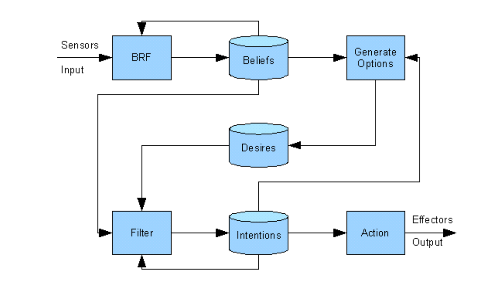
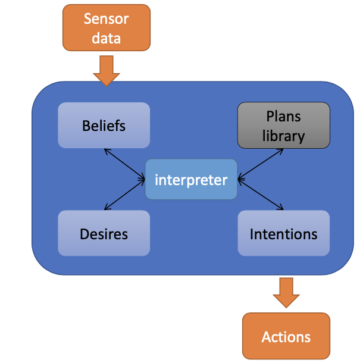
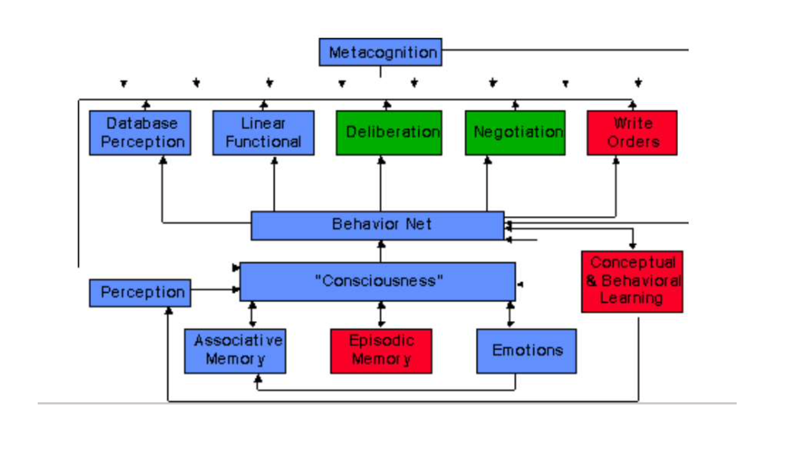
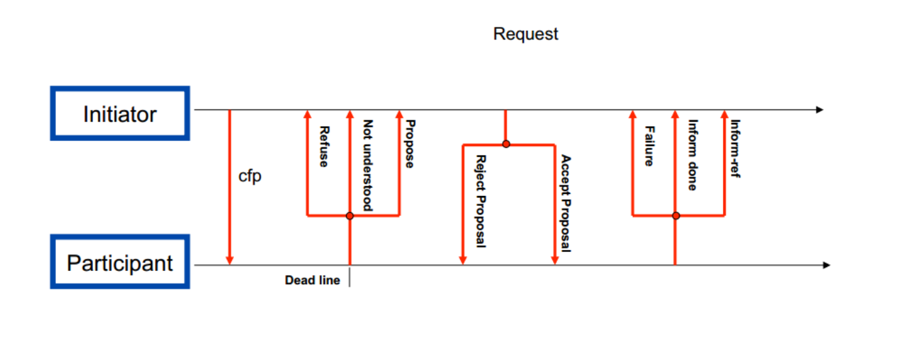
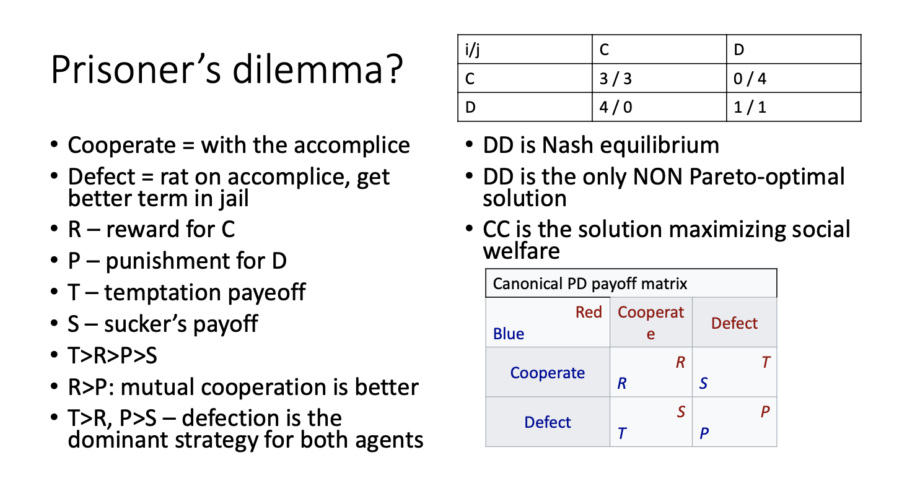

# NAIL106 Multiagent Systems Class Notes and Exam Review

## Lecture 1 Intro

### Chapter 1

-   Multi-agent Systems, systems composed of agents in an environment
-   Reasoning agents BDI, beliefs-desires-intentions
-   Communication of agents (speech acts), ontologies
-   Cooperate, solving some task as a group
-   Compete, selfish agents, resource allocation
-   Auctions and voting strategies
-   Design of multi-agent systems JADE, Agent Speak, ...
-   How to create an agent and a system of agents
-   AI is apart of multi-agent systems

### Chapter 2

-   **Agent Selection** The key problem of agent design, what should the
    agent do in a given moment based on information from the
    environment.
-   **Agent architecture** software architecture that enables the
    process of decision, action selection.

#### Agent Definitions, What is an agent?!

-   An **autonomous agent** is a system situated within and a part of an
    environment that senses that environment and acts on it, over time,
    in pursuit of its own agenda and so as to effect what it senses in
    the future.
-   An **agent** is a computer system that is situated in some
    environment, and that is capable of autonomous action in this
    environment in order to meet its delegated objectives.
-   Autonomy, agent should be able to choose how to solve a goal given
    its programmed beliefs
-   Deliberation, key problem is to select the best action for a given
    situation
-   Example, thermostat is a very basic example of a (not so
    intelligent) agent

#### Environments

-   Observable, is the environment fully or partially observable? Can
    the agent observe the full environment state via its sensors?
-   Static or Dynamic, is the environment changing? Static environment
    is only changed by actions of an agent, Dynamic environment can be
    changed by anything such as a cat.
-   Deterministic, where each action has only one result, create plans
    based on this idea. In non-deterministic is more complex.
-   Discrete or Continuous, fixed number of states vs robotics and
    control theory.
-   **Most environments in the real world are continuous,
    non-deterministic, dynamic, and partially observable.**
-   **Micro vs macro agents, designing a single agent vs designing a
    society of agents**

## Lecture 2

#### Weak Agents

-   reactive, senses the environment, is able to react in real time to
    changes
-   proactive, has its own goals, is able to fulfill them actively
-   social, is able to communicate with other agents
-   **difficult to achieve a balance between reactivity and
    proactivity**

#### Strong Agents

-   Rationality
-   Reasoning\
-   New knowledge\
-   Learning
-   BDI Architecture

#### Intentional Systems, Daniel Dennet

-   [link to
    paper](https://ase.tufts.edu/cogstud/dennett/papers/intentionalsystems.pdf)
-   Gnome in Polaroid camera painting picture very fast example!
-   Using the intentional stance to design agents (beliefs, desire, and
    intentions model)
-   Intentional system as an entity whose behavior can be predicted by
    assigning properties as beliefs, desires, and rational wit
-   **Physical stance** The physical stance is simply the standard
    laborious method of the physical sciences, in which we use whatever
    we know about the laws of physics and the physical constitution of
    the things in question to devise our prediction. (i.e. laws of
    physics)
-   **Design stance** predictions are riskier than physical-stance
    predictions, because of the extra assumptions I have to take on
    board: that an entity is designed as I suppose it to be, and that it
    will operate according to that design---that is, it will not
    malfunction. (i.e. alarm clock)
-   **Intentional stance** . The intentional stance is the strategy of
    interpreting the behavior of an entity (person, animal, artifact,
    whatever) by treating it as if it were a rational agent who governed
    its 'choice' of 'action' by a 'consideration' of its 'beliefs' and
    'desires.

### Chapter 3 Abstract Agent and Architectures

-   Environment
    -   Always try and make the environment discrete, every continuous
        environment can be modeled by a discrete environment with
        arbitrary precision
    -   Environment is a triple, set of environment states, initial
        state, and the state transformer function
    -   environment could change when a agent makes an action
-   Agent
    -   has a finite number of possible actions
    -   Agent is a function mapping runs to actions
    -   Agent is deterministic
    -   A system is a pair containing an agent and an environment
-   Run
    -   A sequence of moves and states in a multiagent system
-   State Transformer Function
    -   The environment has history, the complete sequence of events and
        actions impacts the current environment
    -   Environments are non deterministic, we dont know which state the
        enviornment will be after the action execution

#### Pure Reactive Agent (Tropist)

-   React without taking history into account
-   Action selection based on current environment state only
-   Thermostat is one example
-   Doesn't remember anything!

#### Agents with State

-   Agent starts with an initial state and then perceives the
    environment
-   It then updates its inner state according to this perception and
    selects and action
-   It executes this action then the process starts all over again

#### How to tell an Agent what to do?

-   Tell the agent what to do not how to do it
-   Define a goal indirectly with some kind of measure of success
-   An objection function evaluating environment states
-   Goal is to reach environment states with high utility value

#### Utility of a run

-   Overall success of an agent can be based on the utility of the worst
    state reached by an agent or the average utility of states visited
    by an agent
-   Usually better for agents running independently for a longer time

## Lecture 3

#### Maximization of Expected Utility

-   Optimal agent should maximize its expected utility
-   $P(r|Ag,Env)=1 \ \forall r \in R(Ag,Env)$
-   Predicate specification of a task
    -   Utility is a mapping to the set of {0,1}
-   The environment of a task
    -   RF(Ag,Env) is a set of runs of agent Ag in environment Env that
        satisfies F
-   When does an Agent solve the task (Env, F), can have strict or
    relaxed versions
    -   Pessimist, all runs satisfy F
    -   Optimist, at least one run satisfies F
    -   Realist, let us extend T such that it includes probability
        distribution over all possible results and so over all runs,
        compute the probabilities of all runs that end up being
        successful

#### Agent Tasks (Type of Tasks(from life))

-   To **find** something (achievement tasks)
    -   searching for a solution tasks (any task from AI)
    -   goal to reach any state from a goal set G
    -   agent is successful if all runs end in a state G
-   To **keep** something (maintenance tasks)
    -   agent must avoid some environment states
    -   B is a set of states such that F(r) is false if any states from
        B appear in the run r
    -   games are an example of this, the environment is the opponent
-   Combination
    -   Achieve state from G but avoid states from B

### Chapter 4 Deductive Reasoning Agent

-   Classical AI approach
    -   Classic way AI creates an intelligent system
    -   Symbolic representation of environment and behavior
    -   Syntactic manipulation with such a representation
    -   Thus the theory about the agent behavior is in fact a program,
        an executable specification providing concrete agent actions
    -   The transduction problem, how to represent the world
    -   the representation and reasoning problem
    -   **Deduction**, derivation of conclusions that are true, based on
        the fact that the preconditions are true, general -\> specific
    -   **Induction** if the preconditions are true then the conclusion
        is more likely true than not, special case -\> more general
-   Agent as a Theorem Prover
    -   L is a set of formulae in first order logics
    -   $D=L^2$ is a set of database formulae L
    -   The inner state DB of an agent is then DB $\in$ D
    -   Deliberation is done by means of deduction/derivation rules P in
        the underlying mathematical logics

## Lecture 4

### Chapter 5 Practical Reasoning Agent

\|-- Rigid (thermostat) -- Middle (BDI) -- Reactive (theorem proving?)
--\|

-   Inspired by human decision process
-   Two phases:
    -   Deliberation, what we want to achieve, i.e. I want to graduate
    -   Means-End, how to achieve the goal, i.e. Have to create a plan
        to graduate
-   **BDI**:
    -   **Beliefs**, agents knowledge, represent its information state
        -   They are subjective from the agents point of view
        -   They are not necessarily true
        -   They can change in the future
        -   Can contain inference rules allowing forward chaining
    -   **Desires**, represent the motivational state of the agent
        -   Objectives or situations that the agent would *like* to
            accomplish or bring about
    -   **Intentions**, a state of the world that the agent wants to
        achieve
        -   Intentions in an agent lead to actions, reasoning leads to a
            plan
            -   Persist until the agent achieves them
            -   Persist until the agent starts believing they cant be
                achieved
            -   Persist until the reasons leading to the intention
                disappear
        -   Intentions constrain further deliberation
        -   Intentions influence what the agent will believe in the
            future
-   **Deliberation**
    -   Options generating function
        $2^{Bel} \cdot 2^{Int} \implies 2^{Des}$
    -   Filter function
        $2^{Bel} \cdot 2^{Des} \cdot 2^{Int} \implies 2^{Int}$
    -   Belief refresh function
        $2^{Bel} \cdot \text{Per} \implies 2^{Bel}$

#### Means End Reasoning or Planning

-   The process of deciding how to reach a goal (intention) based on
    available means (actions)
-   Input
    -   Goal = intention
    -   Current environment state = agent beliefs
    -   Actions available for agent
-   Output
    -   Plan = sequence of actions
    -   When the agent executes the actions the goal is fulfilled

#### STRIPS

-   [link to
    paper](http://ai.stanford.edu/users/nilsson/OnlinePubs-Nils/PublishedPapers/strips.pdf)
-   STRIPS is a member of the class of problem solvers that search a
    space of "world models" to find one in which a given goal is
    achieved.
-   Model of the world = a set of first order logic formulae
-   The set of action schemes:
    -   Preconditions
    -   Effects
        -   Add facts that will be (newly) true after the action
        -   Delete facts no longer true
-   Planning algorithm
    -   Finds the differences between the goal and current state of the
        world
    -   Decreases the differences by application of suitable action
    -   This is nice but not very practical, the algorithms often
        iterates a lot over low level details
-   Block World Example -\> lecture 4 slide 13

#### Agent Planning Function (Planning Agent)

-   Agent does not have to construct plans on line bc it can be time
    consuming
-   Often time plan() is implemented by means of library of plans
-   Then it is sufficient to iterate through the plan library once and
    check if
    -   The preconditions of a plan correspond to agent current beliefs
    -   The effects of a plan correspond to the goal

#### Agent Commitments

-   Commitment Strategies
    -   Blind

        -   Agent continues to maintain an intention until it believes
            it has achieved the intention

    -   Single Minded

        -   Agent will continue to maintain an intention until it
            believes either the intention has been achieved or it is no
            longer possible to achieve it

    -   Open Minded

        -   The intention persists until the agent believes it is still
            possible to achieve it
-   Agent is committed to one strategy only i.e.
    -   If will end if:
        -   Believes the goal has been achieved
        -   Believes the goal is not possible to achieve
        -   The plan is empty
    -   Succeeded(I,B) = I holds under assumption of B
    -   Impossible(I,B) = I cannot hold assuming B
-   Commitment to goals
    -   When should the agent stop and reconsider the intention?
    -   Classical dilemma, deliberation takes time and the environment
        can change during the process
        -   Agent who does not reconsider intentions can happen to be
            committed to goals that are no longer possible to achieve
        -   Agent who reconsiders to often can be too busy to actually
            solve the current intention and might not achieve anything
    -   Meta-control
        -   fn reconsider() which is computationally simpler than the
            reconsidering itself
        -   observation reconsider() is working well if every time it
            proposes reconsidering the agent actually changes the
            intention after deliberation process
-   Agent types
    -   BOLD agent reconsider intentions only after it ends execution of
        the current plan (does not reconsider)
        -   Level of boldness, how many actions to execute between
            reconsiderations
    -   CAUTIOUS agent reconsiders after every action of the plan
    -   Dynamism of the environment, rate at which the world is
        changing, how many times the environment can change during one
        cycle
    -   Agent efficiency = achieved intentions / all intentions
        -   When the world is changing slowly bold agents are efficient
        -   When the world is changing quickly, cautious agents are
            better than bold

### Chapter 6 Procedural Reasoning System

#### PRS

-   Procedural Reasoning System (practical implementation of BDI)
-   **The first implementation of BDI architecture**
-   Maybe the most successful agent architecture, re-implemented in many
    cases and environments
    -   AgentSpeak/Jason
    -   Jam
    -   Jack
    -   JADEX
-   And also used in practice
    -   OASIS -- Sydney air traffic control system
    -   SPOC (single point of contact) business processes organization
    -   SWARMM -- air force flight simulator

#### Plans in PRS

-   Agent has a library of ready plans, representing its procedural
    knowledge
-   No full planning, only choosing a plan from the library
-   Plan
    -   Goal, condition holding after the execution
    -   Context -- condition necessary to run
    -   Body, actions to execute
-   Plan body:
    -   Not only linear sequence of actions
    -   Plan can contain goals
    -   Achieve f
    -   Achieve f or g
    -   Keep achieving f until g

#### Deliberation in PRS

-   Deliberation -- selecting intention from desires
-   The original PRS had meta-plans
    -   Plans about plans, they were modifying agent intentions
    -   But it was too complicated
-   Utility
    -   Every plan is evaluated by number representing expected utility
    -   The plan with biggest utility is selected
-   The selected plan is executed, which can result in adding more
    intentions on the stack
-   If a plan fails, agent chooses another intention from options, and
    continues

## Lecture 5

### Chapter 7 Reactive and Hybrid Architectures

#### Reactive Agents and Approach

-   Problems with symbolic representation and reasoning
-   Rejection of symbolic representation with deduction based on
    syntactic manipulation
-   Integration, intelligent behavior depends on the environment where
    the agent is situated
-   Embodiment, Intelligent behavior is not just the logic, it is a
    product of embodied agent
-   Emergence, intelligent behavior emerges by interaction of many
    simple behaviors
-   Reactive Agents:
    -   Behavioral, emphasize evolution and combination of individual
    -   Situated, agent is in environment, it is embodied
    -   Reactive, mainly only reacts to the environment, it doesnt
        deliberate, *subsumption*
    -   Sub-Symbolic, connectionism, finite automata, simple IF-THEN
        rules
-   Subsumption agent architectures
    -   Probably the most successful reactive approach
    -   Intelligent behavior can be generated without symbolic
        representation and without explicit abstract reasoning
    -   Intelligence is an emergent property of certain complex systems
    -   Architecture, each behavior is:
        -   An action selection mechanism
        -   Receives perceptions and transforms them into actions
        -   Responsible for some goal
        -   Is a simple rule-like structure
        -   Competes with others for control of the agent
        -   Works in parallel to others
        -   Behaviors are in the subsumption hierarchy defining their
            priorities
-   Action Selection
    -   Subsumption mechanism reacts on inputs
        -   Selects rules depending on the situation
        -   For each situation it checks if there is a behavior with a
            higher priority in the hierarchy
        -   If not the behavior is selected
        -   If nothing is executed no behavior is executed
-   Agent Network Architecture
    -   Every agent is a set of competence modules
    -   Each module has pre and post conditions
    -   Activation threshold works as a priority during action selection
        process
    -   Modules are connected in a network based on their conditions
    -   Modules in the network are activated and the most activated one
        is selected to determine the action
-   Limitations of Reactive Architectures
    -   They dont create any model of the world
    -   They derive everything from the environment
    -   Have only short term views on the world, act based on current
        state and local info only, it is difficult to consider global
        conditions and long term goals
    -   Emergence of behaviors is not an ideal engineering approach to
        programming
    -   Many layers of reactive behavior is difficult to design

#### Hybrid Architectures

-   Details
    -   Agent that is not completely reactive or completely deliberate

    -   Hybrid arch combines agent types for best of both worlds

        -   Deliberative planning components work on symbolic level,
            create representations
        -   Reactive components for immediate actions without complex
            computations

    -   These components are usually in a hierarchy where the reactive
        ones are given precedence over the deliberate ones
-   Types
    -   **Horizontal**

        -   Layers are connected to sensors in parallel
        -   Relatively simple but the layers can influence each other
        -   Mediator function resolves conflict between layers
            (potential bottle neck)

    -   **Vertical**

        -   Layers are connect to sensors and effectors in serial manner
        -   One pass, natural ordering and hierarchy of behaviors
        -   Two pass, bottom up go perceptions, top down go actions,
            flow resembles control in real world companies (i.e.
            Janitor/Engineer ... -\> CEO)

#### Intelligent Distribution Agent (IDA)

-   Trying to program the models of minds and consciousness
-   Complicated architecture
-   Combines many approaches from MAS and other fields of AI to achieve
    complex tasks
    -   Action selection, memory, deliberation, emotions
    -   Some choices were made ad hoc
    -   It is difficult to tune the collection of heterogeneous models
        to cooperate
-   Principles
    -   Mind is a multi agent system
    -   Consists of processes realizing specialized operations
    -   They communicate seldom via shared memory of blackboard type
        organized as an associative array
    -   The process dynamically create higher order coalitions
    -   Most applicable coalition will get to the consciousness (and is
        executed)
    -   There is a hierarchy of contexts representing the world on
        different levels, goals, perceptions, senses, concepts, cultural
        context

## Lecture 6

1.  Goal layer
2.  Conceptual layer
3.  Perception layer
4.  Global work space layer

-   Global Work space Theory
    -   Where different groups form coalitions and consciousness is the
        spotlight that then focuses on the coalition
    -   Then the person who invented it programmed it in Java

### Chapter 8 Ontologies (languages to represent information)

#### From single agents to MAS

-   How should an agent communicate in a MAS environment
    -   Knowledge representation
    -   Common dictionaries
    -   Standard messages
    -   Predictable behavior during communication i.e. comm protocols
    -   Semantics communication
    -   Technical problems with communication
        -   Distributivity
        -   Mobility
        -   Asynchronicity
        -   Unreliable comm channels

#### Ontologies

-   Ontology (from Greek to being) is part of philosophy dealing with
    nature of being, becoming, existence, or reality, and related basic
    philosophical notions. Aristotle is calling it the first philosophy,
    it is part of metaphysics, and dealing with the most general
    questions.
-   Ontologies in computer science means explicit and formalized
    description of part of reality. It is usually a formal and
    declarative description containing glossary (definition of concepts)
    and thesaurus (definitions of relations among concepts). Ontologies
    are kind of dictionaries for storing and exchanging knowledge about
    some domain in a standard way.
-   History see slides
-   Example album, genre, has songs, artist, music, lyrics, authors,
    band, members, instruments, ...
-   In general
    -   Classes, things with something in common
    -   Instances, objects, concrete individuals from the classes
    -   Properties
    -   Relations, between classes
    -   Sub-Class, transitive relation
    -   Further properties
        -   Background knowledge
        -   Structural part, this is usually called ontology?
        -   Facts, about concrete items
        -   Together they form a knowledge base

#### Ontology of Ontologies

-   From simplest/weakest towards general description of strong logical
    system
    -   Dictionary, controlled vocab, selected terms
    -   Glossary, definition of meanings by means of selected terms,
        often in natural language
    -   Thesaurus, def of synonyms
    -   Informal Hierarchy, sub classes of hierarchy, more or less
        defined, web market places or Wikipedia pages / sites
    -   Formal is a Hierarchy subsumption of classes in a formal way
    -   Classes with properties
    -   Value constrictions i.e. Constraints on values, i.e. every human
        has one mother
    -   General Constraints (arbitrary logic constraints), leads to
        complex reasoning algorithms
-   Different ontology of ontologies
    -   Application
        -   Most common, not usually reusable
    -   Domain
        -   Used in research and semantic web
    -   Upper
        -   Upper ontologies, trying to describe everything, i.e.
            wordnet
        -   Serve as a base for domain ontologies
        -   Wordnet, ideas not suitable for formal reasoning and machine
            usage
        -   Methodological objections

#### Ontological Languages

-   Formal declarative languages for knowledge representation
-   Contain facts and reasoning rules
-   Most often based on first order logic or description logic
-   Frames
    -   Historical predecessor of ontologies
    -   Proposed by Minsky, favorite in classical AI
    -   Visualization of human reasoning and language processing
    -   Terminology, FRAME -\> Object Oriented ...
        -   Frame = Object class
        -   Slot = Object property or attribute
        -   Trigger Acessor or Mutator Methods = Method
-   Examples of Languages:
    -   XML
        -   Wasnt specifically developed for ontologies but sometimes it
            is used for it
        -   Comes from the WWW
        -   Main advantage is the new tag definition
        -   XML tags natrually represent dictionaries
    -   RDF
        -   Standard knowledge representation tool (not only for web)
        -   Simple, fast but not not very expressive
        -   Uses triples (subject - predicate - object)
    -   OWL
        -   Web ontology language, comes from (semantic web)
        -   Ver 1 vs ver 2
        -   Collection of several formalisms to describe ontologies
        -   Syntax can be XML or RDF or functional notation
        -   Attempts to have formal yet practically usefull approach
        -   *Description Logic*
            -   Decidable fragment of FOL
            -   In the beginning, IS-A was quite simple. Today, however,
                there are almost as many meanings for this inheritance
                link as there are knowledge-representation systems.
        -   Open World Assumption
            -   [The closed] world assumption implies that everything we
                don't know is false, while the open world assumption
                states that everything we don't know is undefined.
    -   Description Logics
        -   Concepts (classes), roles (properties, predicates), and
            individuals (objects-
        -   Axiom - logical expression about roles and concepts,
            different from frames and OO because they fully describe a
            class
        -   A family of logical systems depending on admissible
            rules/axioms
        -   I.E.
            -   ACL = Agent Communication Language
            -   ACL, negation a class conjunction, limited existential
                quantifier, constrains
            -   Extensions, class disjunction, hierarchy of roles,
                transitivity of roles
            -   Terminology T-box, Axiom A-box
    -   OWL 1
        -   OWL-Lite (SHIF)
            -   The simplest, closer to RDF
            -   Many axiom constrains in order to maintain readability
                and fast machine processing
        -   OWL-DL (SHOIN)
            -   Corresponds to DL (description logic)
            -   Allows to express things such as - Two classes are
                disjunct
            -   Complete, Decidable
        -   OWL-Full
            -   The strongest expressive power
            -   Many problems are undecidable for this subset, though
    -   OWL 2
        -   Owl-EL simple and fast (polynomial time)
        -   Owl-QL, specialized to queries in knowledge bases
        -   OWL-RL rules language, special form of axioms/rules
    -   KIF
        -   Representation of knowledge in first order logic
    -   DAML+OIL
        -   Darpa markup language
        -   OIL Ontology Interchange Language
        -   Predecessor of OWL, abandoned in 2006

## Lecture 7

### Chapter 9 Agent Communication

-   In OOP communication means calling object methods with parameters
-   Agents cannot directly make other agent to do something, or to
    change its inner variables
-   Agents have to communicate, perform a communication act:
    -   In order to exchange information,
    -   In order to influence other agents to do something
-   Other agents have their own agenda, goals, and it is up to them how
    they handle all the information, requests, queries from peers

#### Speech Acts

-   **Speech Acts** Some parts of language usage have character of
    actions, because they change the state of the world similarly to
    physical actions, they are speech acts
    -   I pronounce you man and wife
    -   I declare a war on Russia
-   This is the pragmatic language theory, how the speech is used to
    achieve goals
-   Verbs as request, inform, promise
    -   Locutionary acts

        -   What was said,
        -   Utterances - small part of language usage, such as sentence
        -   Make me a tea

    -   Illocutionary act

        -   What was meant
        -   Locution + performative meaning (query, request, ...)
        -   Ha asked me for tea

    -   Perlocutionary act

        -   What really happened
        -   The effect of the speech act
        -   She made me to make her a tea
-   Example:
    -   SPEAKER request HEARER action
    -   Standard I/O conditions
        -   H can hear, it is not happening in the movie ...
    -   Pre-conditions
        -   What has to be true, so that S can choose this speech act:
        -   H must be capable to perform the action, S believes that H
            is capable to perform the action, it is not clear that H
            would perform the action without asking
    -   Honesty
        -   S really wants the action to be performed
-   Speech Acts Categories:
    -   Older:
        -   Request, Advice, Statement, Promise, ...
    -   Newer
        -   Assertives (Representatives) -- informing the hearer
        -   Directives -- requesting an action from the hearer
        -   Comissives -- promise by a speaker
        -   Expressives -- speaker expresses a mental state, emotions,
            "thank you!"
        -   Declarations -- change the state of things, war, marriage
    -   Speech act should have
        -   Performative verb -- request, query, inform, ...
        -   Propositional content -- the window is closed
-   Planning Theory of Speech Acts
    -   Some guys took planning theory and applied it to STRIPS, first
        formal system that had communications as actions and applied
        planning principles on those actions
    -   STRIPS
        -   preconditions,
        -   postconditions
    -   Modal operators
        -   beliefs,
        -   abilities,
        -   wants
    -   Thus, the semantics of speech acts is defined by means of
        precondition- delete-add approach from STRIPS
-   Example Request and Inform
    -   S,H,A -\> Speaker Hearer Action!
    -   Request (S,H,A)
        -   Preconditions
            -   Cando, (S believe (H cando A))&(S believe(H believe (H
                cando A)))
            -   Want, (S believe (S want request instance))
        -   Effect, (H believe (S believe (S want A)))
    -   Inform(S,H,F)
        -   Preconditions
            -   Cando, (S believe F)
            -   Want, (S believe (S want inform instance))
            -   Effect, (H believe (S believe F))

## Lecture 8

#### Agent Communication Languages

-   KQML

    -   Knowledge Query Manipulation Language turned into ACL
    -   DARPA knowledge sharing effort
    -   Outter communication language, envelope of a letter
    -   Contains illocutionary part of message
    -   Parts of KQML??
        -   Performative
        -   Content
        -   Reciever
        -   Language
        -   Ontology
    -   Parameters and Performatives
        -   Content
        -   Force
        -   Reply-with
        -   In-reply-to
        -   Sender
        -   Receiver
        -   ...
        -   Achieve
        -   Advertise
        -   Ask-about, ask-one, ask-all, ask-if • Break, sorry, error
        -   Broadcast
        -   Forward
        -   Recruit-all, -one
        -   Reply
        -   Subscribe
    -   Example ??

    <!-- -->

          (ask-one
          :content (PRICE IBM ?price) :receiver stock-server :language LPROLOG
          :ontology NYSE-TICKS
          )

-   KIF

    -   Knowledge Interchange Format \~ FOL
    -   Inner language
    -   Propositional contents of the message
    -   Knowledge representation

-   FIPA ACL (foundation of physical agents, agent communication
    language)

    -   Simplification of KQML, semantics, better system in
        performatives,
    -   Practical implementation in JADE

-   ACL

    -   Example:

    <!-- -->

          (inform
          :sender agent1
          :receiver agent2
          :content (price good2 150) :language sl
          ontology: hpl-auction
          )

    -   ACL performatives
        -   Request, request-when
        -   Inform, inform-if, inform-ref • Subscribe
        -   Cfp
        -   Propose
        -   Proxy
        -   Refuse
        -   Reject-proposal
        -   Confirm, disconfirm
        -   Agree, cancel

### Chapter 10 Cooperation Of Agents

-   Contract Net, BlackBoard System, and Results Sharing, FELINE,
    Interaction of Agents
-   Lecture mas21-8.pdf stops at slide 16 of 19

#### Working Together

-   Agents have different goals, are autonomous
-   Agents work in time, not hard-wired, decisions made at run-time, be
    capable of dynamic coordination
-   Sharing tasks
-   Sharing information
-   **Coherence** how well the system performs as a whole
-   **Coordination** how well agents minimize overhead activities
    related to synchronization
    -   Cooperative Distributed Problem Solving **CDPS**
    -   Cooperation of individual agents when solving a problem
        exceeding their individual capabilities (information, sources)
    -   Agents implicitly share a common goal, there are no conflicts
        **benevolence**
    -   Overall system performance is the measure of success
    -   Agent helps the whole system even if it can be disadvantageous
        for it
    -   Benevolence enormously simplifies the system design
-   CPDS vs PPS vs MAS
    -   CDPS differs from **PPS** (parallel problem solving)
        -   Focus on parallel solving,
        -   Homogenous and simple processors
    -   Generally, agents in MAS are more complicated:
        -   MAS is a society of agents with their own goals
        -   They do NOT share a common goal
        -   They should cooperate despite this
            -   Why and how
            -   How to identify and resolve conflicts
            -   How to negotiate and bargain
-   Task Sharing and Result Sharing
    -   CDPS approach:
    -   Problem decomposition
        -   Hierarchical, recursive
        -   How to decompose, who does the decomposition
        -   ACTORS -- for each sub-problem a new agent, till the
            instruction level
    -   Sub-problem solution
        -   Agents typically share some information during this
        -   Agents might need to synchronize their actions
    -   Solution synthesis -\> Hierarchical
    -   Task sharing -- agreement of agents
    -   Result sharing -- proactive or reactive

#### CNET (Contract Net Protocol)

-   Metaphor for task sharing via the contract mechanism
    -   Recognition, agent recognizes it has a problem it cannot solve
        on its own, need to involve other agents
    -   Announcement, agent broadcasts the announcement of the task
        including
        -   specification

        -   description of the task (maybe executable)

        -   constraints (deadline, price, ...)
    -   Bidding, receiving agents decide if they want to participate,
        submit a tender
    -   Awarding, Expediting, the agent in need selects a winner among
        bids and awards a contract
-   Simple, can lead to hierarchical cascades of sub-contracting, was
    extensively studied, most implemented
-   Other types of auctions possible (cf. the Auctions talk)

#### Blackboard Systems (BBS)

-   Agents use a central blackboard to write down plans and take plans
    from (?)
-   BBS, the first original scheme for cooperative problem solving
-   Results shared via the common data structure -- the blackboard BB
    -   Multiple agents (experts) sit around the BB, they can read and
        write there
    -   The tasks are dynamically appearing on the BB
    -   When an expert sees it can solve some task, will write the
        partial solution on BB
    -   Until the final solution appears on the BB
-   Requires mutual exclusion over BB -- bottleneck
-   Typically contain several abstraction levels, the BB can be
    structured into hierarchy
-   BBS Roles
    -   Arbiter
        -   Selects experts who can come to BB
        -   Reactive, or considering plans maximizing expected utility
        -   Responsible for higher-level problem solving (motivation)
    -   Experts
        -   Agents to solve the problem by cooperation
        -   React on the goals on BB
        -   Execute actions when selected
    -   BB
        -   Shared memory
        -   The formalism for information representation is important
        -   Typically for this paradigm, goals (and actions) are
            hierarchically ordered
-   BBS Example BBWar Game
    -   BB
        -   hash table -- maps required capabilities to tasks
        -   Open missions -- tasks are publicized on the BB
    -   Experts
        -   Solvers of various tasks in a hierarchy
        -   List of capabilities and efficiency
    -   Example:
        -   Commander agent seeks for ATTACK-CITY tasks, transforms them
            into multiple ATTACK-LOCATION tasks
        -   Soldiers of various kinds seek for appropriate
            ATTACK-LOCATION missions
-   BB Pros and Cons
    -   Simple mechanism for agent coordination, cooperation, task and
        results sharing
    -   Experts do not need to know about other experts and still they
        can cooperate with them
    -   Messages on BB can (and typically are) rewritten -- delegate
        tasks, create subtasks, change experts ...
    -   Sometimes the BBS architecture is used for general communication
        of agents (every message is via BBS)
    -   Agents typically have to share the same architecture (to access
        the BB), and it can get crowded around BB (maybe distributed
        hash-tables can help)

#### Results Sharing

-   straightforward (wtf does this mean)
-   Besides trivial reasons, results sharing can help in solving these
    aspects:
    -   Confidence
        -   Independent solutions of identical problems can be compared
    -   Completeness
        -   Agents share their local views to create more global idea
            about the problem
    -   Precision
        -   Sharing can improve overall precision of the solution
    -   Timely manner
        -   An obvious advantage of distributed approach is the time
            reduction
-   Example: FELINE
    -   Long time ago (before KQML or ACL)
    -   Distributed expert system
    -   Sharing of knowledge, distribution of sub-tasks
    -   Each agent is a rule-based system
        -   Skills, I can prove/contradict the following ...
        -   Interests, I am interested if the following is true or false
            ...
    -   Communication
        -   Sender, receiver, content (hypothesis + speech act)
        -   Request, response, inform

#### Interaction of Agents

-   General Info
    -   Agents can help each other, or obstruct
        -   Robots can move a brick only by pushing from one side
            together
        -   Robots crowd the entrance and cannot open the door
    -   Agents affect the environment
    -   Agents can create societies, subordinates, enemies
    -   It is important to know the types of interactions among agents
        in the particular MAS
    -   Otherwise, it is not possible to design efficient control
        mechanisms
    -   The simplest case, interaction of two rational (selfish) agents
        in an environment resembling a game
-   Self Interested Agents Cooperate
    -   Why should an agent be honest about its capabilities
    -   Why should agent finish an assigned task
    -   If the system is homogenous (such as completely designed by us),
        benevolence is good strategy
    -   But most often, the system contains agents with various
        interests
        -   Conflict between the common goal and the goals of individual
            agents
        -   Consider, e.g. the air traffic control
    -   Sometimes, the system is complicated, it is not explicitly clear
        what the common interest is
    -   Then, it is better to consider selfish agents
-   What does a selfish agent want?
    -   To maximize its **expected utility**
    -   There is game theory, and many AI techniques to achieve this
        -   But other agents in the system want the same
    -   Each agent typically knows utilities fo its own actions
    -   Strategic thinking:
        -   **Maximize your utility**
    -   Considering everybody else (also) **act rationally**
    -   This does NOT maximize the common utility
    -   But it's a robust strategy
-   Self interested agent..
    -   *Benevolence not supported*
    -   The set of possible outcomes O={o1, o2, ...},
        -   Common for all (both) agents
    -   And preferences on O, **utility function** u: O-\>R
        -   Different for each agent
        -   Utility function sorts outcomes
    -   Remarks:
        -   Money is not a good utility for humans
        -   Non-linear utility function on money -- different utility
            for rich/poor people
        -   Extremes are symmetric

## Lecture 9

-   mas21-09.pdf
-   MAS-Lecture-09.mp4
-   slides 0 - 12

### Chapter 11 Interaction of Agents

-   Pure Strategy
-   Nash Eq
-   Pareto Eq
-   Social Welfare, assess the performance of the whole system by
    summing up the outcomes of the agents
-   Decision process as a 2 player game
    -   Both agents i and j influence the result
    -   Environment state change
        -   e: Ai x Aj -\> O
    -   Agent has a strategy Si(Sj)
    -   Strategy Si is dominant for agent i if it provides better or
        same result than any other strategy of agent i, against all
        strategies of agent j
    -   Worst case scenario, opponent is rational, chooses the best
        alternative

#### Nash Equilibrium

-   Strategies s1 and s2 are in Nash equilibrium, if:
    -   If agent i plays s1, for agent j the best is to play s2
    -   If agent j plays s2, agent i is best playing s1
-   I.e. s1 and s2 are mutually the best answer
-   To find equilibria for n agents and m strategies takes mn
-   The definition is Nash equilibrium of **pure strategies**
    -   But not every game has a Nash equilibrium in pure strategies
    -   And some games have more of them
-   Nash Theorem
-   **Mixed strategy** random selection between pure strategies
-   **Nash theorem:** Every game with finite number of strategies has a
    Nash equilibrium in mixed strategies
-   How difficult it is to find such an equilibrium
    -   total search problem,
    -   since 2006 we know the problem is PPAD complete
    -   PPAD-completness mean (oversimplified!) only a little bit less
        intractable than NP-completness.
-   Pareto Optimality
    -   The strategy is **Pareto-optimal/efficient**, when no other
        strategy exists which would improve agent result without
        worsening the other agent result
    -   Non-Pareto-optimal solution can be improved without making other
        agent outcome worse

#### Social Welfare

-   Why don't actually agents maximize a common utility -- social
    welfare = sum of utilities of all agents in the system
-   But this is good in the cooperation scenarios only
-   Typically,
    -   when all agents are from one team
    -   Have one owner
    -   Solve one task
    -   The more homogeneous the system, the better

#### Games

-   Prisoners Dilemma
    -   Implications of Prisoners Dilemma
        -   Tragedy of the commons, if someone doesn't own it then
            humans will use it to depletion
        -   What does it mean to be rational?
        -   Are people rational?
        -   Shadow of the future, Iterated, Axelrod TFT Strategy
    -   Nash Equilibrium
        -   strategies are non existence if one player can get better
            results by changing their strategy
    -   Pareto Optimality
        -   there is no set of strategies for the players such that all
            players would get better
    -   Strategies
        -   Always Cooperate, Always Defect, TFT
        -   AC : TFT always getting 3 points
        -   AC : AC always getting 3 points
        -   AD : AD always getting 1 point
        -   AD : TFT always getting 1 + 4 / num of iterations, TFT
            getting 99 while AD getting 104

| i/j    | Ballet | Fight |
|--------|--------|-------|
| Ballet | 1/2    | 0/1   |
| Fight  | 0/0    | 2/1   |

-   Coordination Game
    -   Payoffs support cooperation
    -   Nash equilibrium (pure strategies) are (BB), (FF)
    -   Social welfare is (BB), (FF)
    -   Pareto optimality is (BB), (FF)
    -   Mixed strategy Nash equilibrium for each is 2/3 for more
        preferable and 1/3 for less preferable
    -   The utility in mixed strategy is 2/3 only, less than pure
        strategy
    -   Also known as Battle of sexes (BOS) or Bach or Stravinsky (BOS)

| i/j    | Ballet | Fight |
|--------|--------|-------|
| Ballet | 5/5    | 1/6   |
| Fight  | 6/1    | 0/0   |

-   Anti-Coordination Game
    -   Payoffs support playing different strategies
    -   In coordination games, sharing the resource creates a benefit
        for all
    -   In anti-coordination games, sharing comes at a cost
    -   Nash equilibriums (pure strategies) are (CD), (DC)
    -   Social welfare is (CD), (DC)
    -   Also known as Chicken-Dare (the cost of conflict is big),
        Hawk-Dove

## Lecture 10

-   mas21-10.pdf
-   mas21-09.pdf
-   MAS-Lecture-10and11.mp4

#### Quick review of last lecture

-   Agent Interactions
    -   Game theory, its math based, proof based
    -   Agents, rational agent (wants to maximize its own utility
        function)
    -   Not so good... results of Nash equilibria aren't practical and
        can be difficult to work with game theory
    -   Nash equilibrium two strategies that are fool proof for each
        player playing
        -   Some games the Nash equilibrium doesn't exist
        -   Sometimes Nash equilibria exists only in mixed strategies
            (like rock paper scissors), assign 1/3 to each move and
            randomly play each action/move
        -   TFT is pareto optimal for iterated

### Chapter 10 Voting

-   Common utility -- **social welfare** -- aggregation of individual
    utilities
-   Common candidate in elections -- **social choice** -- choosing the
    best candidate / utility
-   Example:
    -   A: o2\>o1\>o3,
    -   B: o3\>o2\>o1,
    -   C: o2\>o3\>o1
    -   Social welfare: o2\>o3\>01
    -   Social choice: o2
    -   **Ballot**, each agent expresses its voting preferences
        -   Traditionally in elections:
            -   Pick your favorite(s) from the list
        -   **Preference ballot**, each voter ranks the choices in the
            order of preference.
        -   Individual ballots are combined into a preference schedule
        -   From the schedule, a winner is determined by a voting scheme

#### Voting Schemes

-   **Plurality**
    -   Combine individual preferences to derive a social outcome
        -   Each voter submits preferences

        -   Each candidate gets one point for every preference ranking
            them first

        -   Winner is the one with largest no. of points
    -   With two candidates, it is simple majority election
    -   With more candidates, it can happen that the winner is not a
        preferred candidate for majority of voters
    -   In practice, individual ballots contain only first choice
    -   The choice with the most first-preference votes is the winner
    -   Ties are possible, there should be some **run-off** voting to
        establish the winner
    -   **Majority** the winner receives more than 50% votes
    -   Plurality winner does not have to be a majority winner (for more
        than 2 candidates)
    -   In practice, plurality with majority condition and possible
        second round of 2 best candidates, Czech Senate, President
-   **Condorcet Paradox**
    -   Condorcet paradox, there are situations in which no matter which
        outcome we choose, a majority of voters will be unhappy with the
        result
        -   Marquis de Condorcet, French philosopher and mathematician
            (1743-94), active in French revolution, died in prison
    -   Tactical voting (do not follow my preferences, but vote against
        some candidate)
        -   Imagine, in the next example, o2 and o3 are somewhat similar
            (from the same party), so voters of o2 would vote for o3 to
            defeat o1 (called insincere voting)
    -   Example:
        -   o1 -- 40%,
        -   o2 -- 30%,
        -   o3 -- 30%,
        -   winner is o1, but 60% did not want him
    -   Condorcet Example
        -   V1: A \> B \> C
        -   V2: B \> C \> A
        -   V3: C \> A \> B
        -   Social welfare is cyclic, although individual preferences
            are linear
        -   The similar situation as with Nash equilibrium for the
            Rock-Paper- Scissors game (no NE in pure strategies)
        -   Condorcet proposed several fairness criteria -- properties
            that should be true for fair elections, started the
            mathematical theory of voting
        -   No Condorcet winner (preferred choice in one-to-one
            comparisons)
-   **Plurality with Elimination**
    -   Also called *Instant runoff voting*
    -   It should have similar effect as the plurality with runoff (2nd
        round)
    -   But the idea is to make use of preferences already registered
        without the need of the second round
    -   Also should eliminate insincere voting
    -   Used in Australian House of Representatives, Olympic committee,
        ...
        -   Eliminate choice with least first-place votes
        -   Redistribute the votes for that candidate to voter's next
            choice
        -   Repeat this until the winner has a majority
-   **Sequential Majority Elections**
    -   Variant of plurality where players play pairwise "tournament
        rounds" the winner moves further
    -   **Tree tournaments**
    -   The order of tournaments influences the election
    -   American Idol
    -   **Condorcet method**
    -   Simulate all pairwise elections
    -   Takes too long, too expensive
-   **Borda Count**
    -   Each voter submits its complete preferences -- integer ranking,
        they are aggregated by counting the orders of all candidates
        (first place -- N-1, second -- N-2, ... last -- 0 )
    -   It should be a consensus-based voting rather than a majority one
    -   Used in real life politics sometimes: Slovenia, Nauru, Island,
        and in academic institutions, competitions
-   **Borda Combinations**
    -   Black method
        -   Condorcet method
        -   In the absence of Condorcet winner, choose Borda winner
    -   Baldwin method
        -   Count Borda scores, eliminate candidate with fewer points
        -   Recompute Borda scores for new candidates only, iterate
    -   Nanson method
        -   Count Borda scores, eliminate the candidates bellow average
        -   Recompute Borda scores for new candidates only, iterate
    -   These provide Condorcet winner, if exists
-   **Slater System**
    -   Optimize the preference aggregation process
    -   Final ranking is an acyclic graph representing a tournament
        (between every pair, there is an oriented edge, meaning a ranked
        above b)
    -   Slater ranking minimizes the number of edges that represent the
        disagreement -- the inverted edges
    -   Select a ranking of candidates to minimize the number of pairs
        of candidates such that the ranking disagrees with the pairwise
        majority vote on these two candidates
    -   NP-hard

## Lecture 11

-   mas21-12.pdf
-   MAS-Lecture-11.mp4
-   voting for superheros
-   Lecture 11 was all voting discussion

#### Properties of Voting Procedures

-   *Pareto property*
    -   If in everybody's preferences X \> Y, then it should hold that X
        \>sw Y (sw = social welfare)
    -   Holds for majority and Borda voting procedures
    -   Does not hold for sequential majority
-   *Condorcet winner*
    -   Condorcet winner is the candidate that beats opponents in
        pairwise comparisons, quite a strong thing.
    -   Condorcet winner condition: Condorcet winner will be the overall
        voting
    -   Sounds reasonable but holds only for sequential majority, and
        the Borda combinations
-   *Independence of irrelevant alternatives (IIA)*
    -   Whether X \>sw Y (i.e. X is ranked above Y in the social
        outcome) should depend only on relative orderings of X and Y in
        voters preferences.
    -   Thus, when all preferences remain the relative ordering of X and
        Y, and maybe change something else, like preferences of other
        candidates X, Z or Z W, the relation X \>sw Y should remain the
        same
    -   Does not hold for majority, sequential majority, neither Borda
    -   Looking for potential candidate that if removed changes the
        relative order
-   *Unrestricted domain, or universality*
    -   A property of social welfare functions in which all preferences
        of all voters (but no other considerations) are allowed.
    -   With unrestricted domain, the social welfare function accounts
        for all preferences among all voters to yield a unique and
        complete ranking of societal choices.
    -   Thus, the voting mechanism must account for all individual
        preferences, it must do so in a manner that results in a
        complete ranking of preferences for society, and it must
        deterministically provide the same ranking each time voters'
        preferences are presented the same way.
-   *Dictatorship*
    -   The social outcome is determined by one of the voters -- the
        dictator, whose preferences are taken as the social outcome
    -   Non-dictatorship: No voter in the society is a dictator in the
        sense that, there does not exist a single voter i in the society
        such that for every set of orderings in the domain and every
        pair of distinct social states x and y, if voter i strictly
        prefers x over y, x is socially selected over y

#### Arrows Theorem

-   Arrow said in summary: We don't have a system where these properties
    are satisfied together for 3 or more candidates, no ranking system
    can satisfy all of the properties of voting procedures
-   For 3 and more candidates, no ranked voting electoral system can
    convert the ranked preferences of individuals into a community-wide
    (complete and transitive) ranking while also meeting a specified set
    of criteria:
    -   unrestricted domain,
    -   non-dictatorship,
    -   Pareto efficiency, and
    -   independence of irrelevant alternatives.
-   Arrows Theorem Simplified
    -   For elections with more than 2 candidates, the only voting
        procedure satisfying the Pareto condition and IIA is a
        dictatorship, in which the social outcome is in fact simply
        selected by one of the voters.
    -   This is a negative result: there are fundamental limits to
        democratic decision making.
    -   But the interpretation that the only working system in society
        is the dictatorship is totally wrong.

## Lecture 12

-   mas21-12.pdf

-   MAS-Lecture-12.mp4

-   Bayes-Nash Equilibrium: is defined as a strategy profile that
    maximizes the expected payoff for each player given their beliefs
    and given the strategies played by the other players. That is, a
    strategy profile $\sigma$ is a Bayesian Nash equilibrium if and only
    if for every player $i$ keeping the strategies of every other player
    fixed, strategy $\sigma _{i}$ maximizes the expected payoff of
    player $i$ according to his beliefs

#### Auctions

-   Mechanism how to allocate (sparse) resources to agents
-   An **auction** is a market institution in which messages from
    traders include some price information, this information may be an
    offer to buy at a given price, in the case of a bid, or an offer to
    sell at a given price, in the case of an ask, and which gives
    priority to higher bids and lower asks
-   Auction Protocol Options
    -   Winner -\> first price or second price
    -   Open cry vs sealed bid
    -   One or more rounds
-   The *seller* wants to maximize the price
-   The *buyer* wants to minimize the price and has its own utility
    function
-   In real life, think eBay, Sothebys auction house, mining permits,
    radio frequencies, some games
-   Computer Science, can bid for processor time
-   Efficiency of auction, allocate the resources to agents that want
    them the most
-   Auction Type Examples
    -   First Price Sealed Bid
        -   One round, closed offers
        -   Highest bid wins, the offered price is paid
        -   Market price not estimated
        -   Other participants preferences not estimated
        -   Used for selling properties, treasury bonds, ...
        -   Dominant strategy is to go epsilon bellow your utility
    -   Vickrey
        -   William Vickrey (1914-1996), Nobel laureate in economics
        -   Sealed bid, one round, second-price
        -   Highest bid is the winner, pays the second highest bid price
        -   Dominant strategy for the buyer is to offer its true value
            -- why? • Google AdWords, stamps, ...
    -   English
        -   Open cry, increasing price, first-price
        -   The most common one -- antiques, artwork, internet, 95% of
            auctions are English
        -   Most common case where the buyer overshoots the price •
            Dominant strategy -- increase epsilons until the utility
    -   Dutch
        -   Open cry, decreasing price, first-price
        -   Often used for perishable items -- flowers, fish
        -   Sellers like it
        -   Not possible to estimate the market price
        -   Not possible to estimate other buyers preferences
        -   Dominant strategy -- wait till utility minus epsilon is
            reached
-   Example
    -   Buyers utilities:
        -   A--80Kč
        -   B--60Kč
        -   C--30Kč
    -   Different auctions outcomes:
        -   English -- 61
        -   Dutch -- 80or79ish
        -   FP Sealed bid -- 80
        -   Vickrey -- 60
    -   Ideal scenario with zero additional information and no cheating,
        ...
-   Other Auction Types
    -   Combinatorial
        -   more items, subsets of items, favorite for theory
    -   Paying all the bids
        -   Poular as a tool for lobbing and bribes research, sport
            events (pay to run race)
    -   Quiet
        -   Version of english auction on paper
    -   Amsterdam
        -   Start using english, when two buyers remain, switch to Dutch
            and then double the starting price for the start of the
            Dutch auction
    -   Tsukiji Tokyo Fish Market
        -   Offers all at once, settle conflicts by scissors-stone-paper

## Lecture 13 Learning in MAS

-   mas21-13.pdf
-   MAS-Lecture-13.mp4
-   REVIEW Last 5 minutes of last lecture

#### Introduction

-   Intelligent agents in MAS should be adaptive, they should learn
-   The most common approach to learning in MAS is reinforcement
    learning (RL) -- change of behavior via trial-error approach based
    on rewards from environment
-   One agent learning is easier -- traditional RL algorithms such as Q-
    learning can be applied
-   Multi-agent reinforcement learning -- MARL -- agents learn
    simultaneously
-   Markov Games approach -- Nash and Pareto optimality
-   Deep learning approach -- MADRL -- currently state-of-the-art
-   Markov Decision Process
    -   Agent learns its decision/control policy expressed by state
        transition function, based on (occasional) feedback from
        environment.
    -   MDP is a tuple (S,A,T,R,$\gamma$):
    -   S is a state space
    -   A is an action space
    -   T: SxAxS -\> [0,1] is the transition function -- probability of
        state transition from state to state given an action
    -   R: SxAxS -\> R is the reward function -- immediate reward for
        agent going from state to state executing action
    -   0\<= $\gamma$ \< 1 is a discount factor -- trade-off between
        immediate reward and future rewards
    -   Learning in MDP
        -   The agent goal is to maximize the expected performance in
            long-term perspective
        -   The transition function T is unknown, the agent solves it by
            designing a policy $\pi$: S -\> A, i.e. mapping from states
            to actions
        -   Optimal policy $\pi$\* maximizes the expected discounted
            sums of future rewards:
            $E[ \sum(\gamma t R(s_t, a_t, s_{t+1}), t=0, ... )]$
        -   The value function V$\pi$ : S -\> R assigns the expected
            utility in a state given the agent follows a particular
            policy
        -   In case we have a complete description of all MDP functions,
            i.e. representation of states, actions, transitions and
            rewards, the optimal policy can be found by value iteration
            algorithm.
-   Q Learning
    -   But often we do not, thus RL algorithm learns from experience by
        interacting with the environment in discrete steps
    -   Q-learning agent:
        -   Represents estimate of expected payoffs of states vs actions
            as table Q

        -   Q(s,a) -- in a state s take action a, the value is an
            estimate of the discounted sum of future rewards

        -   It is updated each time agent goes from state s to state s'
            by action a, and receives a payoff r (0\<=$\alpha$\<=1 is a
            learning rate ):

        -   Q(s,a) \<- Q(s,a) + $\alpha$ [(r + $\gamma$ maxa'
            Q(s',a')) - Q(s,a)]
-   Markov Game
    -   Generalize MDP for N agents
    -   Each agent has its own reward function Ri
    -   The joint action space is a product of of individual action
        spaces Ai
    -   Each agent has its own policy $\pi$, the value function V$\pi$
        depends not only on agent's own policy, but on policies of other
        agents
    -   Using game theory we can say the policy of agent is best
        response to joint policies of all agents, if it maximizes the
        value function
    -   Policies can be in Nash equilibrium
    -   Joint policies can be Pareto-optimal
-   Challenges in MAR Learning
    -   Game theory provides nice mathematical formalizations (for few
        agents), but in practice there are challenges:
    -   Environments are partially observable
    -   State and action spaces can be continuous
    -   Agents update their policies simultaneously, the environment is
        non- stationary from the single agent perspective
    -   Agents can converge to sub-optimal solutions or oscillate
        between more Nash equilibria
    -   The variance in estimates of value function can be large
-   Policy Based Learning
    -   Optimize directly the agents' policies
    -   Do not use intermediate value estimates
    -   Parameterize the policy by parameters z, i.e. $\pi$(z), so you
        can search for optimal parameters z\* of the policy
    -   Use gradient descent on the parameter space
    -   REINFORCE -- use Monte Carlo playouts of full episodes to
        estimate gradient (Gt is the return, $\delta$ is the gradient)
    -   zt+1 = zt + $\alpha$ Gt $\delta$ $\pi$(At,St,zt) /
        $\pi$(At,St,zt)
-   Actor Critic Methods
    -   The actor represents a policy -- the action selection mechanism
    -   The critic is used for the value function learning
    -   If the critic learns a state-action (Q) function, and a state
        value (V) function, we can use advantage function as Q-V
        (relative advantage of an action w.r.t. other actions)
    -   Actor optimizes its policy
    -   Critic optimizes its estimate of actor performance
-   Deep Learning
    -   DQN -- deep Q-learning network (feedforward or recurrent for
        partially observable environments)
    -   In policy-based methods, the policy is represented by a neural
        network (inputs are states, outputs are actions, weights are
        parameters)
    -   A3C -- asynchronous advantage actor-critic:
    -   Multiple workers updating the gradient information
        asynchronously
    -   Policy loss function for actors
    -   Value loss for critic

## Exam Review

-   Likely Topics
    -   What is the difference between reactive and planning agents,
        which do you prefer a planned why?
    -   What is BDI?
    -   AAA (Abstract agent architectures)
    -   Contract NET vs BBS
    -   ACO (Ant colony optimization)
    -   BDI and Brooks subsump architecture
    -   ContractNet + what would cfp look like with other auctions
    -   Iterated Prisoners Dilemma
    -   Contract Net (CNET) and Blackboard Systems (BBS)
