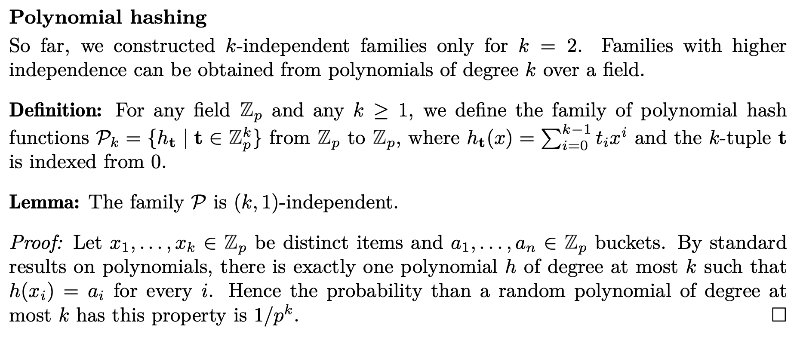

# NTIN066 Data Structures 1 Exam Review 

## Outline

1.  **14-02** Lecture 1: Introduction, model of computation, amortized complexity, examples. [L01]
2.  **21-02** Lecture 2: Amortized complexity: potentials. Lazily balanced trees. Splay trees (without analysis of splaying cost). [L01-2] [ST]
3.  **28-03** Lecture 3: Splay trees: alternative Insert and Delete, amortized (weighted) analysis, static optimality, working set bound (without proof). [L02] [ST]
4.  **07-03** Lecture 4: (a,b)-trees: definition, operations, choice of parameters. Amortized bounds for (a,2a-1) and (a,2a)-trees. Top-down splitting and joining. [L03]
5.  **14-03** Lecture 5: Memory hierarchy: hardware caches, theoretical models, cache-aware and cache-oblivious algorithms. Mergesort, matrix transposition. [L05] [CO]
6.  **21-03** Lecture 6: Cache-oblivious algorithms: matrix transposition. Model versus reality: competitivity of LRU. [L05] [CO]
7.  **28-03** Lecture 7: Hashing: with chaining. c-universal families, expected length of chains, constructions from linear congruence / multiply-shift / scalar product. [L06]
8.  **04-04** Lecture 8: Hashing: k-independent families, compositions of hashing families. Tabulation hashing, cuckoo hashing. [L06] [Tb]
9.  **11-04** Lecture 9: Hashing: with linear probing and its analysis. Rolling hashing. [L06] [T] [Tb]
10. **18-04** no lecture
11. **25-04** Lecture 10: Hashing of strings. Bloom filters: single-band, multi-band, counting filters. [L06] [Tb]
12. **02-05** Lecture 11: Suffix array, LCP array, applications. Constructions of LCP array (Kasai's algorithm) and suffix array (doubling). [L08]
13. **09-05** Lecture 12: Geometric data structures: range queries, k-d trees, range trees. [L07] [M7]
14. **16-05** Lecture 13: Parallel data structures: (a,b)-trees, lock-free and wait-free data structures, lock-free stack. [L09]

## Exam Questions

### Major questions

#### Define the **Splay tree**. State and prove the theorem on amortized complexity of the Splay operation.

-   Definition
    -   Self-adjusting binary search trees
    -   Whenever we access a node, we bring it to the root by a sequence of rotations
    -   This is enough to guarantee amortized $O(\log n)$ cost of all operations
    -   When the items are accessed with non-uniform probabilities, the Splay trees will turn out to be even superior to ordinary balanced trees
    -   Single rotations does not lead to good amortized complexity, the trick is to prefer double rotations
    -   Rotations are zig, zig-zig, zig-zag
    -   Splaying reduces the potential and makes future operations less costly
-   Amortized Complexity Proof (?)
    -   Theorem: The amortized cost of Splay(x) is at most $3 \cdot (r'(x) - r(x)) + 1$, where $r(x)$ is the rank of the node x before the operation and $r'(x)$ the rank after it
    -   Proof: The amortized cost of the full Splay is a sum of amortized costs of the individual steps. Let $r_1(x) \rightarrow r_t(x)$ be the rank of x after each step and $r_0(x)$ the rank before the first step. We will use the following claim, which will be proven in the rest of this section:
        -   Claim: The amortized cost of the i-th step is at most $3r_i(x) - 3r_{i-1}(x)$, plus 1 if it is a zig step.
    -   As there is at most one zig step, the total amortized cost becomes:
        -   $A \leq \sum_{i=1}^{t} \left( 3r_i(x) - 3r_{i-1}(x) \right) + 1$
    -   This is a telescopic sum: each rank except $r_0$ and $r_t$ participates once positively and once negatively. Therefore the right-hand side is equal to $3r_t(x)-3r_0(x)+1$ as claimed by the theorem.

#### Define the **(a,b)-tree**. Describe operations Find, Insert, and Delete. Analyze their complexity in the worst case.

-   Definition
    -   a-b trees are an extension of binary search trees and they store multiple keys per node, so the nodes will have more than two children
    -   The structure of such trees is more complex, but we gain much more straightforward balancing operations
    -   A multi-way search tree is a rooted tree
    -   Nodes are divided to internal and external, and external nodes are all on the same level
    -   *Internal* nodes
        -   Contains one or more distinct keys, stored in increasing order
        -   If there are $k$ keys then there are $k+1$ children
        -   The keys in the node separate keys in the corresponding subtrees
    -   *External* nodes
        -   Carry no data and they have no children.
        -   These are the leaves of the tree.
        -   In a program, we can represent them by null pointers.
    -   Operations
        -   Find
            -   Find follows the general algorithm for multi-way trees.
            -   In total, we spend time $\Theta(\log n \cdot \frac{\log b}{\log a})$. But if b is polynomial in a, the ratio of logarithms is $\Theta(1)$, so the complexity of Find is $\Theta(\log n)$
        -   Insert
            -   If we want to insert a key, we try to find it first. If the key is not present yet, the search ends in a leaf (external node). Instead, we insert the key to the parent of the external node, that is, to a node on the lowest internal level. Adding a key requires adding a child, so we add a leaf.
            -   If the node still has at most b - 1 keys, we are done. Otherwise, we split the overfull node to two and distribute the keys approximately equally. In the parent of the split node, we need to replace one child pointer by two, so we have to add a key to the parent. We solve this by moving the middle key of the overfull node to the parent. Therefore we are splitting the overfull node to three parts: the middle key is moved to the parent, all smaller keys form one new node, and all larger keys form the other one. Children will be distributed among the new nodes in the only possible way. Splitting could continue up the tree and increase height by 1.
            -   $\star$ **Insert Complexity** Let us calculate time complexity of Insert. In the worst case, we visit $\Theta(1)$ nodes on each level and we spend $\Theta(b)$ time on each node. This makes $\Theta(b \cdot \log_a n)$ time total. It remains to show that nodes created by splitting are not undersized, meaning they have at least a children. We split a node v when it reached b + 1 children, so it had b keys. We send one key to the parent, so the new nodes v1 and v2 will take L[(b - 1)/2]L and u[(b - 1)/2]u keys. If any of them were undersized, we would have (b - 1)/2 \< a - 1 and thus b \< 2a-1. Voilà, this explains why we put the condition b >= 2a-1 in the definition.
        -   Delete
            -   There are three cases to consider for delete
                -   The key is a leaf node
                    -   If we want to delete a key, we find it first. If it is located on the last internal level, we can delete it directly, together with one of the leaves under it.
                -   Key lies in an internal node
                    -   We replace the deleted key by its successor (which is the leftmost key in the deleted key's right subtree). The successor lies on the last internal level, so it can be deleted directly.
                    -   If the sibling has only a children, we merge nodes v and l to a single node and we also move the key p from the parent there (see diagrams in notes)
                    -   If the sibling has more than a children, we disconnect its rightmost child c and its largest key m. Then we move the key m to the parent and the key p from the parent to v.
                    -   We either produce a node which is not undersized, or we fix the underflow by borrowing from a sibling, or we merge two nodes.
                -   Reduce height of tree case
                    -   If we want to delete a key, we find it first. If it is located on the last internal level, we can delete it directly, together with one of the leaves under it. We still have to check for underflow, though.
                    -   In each step of the algorithm, we either produce a node which is not undersized, or we fix the underflow by borrowing from a sibling, or we merge two nodes.
                    -   In the third case, we continue by deleting a key on the next higher level, continuing possibly to the root. If the root becomes undersized, it has no keys left, in which case we make its only child the new root.
            -   $\star$ In the **worst case**, *Delete visits $\Theta(1)$ nodes on each level and it spends $\Theta(b)$ time per node. Its time complexity is therefore* $\Theta ( b \cdot \log_a n)$

#### Formulate a cache-oblivious algorithm for transposition of a square matrix. Analyze its time complexity and I/O complexity.

-   Optimal I/O complexity can be achieved even in the cache-oblivious model
-   Since we cannot guess the right tile size, we will try to approximate it by recursive subdivisions. This leads to the following divide-and-conquer algorithm.
-   Basically we want to use a tile method where we split the matrix into quadrants. There are 2 transpose tiles along the LR diagonal and 2 transpose-swap tiles.
-   A single transpose-and-swap (TS) therefore recurses on 4-subproblems, which are again TS. A transpose (T) problem recurses on 3 sub-problems, two of which are T and one is TS. All these sub-problems have size N/2.
-   To establish time and I/O complexity, we consider the tree of recursion. Every node corresponds to a T or TS problem. It has 3 or 4 children for its sub-problems. At level i (counted from the root, which is at level 0), we have at most $4^i$ nodes with sub-problems of size $N/2^i$. Therefore, the height of the tree is $\log N$ and it has at most $4^{\log N} = N^2$ leaves. Since all internal nodes have least 2 children (in fact, 3 or 4), there are less internal nodes than leaves.
-   In every TS leaf, we swap a pair of items. In every T leaf, nothing happens. Internal nodes only redistribute work and they do not touch items. So every node takes O(1) time and the whole algorithm finishes in $O(N^2)$ steps.
-   To analyze I/O complexity, we focus on the highest level, at which the sub-problems correspond to tiles from the previous algorithm. Specifically, we will find the smallest i such that the sub-problem size $d = N/2^i$ is at most B. Unless the whole input is small and $i=0$, this implies $2d=N/2^{i-1} > B$. Therefore $B/2<d \leq B$.
-   $\star$ We have reached optimal I/O complexity $O(N^2/B+1)$ even in the cache-oblivious model. The algorithm still runs in time $\Theta(N^2)$.
-   In a real implementation, we can reduce its overhead by stopping recursion at sub-problems of some fixed size greater than 1. This comes at the expense of I/O complexity in very small caches, but these do not occur in practice.
-   --- Extra Information Below
-   Finally, what if N is not a power of 2? When we sub-divide a matrix of odd size, we need to round one half of N down and the other up. This makes off-diagonal quadrants rectangular. Fortunately, it is easy to prove that all matrices we generate are either square, or almost-square, meaning that the lengths of sides differ by at most 1. For almost-square matrices, our reasoning about the required number of block transfers still applies.
-   However, transposing first and then swapping would spoil time complexity (try to prove this). We will rather apply divide and conquer on a more general problem: given two matrices, transpose them and swap them. This problem admits a similar recursive decomposition (see figure 5.1). If we split two matrices A and B to quadrants, we have to transpose-and-swap A11 with B11, A22 with B22, A12 with B21, and A21 with B12.

#### Describe and analyze hashing with linear probing.

-   Open addressing is a form of hashing where each bucket contains at most one item --- the items are stored in an array and the hash function produces the index of an array cell where the particular item should be stored. Of course, multiple items can collide in the same cell. So we have to consider alternative locations of items.
-   In general, we can define a probe sequence for each element of the universe. This is a sequence of possible locations of the element in the array in decreasing order of preference. The cells will be numbered from 0 to m - 1 and indexed modulo m.
-   Insert follows the probe sequence until it finds an empty cell.
-   Find follows the probe sequence until it either finds a matching item, or it finds an empty cell.
-   Delete is more complicated, since we generally cannot remove items from their cells --- a probe sequence for a different item could have been interrupted. Instead, we will replace deleted items with ''tombstones'' and rebuild the whole table occasionally.
-   We will study a particularly simple probe sequence called linear probing. We fix a hash function h from the universe to [m]. The probe sequence for x will be h(x), h(x) + 1, h(x)+2, ..., taken modulo m.
-   Historically, linear probing was considered inferior to other probing methods, because it tends to produce clusters --- continuous intervals of cells occupied by items. Once a large cluster forms, it is probable that the next item inserted will be hashed to a cell inside the cluster, extending the cluster even further. On the other hand, linear probing is quite friendly to caches, since it accesses the array sequentially. We will prove that if we use a strong hash function and we keep the table sparse enough (let us say at most half full), the expected size of clusters will be constant.
-   Claim (basic properties of linear probing): Suppose that m >= (1 + ε) · n. Then the expected number of probes during an operation is:
    -   $O(1/\epsilon^2)$ for random hash functions or for tabulation hashing
    -   $O(1/\epsilon^{13/6})$ for hash function from a 5-independent family
    -   $\Omega(\log n)$ for at least one 4-independent family or multiply-shift hashing
    -   $\Omega(\sqrt{n})$ for at least one 2-independent family

#### Define multidimensional range trees. Analyze time and space complexity of construction and range queries. Extend the structure by dynamic insertion of points.

-   Multi-dimensional generalization
    -   The 2-d range tree is easily generalized to multiple dimensions. We build a 1-d tree on the first coordinate (usually called the primary tree). Each node defines a hyperplane of all points sharing the given first coordinate and a d-dimensional band (the Cartesian product of an open interval and Rd-1). For each hyperplane and each point, we build a secondary tree, which is a (d - 1)-dimensional range tree.
    -   Since every point lies in $O(\log n)$ secondary trees, memory consumption is O(log n) times larger than for a (d - 1)-dimensional tree. Therefore the d-dimensional tree requires $O(n \log^{d-1} n)$ space, where constants hidden in the O depend on d.
    -   The data structure can be built by induction on dimension. We keep all points in d separate list, each sorted by a different coordinate. We build the primary tree as a perfectly balanced tree. In each node, we construct the (d - 1)-dimensional secondary trees recursively. Since each point participates in $O(\log n)$ secondary trees, each additional dimension multiplies time complexity by $O(\log n)$. So a d-dimensional tree can be built in $O(n \log^{d-1} n)$ time.
    -   Range queries are again performed by recursion on dimension. Given a d-dimensional range [a1, b1] × . . . × [ad, bd], we first query the primary tree for the range [a1, b1]. This results in $O(\log n)$ nodes and subtrees, whose secondary trees we ask for [a2, b2] × . . . × [ad,bd]. Again, each additional dimensions slows queries down by a factor of $O(\log n)$. Therefore a d-dimensional query requires $O(\log^d n)$ time.
-   Dynamization
    -   In the worst case we need $\Theta(n)$ time to rebuild the corresponding y-trees.
    -   However, rebuilding of subtrees comes relatively cheap: we can rebuild a single y-tree in linear time
    -   We will use local rebuilds to keep the whole 2-d tree balanced.
    -   We will simply use the 1-d lazy weight-balanced trees for all x-trees and y-trees.
    -   Suppose that we want to Insert a new point. This causes up to one insertion to the x-tree (if the x coordinate was not used yet) and $O(\log n)$ insertions to the y-trees. Every insertion to a y-tree can cause rebalancing of that tree, which costs $O(\log n)$ amortized per tree, so $O(\log^2 n)$ altogether. Insertion to the x-tree can cause rebalancing of the x-tree, which is more costly since rebuilding a subtree requires $O(n \log n)$ time instead of $O(n)$. So we have to spend $O(\log^2 n)$ amortized to pre-pay this cost.
    -   We have therefore shown that saving $O(\log^2 n)$ time per Insert pays for rebalancing all the 1-d trees. The same argument applies to Delete. The whole argument can be extended by induction to d-d trees.
-   Summary of Operations
    -   Build $O(n \log^{d-1} n)$

    -   Range Query $O(\log^{d} n + p)$

    -   Insert $O(\log^{d} n)$

    -   Delete $O(\log^{d} n)$
-   Space
    -   $O(n \log^{d-1} n)$

#### Define suffix arrays and LCP arrays. Describe and analyze algorithms for their construction.

-   The **suffix array** is a sorted array of all suffixes of a string. Each suffix of $S$ shows up in $A$ exactly once. Suffixes are simple strings. The suffix array for a string α of length n is a permutation S of the set {0, . . . , n} such that $\alpha[S[i] : ] < \alpha[S[i + 1] : ]$ for all $0 \leq i < n$.
    -   Using a general purpose algorithm we can achieve $O(n \log n)$ time complexity, on this same algorithm if we implement bucket sort we can achieve $O(n)$ time complexity
    -   With O(log n) doubling steps algorithm we have $O(n \log^2 n)$ complexity which can be reduced to $O(n \log n)$ with bucket sort. The idea is to find prefixes that honor the lexicographic ordering of suffixes. The assessed prefix length doubles in each iteration of the algorithm until a prefix is unique and provides the rank of the associated suffix. The algorithm works in O(logn) passes, which sort suffixes by their first k characters,
        where $k = 2^0, 2^1, 2^2$, . . .
-   The **LCP array** L[0 . . . n - 1] stores the length of the longest common prefix of each suffix and its lexicographic successor. Then the LCP array $H$ is constructed by comparing lexicographically consecutive suffixes to determine their longest common prefix.
    -   Kasais Algorithm runs in $\Theta(n)$ time and computes the LCP array given the suffix array and rank array.
    -   The function uses a while loop within a for loop to increase k while the characters match, it process suffixes in order of decreasing length, use the rank array to jump to the proper location. K in the while loop is only increasing or decreasing by one. This allows the function to amortize to $\Theta(n)$
    -   This algorithm is better than the naive implementation because it allows us to process suffixes of $\alpha$ from the longest to the shortest, always obtaining the next suffix by cutting off the first character of the previous suffix.

### Minor Questions

#### Describe a flexible array with growing and shrinking. Analyze its amortized complexity.

-   Flexible arrays can be resized at will
-   The flexible array, will both stretch (to C' = 2C) and shrink (to C' = max(C/2,1)) as necessary
-   We can interpret the rules for stretching and shrinking in terms of density --- the ratio n/C. We require that the density of a non-empty structure lies in the interval [1/4, 1]. When it leaves this interval, we reallocate and the density becomes exactly 1/2. Before the next reallocation, the density must change by a constant, which requires Ω(n) operations to happen.
-   The problem is that stretching a ''full'' array leads to an ''almost empty'' array; similarly, shrinking an ''empty'' array gives us an ''almost full'' array. We need to design better rules such that an array after a stretch or shrink will be far from being empty or full.
-   Growing and Shrinking
    -   Items start arriving one by one, we will be appending them to the array and the size will gradually increase. Once we hit the capacity, we need to reallocate the array: we create a new array of some higher capacity C', copy all items to it, and delete the old array.
    -   We can conclude that while a single append can take $\Theta(n)$ time, all n appends also take $\Theta(n)$ time, as if each append took constant time only. We will say that the amortized complexity of a single append is constant.
    -   This type of analysis is sometimes called the aggregation method --- instead of considering each operation separately, we aggregated them and found an upper bound on the total time.
    -   We will stretch when n \> C and shrink when n \< C/4. Intuitively, this should work: both stretching and shrinking leads to n = C/2 ± 1. We are going to prove that this is indeed a good choice.
    -   Let us consider an arbitrary sequence of m operations (appends and removals). We split this sequence to blocks, where a block ends when the array is reallocated or when the whole sequence of operation ends. For each block, we analyze the cost of the relocation at its end:
        -   The first block starts with capacity 1, so its reallocation takes constant time.
        -   The last block does not end with a relocation.
        -   All other blocks start with a relocation, so at their beginning we have n = C/2. If it ends with a stretch, n must have increased to C during the block. If it ends with a shrink, n must have dropped to C/4. In both cases, the block must contain at least C/4 operations. Hence we can redistribute the $\Theta(C)$ cost of the reallocation to $\Theta(C)$ operations, each getting $\Theta(1)$ time.
    -   We have proven that total time of all operations can be redistributed in a way such that each operation gets only $\Theta(1)$ units of time. Hence a sequence of m operations takes \$Theta(m)$ time, assuming that we started with an empty array.
    -   This is a common technique, which is usually called the accounting method. It redis- tributes time between operations so that the total time remains the same, but the worst- case time decreases.

#### Define the lazily balanced trees BB[alpha]. Analyze their amortized complexity.

-   Also known as a weight balanced tree that is rebuilt locally to clear out things like tombstones for a binary search tree.
-   A perfectly balanced tree has the ratio of the two sizes very close to 1 : 1. A perfectly balanced tree can be constructed from a sorted sequence of items in O(n) time, but it is notoriously hard to maintain.
-   Along the path, we check that all nodes are still in balance. If they are, we are done. Otherwise, we find the highest out-of-balance node v and rebuild the whole subtree rooted there to make it perfectly balanced. This takes $\Theta(s(v))$ time.
-   As long as the imbalance is small, we keep smiling and do nothing. The balance invariant guarantees logaritmic height and thus also worst-case logarithmic complexity of queries. When the shape of the tree gets seriously out of hand, we make a resolute strike and clean up a potentially large subtree. This takes a lot of time, but we will show that it happens infrequently enough to keep the amortized cost small.
-   If no rebuild took place, we spent O(log n) time on the operation and we increased the potential by another O(log n), so the total amortized cost is O(log n).

#### Design operations Find, Insert, and Delete on a Splay tree. Analyze their amortized complexity.

-   Find, search for a node like in a binary search tree then splay the node to the root, or splay the node that the search ended on
-   Insert, find location to insert, then insert node like in binary search tree then splay to the root
-   Delete, find the node then and delete it then splay the parent, 3 cases,
    -   Remove leaf node
    -   Remove internal node with one child
    -   Remove internal node with two children, (replace by min node of right subtree)
-   Whenever we walk from the root to a node and we splay that node, together it will have amortized cost $O(\log n)$. Amortized complexity for all operations in Splay tree are $O(\log n)$

#### State and prove the theorem on amortized complexity on Insert and Delete on (a,2a-1)-trees and (a,2a)-trees.

-   $2a - 1$ Trees
    -   Theorem: A sequence of m Inserts on an initially empty (a, b)-tree performs O(m) node modifications.
    -   Proof
        -   Each Insert performs a (possibly empty) sequence of node splits and then it modifies one node. A split modifies two nodes: one existing and one newly created. Since each split creates a new node and the number of nodes never decreases, the total number of splits is bounded by the number of nodes at the end of the sequence, which cannot exceed m. So we have O(m) splits, each modifying O(1) nodes, and O(m) modifications outside splits.
-   $2a$ Trees
    -   Theorem: A sequence of m Inserts and Deletes on an initially empty (a,2a)-tree performs O(m) node modifications.
    -   Proof
        -   We define the cost of an operation as the number of nodes it modifies. We will show that there exists a potential Φ such that the amortized cost of splitting and merging with respect to Φ is zero or negative and the amortized cost of the rest of Insert and Delete is constant.

#### Analyze k-way Mergesort in the cache-aware model. Which is the optimum value of k?

-   Optimum k value: Each scan requires its own cached block, which is K+1 blocks total. Another K-1 blocks are more than enough for the heap, so M >= 2BK is sufficient. If we know M and B, we can set K = M/2B. Then the I/O complexity will reach O(N/B·logN/log(M/B)+1). This is actually known to be optimal.

#### State and prove the Sleator-Tarjan theorem on competivity of LRU.

-   SKIP
-   We would like to prove that LRU is k-competitive, that is CLRU ≤ k · COPT for some constant k independent of M. Unfortunately, this is impossible to achieve:
-   Theorem: For every cache size M and every epsilon > 0, there exists a sequence of requests for whichCLRU >=(1-ε)·C·COPT.
-   Proof: The sequence will consist of K copies of 1, . . . , M + 1. The exact value of K will be chosen later.
-   The number of cache misses on the first M blocks depends on the initial state of the cache. When they are processed, LRU's cache will contain exactly blocks 1, . . . , M . The next request for M + 1 will therefore miss and the least-recently used block 1 will be replaced by C + 1. The next access will request block 1, which will be again a cache miss, so 2 will be replaced by 1. And so on: all subsequent requests will miss.
-   We will show a better strategy, which will serve as an upper bound on the optimum strategy. We divide the sequence to epochs of size M. Two consecutive epochs overlap in M - 1 blocks. Except for the initial epoch, every other epoch can re-use M - 1 cached blocks from the previous epoch. When it needs to access the remaining block, it replaces the one block, which is not going to be accessed in the current epoch. Thus it has only one cache miss per M requests.
-   Except for the first epoch, the ratio between CLRU and COPT is exactly M. The first epoch can decrease this ratio, but its effect can be diminished by increasing K.

#### Define c-universal and k-independent systems of hash functions. State and prove the theorem on the expected chain length in hashing with chains.

-   SKIP
-   c-universal, If we pick a hash function h uniformly at random from H, the probability that x and y collide is at most c-times more than for a completely random function h. Occasionally, we are not interested in the specific value of c, so we simply say that the family is universal.
-   k-indpendence, If we pick a hash function h uniformly at random from H, the probability that the given items are mapped to the given buckets is at most c-times more than for a completely random function h. Sometimes, we do not care about the exact value of c, so we simply say that a family is k-independent, if it is (k, c)-independent for some c.
-   Corollary (Complexity of hashing with chaining): Consider a hash table with chaining which uses m buckets and a hash function h picked at random from a c-universal family. Suppose that the hash table contains items x1, . . . , xn.
    -   Unsuccessful search for an item y distinct from all xi visits all items in the bucket h(y). By the previous theorem, the expected number of such items is at most cn/m.
    -   Insertion of a new item y to its bucket takes constant time, but we have to verify that the item was not present yet. If it was not, this is equivalent to unsuccessful search.
    -   In case of a successful search for xi, all items visited in xi's bucket were there when xi was inserted (this assumes that we always add new items at the end of the chain). So the expected time complexity of the search is bounded by the expected time complexity of the previous insert of xi.
    -   Unsuccessful insertion (the item is already there) takes the same time as successful search.
    -   Finally, deletion takes the same time as search (either successful or unsuccessful).
-   Hence, if the number of buckets m is Ω(n), expected time complexity of all operations is constant. If we do not know how many items will be inserted, we can resize the hash table and re-hash all items whenever n grows too much. This is similar to the flexible arrays from section 1.3 and likewise we can prove that the amortized cost of resizing is constant.

#### Describe a system of hash functions based on scalar products. Prove that it is a 1-universal system from Zpk to Zp.

-   SKIP
-   So far, our universe consisted of simple numbers. We now turn our attention to hashing of more complex data, namely d-tuples of integers. We will usually view the tuples as d-dimensional vectors over some field Zp. Similarly to the family of linear functions, we can hash vectors by taking scalar products with a random vector.
-   Theorem: The family S is 1-universal. A function can be picked at random from S in time $\Theta(d)$ and evaluated in the same time. Proof: Consider two distinct vectors x,y ∈ Zdp. Let k be a coordinate for which xk ̸= yk. As the vector product does not depend on ordering of components, we can renumber the components, so that k = d. For a random choice of the parameter t, we have (in Zp): ... For every choice of t1, . . . , td-1, there exists exactly one value of td for which the last equality holds. Therefore it holds with probability 1/p.

#### Describe a system of linear hash functions. Prove that it is a 2-independent system from Zp to [m].

-   SKIP
-   See lecture 06-hash page 3. :(

#### Construct a k-independent system of hash functions from Zp to [m].

#### Construct a 2-independent system of hash functions for hashing of strings of length at most L over an alphabet [a] to a set of buckets [m].

-   Finally, let us consider hashing of strings of variable length, up to a certain limit L. We will pad the strings to length exactly L by appending blank characters, reducing the problem to hashing of L-tuples.
-   We have to make sure that a blank does not occur anywhere else in the string --- otherwise we get systematic collisions. The obvious choice is to encode the blank as 0, which allows to skip the parts of hash function which deal with blanks altogether.
-   The L-tuples can be hashed using the family of **polynomial-based rolling hash functions**. For large L, this is preferred over scalar-product hashing, which requires to generate a random L-component vector of parameters.

#### Describe the cuckoo hashing and state the theorem on its complexity (without proof).

-   For cuckoo hashing we have two hash functions that map the universe to $[m]$, where each bucket contains at most one item. If we hash one item to a bucket that is filled already we kick that item out and insert the new item. The kicked out item is then rehashed with the second hash function and put back into $[m]$. If the kicked out item were to get caught in a loop of getting kicked out then we would let this loop cycle for $6\log m$ before rehashing the entire thing.

-   Theorem: Let ε \> 0 be a fixed constant. Suppose that m >= (2 + ε)n, insertion timeout is set to ⌈6 log n⌉, and f , g chosen at random from a ⌈6 log n⌉-independent family. Then the expected time complexity of Insert is O(1), where the constant in O depends on ε.

#### Describe and analyze the Bloom filter.

-   BF are used to test whether an element is a member of a set. False positive matches are possible, but false negatives are not -- in other words, a query returns either "possibly in set" or "definitely not in set". Elements can be added to the set, but not removed (though this can be addressed with the counting Bloom filter variant); the more items added, the larger the probability of false positives.
-   Suppose that we have already inserted items x1,... , xn. If we query the filter for any xi, it always answers yes. But if we ask for a y different from all xi's, we can get a false positive answer if x falls to the same bucket as one of the xi's.
-   Let us calculate the probability of a false positive answer. For a specific i, we have Prh[h(y) = h(xi)] ≤ 1/m by 1-universality. By union bound, the probability that h(y) = h(xi) for least one i is at most n/m.
-   We can ask an inverse question, too: how large filter do we need to push error probability under some ε \> 0? By our calculation, ⌈n/ε⌉ bits suffice. It is interesting that this size does not depend on the size of the universe --- all previous data structures required at least log \|U \| bits per item. On the other hand, the size scales badly with error probability: for example, a filter for 106 items with ε = 0.01 requires 100 Mb.

#### Show how to perform 1-dimensional range queries on binary search trees.

-   Procedure RangeQuery(v, Q)
    -   Input: a root of a subtree v, query range Q
        1.  If v is external, return.
        2.  If int(v) $\subseteq Q$, report the whole subtree rooted at v and return.
        3.  If key(v) $\in Q$, report the item at v.
        4.  Assign: $Q_l \leftarrow Q \cap \ \text{int}(l(v))$
        5.  Assign: $Q_r \leftarrow Q \ \cap \text{int}(r(v))$
        6.  If $Q_l \neq \emptyset$: call RangeQuery($l(v), Q_l$)
        7.  If $Q_r \neq \emptyset$: call RangeQuery($r(v),Q_r$)

#### Define k-d trees and show that they require Omega(sqrt(n)) time per 2-d range query.

-   The k-d tree is a binary tree in which every node is a k-dimensional point. Every non-leaf node can be thought of as implicitly generating a splitting hyperplane that divides the space into two parts, known as half-spaces. Points to the left of this hyperplane are represented by the left subtree of that node and points to the right of the hyperplane are represented by the right subtree. The hyperplane direction is chosen in the following way: every node in the tree is associated with one of the k dimensions, with the hyperplane perpendicular to that dimension's axis.
-   Proof: Consider a tree built for the set of points {$(i,i)|1≤i≤n$} for $n=2^t-1$. It is a complete binary tree with t levels. Let us observe what happens when we query a range {0} × R $\{0\} \times \mathbb{R}$
    -   On levels where the x coordinate is compared, we always go to the left. On levels comparing y, both subtrees lie in the query range, so we recurse on both of them. This means that the number of visited nodes doubles at every other level, so at level t we visit 2t/2 ≈ √n nodes.

#### Show how to use suffix array and LCP array for finding the longest common substring of two strings.

-   We build a suffix array and LCP array for the string α#β, using a separator \# which occurs in neither α nor β. We observe that each suffix of α#β corresponds to a suffix of either α or β. Like in the previous problem, we want to find a pair of positions i and j such that the LCP of the i-th and j-th suffix is maximized. We however need one i and j to come from α and the other from β. Therefore we find the maximum L[k] such that S[k] comes from α and S[k + 1] from β or vice versa.

#### Describe parallel (a,b)-trees with the use of locks.

-   The idea of locking by sliding a window over a path is much better suited to (a, b)-trees. We will use the version of (a, b)-trees with top-down balancing
-   In Insert, we hold a lock on the current node and its parent. In each step, we split the current node if needed. Then we unlock the parent, find the appropriate child, lock it, and move there.
-   Delete is similar, but besides the current node and its parent, we sometimes need to lock a sibling. This requires more careful ordering of locks to avoid deadlocks.
    -   The primary ordering will be still by level (depth), but at the same level we will order the locks from the left to the right. - Another problem in Delete is deletion of a key which is not at the lowest level. This is usually solved by replacing the key by its successor, but when looking for the successor, we need to keep the current node locked. This can be slow

#### Describe a lock-free stack including the memory management.

-   It will be represented as a linked list of nodes. Each node will contain data of the item and an atomic pointer to the next item. We will also keep an atomic pointer to the head of the list (the most recent item in the stack).
-   We will implement the operations Push (insert a new item at the top of the stack) and Pop (remove an item from the top of the stack)
-   The CAS (compare and swap) guarantees that if another process interferes with the operation, we detect the interference and restart the operation. In the worst case, we can loop indefinitely and never complete the operation --- this is called a livelock. In practice, the livelock is extremely improbable, because there is a lot of random factors which affect scheduling of processes, so every process eventually succeeds.
-   With a locking data structure, we can free memory used by a node once we Pop the node off the stack. In the lock-free version, this could have disastrous consequences: even though the node is already popped, other processes can still access it. This happens if they obtained a pointer to the node before its Pop finished. Later, their CAS will reveal that the node is no longer present. But in the meantime, they might have accessed invalid memory and crashed.
    -   Global Sync, sync all processes at a point where they hold no pointers of their own, and free up all chunks from the free list
    -   Hazard Pointers, each thread keeps a list of hazard pointers indicating which nodes the thread is currently accessing
    -   Reference Counting, in every node, we keep an atomic counter of references to the node
